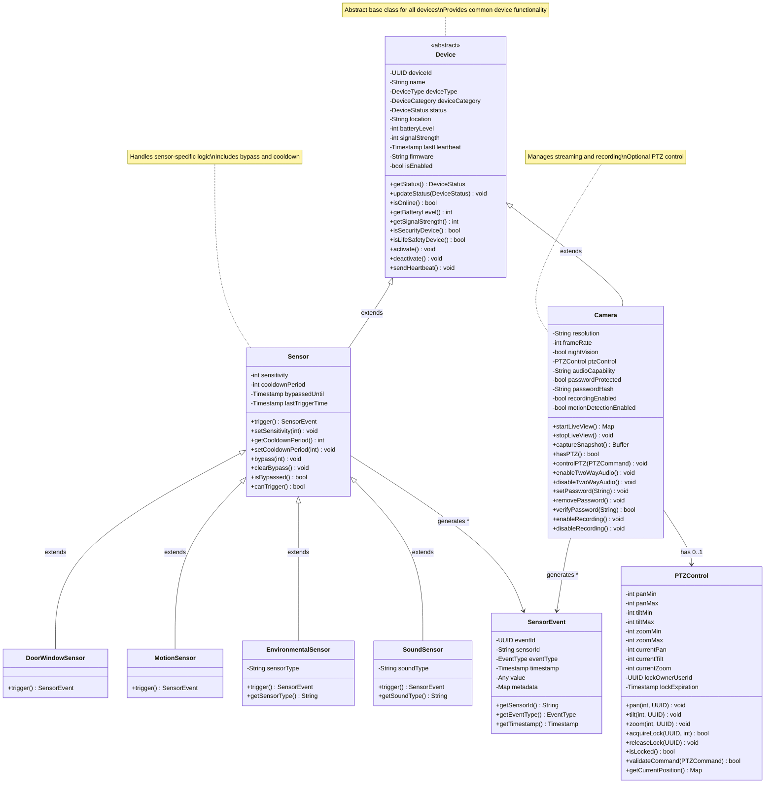
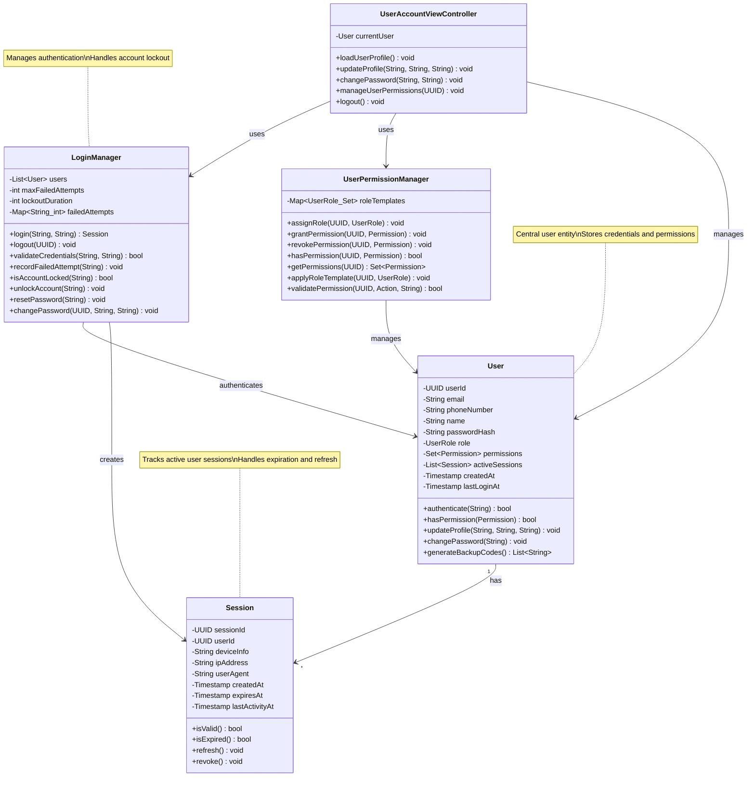
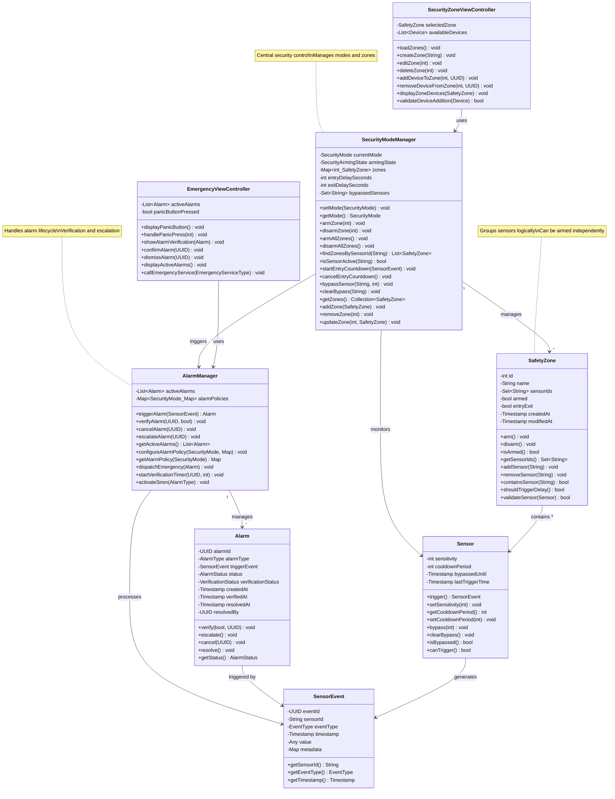
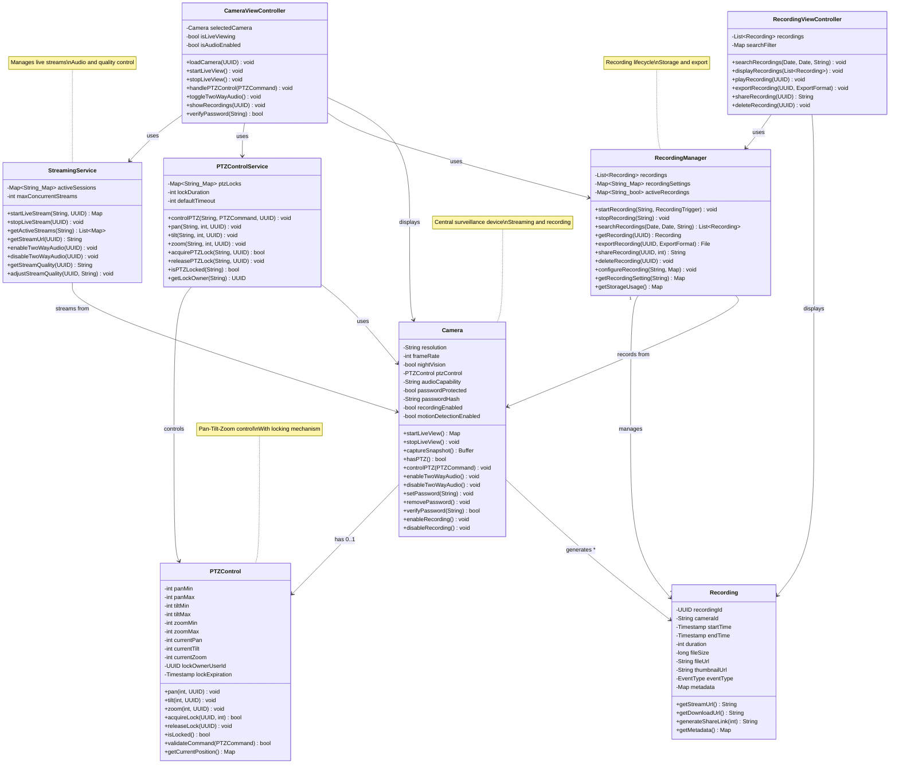
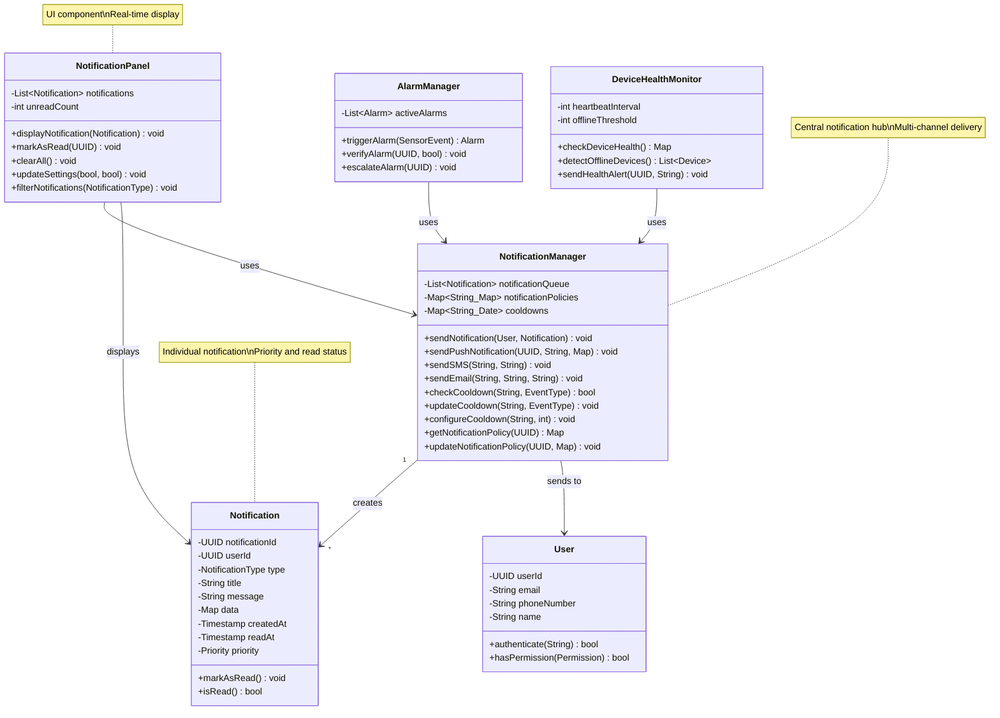
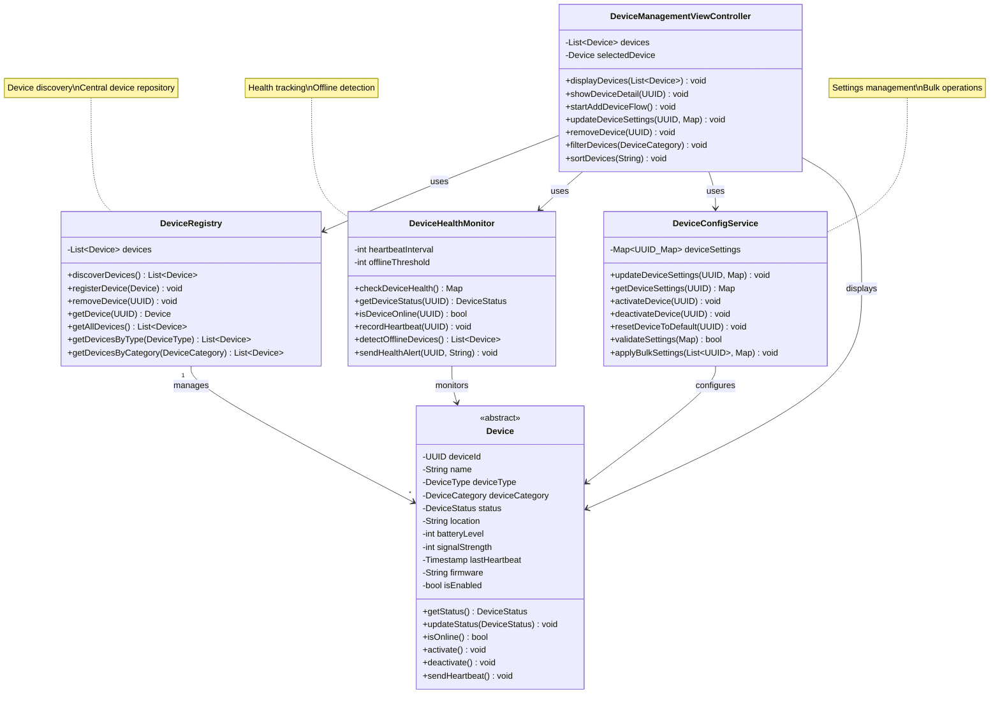
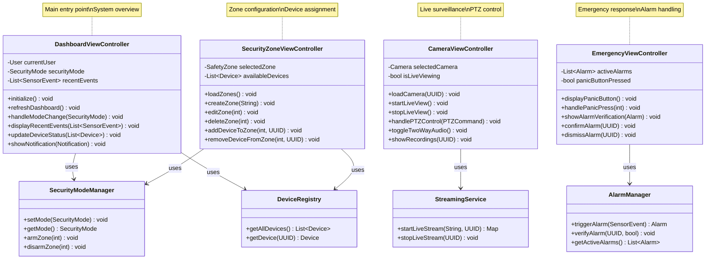
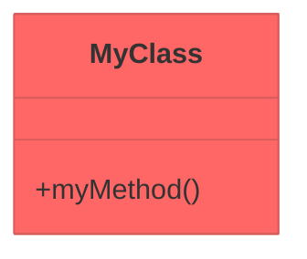
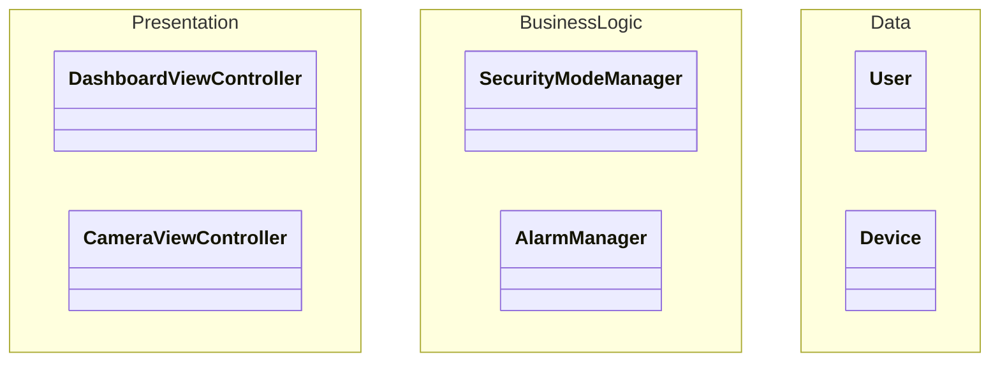

# SafeHome System - Mermaid UML Class Diagrams

## 목차
1. [전체 시스템 통합 Class Diagram](#1-전체-시스템-통합-class-diagram)
2. [개별 Class Diagram 리스트](#2-개별-class-diagram이-필요한-클래스-리스트)
3. [개별 Class Diagrams](#3-개별-class-diagrams)

---

## 1. 전체 시스템 통합 Class Diagram

### 1.1 완전 통합 버전 (모든 클래스 포함)

```mermaid
classDiagram
    %% ===== PRESENTATION LAYER =====
    class DashboardViewController {
        -User currentUser
        -SecurityMode securityMode
        -List~SensorEvent~ recentEvents
        -Map~UUID_DeviceStatus~ deviceStatuses
        +initialize() void
        +refreshDashboard() void
        +handleModeChange(SecurityMode) void
        +displayRecentEvents(List~SensorEvent~) void
        +updateDeviceStatus(List~Device~) void
        +showNotification(Notification) void
    }
    
    class CameraViewController {
        -Camera selectedCamera
        -bool isLiveViewing
        -bool isAudioEnabled
        +loadCamera(UUID) void
        +startLiveView() void
        +stopLiveView() void
        +handlePTZControl(PTZCommand) void
        +toggleTwoWayAudio() void
        +showRecordings(UUID) void
        +verifyPassword(String) bool
    }
    
    class SecurityZoneViewController {
        -SafetyZone selectedZone
        -List~Device~ availableDevices
        +loadZones() void
        +createZone(String) void
        +editZone(int) void
        +deleteZone(int) void
        +addDeviceToZone(int, UUID) void
        +removeDeviceFromZone(int, UUID) void
        +displayZoneDevices(SafetyZone) void
        +validateDeviceAddition(Device) bool
    }
    
    class DeviceManagementViewController {
        -List~Device~ devices
        -Device selectedDevice
        +displayDevices(List~Device~) void
        +showDeviceDetail(UUID) void
        +startAddDeviceFlow() void
        +updateDeviceSettings(UUID, Map) void
        +removeDevice(UUID) void
        +filterDevices(DeviceCategory) void
        +sortDevices(String) void
    }
    
    class EmergencyViewController {
        -List~Alarm~ activeAlarms
        -bool panicButtonPressed
        +displayPanicButton() void
        +handlePanicPress(int) void
        +showAlarmVerification(Alarm) void
        +confirmAlarm(UUID) void
        +dismissAlarm(UUID) void
        +displayActiveAlarms() void
        +callEmergencyService(EmergencyServiceType) void
    }
    
    class UserAccountViewController {
        -User currentUser
        +loadUserProfile() void
        +updateProfile(String, String, String) void
        +changePassword(String, String) void
        +manageUserPermissions(UUID) void
        +logout() void
    }
    
    class RecordingViewController {
        -List~Recording~ recordings
        -Map searchFilter
        +searchRecordings(Date, Date, String) void
        +displayRecordings(List~Recording~) void
        +playRecording(UUID) void
        +exportRecording(UUID, ExportFormat) void
        +shareRecording(UUID) String
        +deleteRecording(UUID) void
    }
    
    class NotificationPanel {
        -List~Notification~ notifications
        -int unreadCount
        +displayNotification(Notification) void
        +markAsRead(UUID) void
        +clearAll() void
        +updateSettings(bool, bool) void
        +filterNotifications(NotificationType) void
    }
    
    %% ===== BUSINESS LOGIC LAYER =====
    class SecurityModeManager {
        -SecurityMode currentMode
        -SecurityArmingState armingState
        -Map~int_SafetyZone~ zones
        -int entryDelaySeconds
        -int exitDelaySeconds
        -Set~String~ bypassedSensors
        +setMode(SecurityMode) void
        +getMode() SecurityMode
        +armZone(int) void
        +disarmZone(int) void
        +armAllZones() void
        +disarmAllZones() void
        +findZonesBySensorId(String) List~SafetyZone~
        +isSensorActive(String) bool
        +startEntryCountdown(SensorEvent) void
        +cancelEntryCountdown() void
        +bypassSensor(String, int) void
        +clearBypass(String) void
        +getZones() Collection~SafetyZone~
        +addZone(SafetyZone) void
        +removeZone(int) void
        +updateZone(int, SafetyZone) void
    }
    
    class AlarmManager {
        -List~Alarm~ activeAlarms
        -Map~SecurityMode_Map~ alarmPolicies
        +triggerAlarm(SensorEvent) Alarm
        +verifyAlarm(UUID, bool) void
        +cancelAlarm(UUID) void
        +escalateAlarm(UUID) void
        +getActiveAlarms() List~Alarm~
        +configureAlarmPolicy(SecurityMode, Map) void
        +getAlarmPolicy(SecurityMode) Map
        +dispatchEmergency(Alarm) void
        +startVerificationTimer(UUID, int) void
        +activateSiren(AlarmType) void
    }
    
    class RecordingManager {
        -List~Recording~ recordings
        -Map~String_Map~ recordingSettings
        -Map~String_bool~ activeRecordings
        +startRecording(String, RecordingTrigger) void
        +stopRecording(String) void
        +searchRecordings(Date, Date, String) List~Recording~
        +getRecording(UUID) Recording
        +exportRecording(UUID, ExportFormat) File
        +shareRecording(UUID, int) String
        +deleteRecording(UUID) void
        +configureRecording(String, Map) void
        +getRecordingSetting(String) Map
        +getStorageUsage() Map
    }
    
    class NotificationManager {
        -List~Notification~ notificationQueue
        -Map~String_Map~ notificationPolicies
        -Map~String_Date~ cooldowns
        +sendNotification(User, Notification) void
        +sendPushNotification(UUID, String, Map) void
        +sendSMS(String, String) void
        +sendEmail(String, String, String) void
        +checkCooldown(String, EventType) bool
        +updateCooldown(String, EventType) void
        +configureCooldown(String, int) void
        +getNotificationPolicy(UUID) Map
        +updateNotificationPolicy(UUID, Map) void
    }
    
    class DeviceRegistry {
        -List~Device~ devices
        +discoverDevices() List~Device~
        +registerDevice(Device) void
        +removeDevice(UUID) void
        +getDevice(UUID) Device
        +getAllDevices() List~Device~
        +getDevicesByType(DeviceType) List~Device~
        +getDevicesByCategory(DeviceCategory) List~Device~
    }
    
    class DeviceHealthMonitor {
        -int heartbeatInterval
        -int offlineThreshold
        +checkDeviceHealth() Map
        +getDeviceStatus(UUID) DeviceStatus
        +isDeviceOnline(UUID) bool
        +recordHeartbeat(UUID) void
        +detectOfflineDevices() List~Device~
        +sendHealthAlert(UUID, String) void
    }
    
    class DeviceConfigService {
        -Map~UUID_Map~ deviceSettings
        +updateDeviceSettings(UUID, Map) void
        +getDeviceSettings(UUID) Map
        +activateDevice(UUID) void
        +deactivateDevice(UUID) void
        +resetDeviceToDefault(UUID) void
        +validateSettings(Map) bool
        +applyBulkSettings(List~UUID~, Map) void
    }
    
    class StreamingService {
        -Map~String_Map~ activeSessions
        -int maxConcurrentStreams
        +startLiveStream(String, UUID) Map
        +stopLiveStream(UUID) void
        +getActiveStreams(String) List~Map~
        +getStreamUrl(UUID) String
        +enableTwoWayAudio(UUID) void
        +disableTwoWayAudio(UUID) void
        +getStreamQuality(UUID) String
        +adjustStreamQuality(UUID, String) void
    }
    
    class PTZControlService {
        -Map~String_Map~ ptzLocks
        -int lockDuration
        -int defaultTimeout
        +controlPTZ(String, PTZCommand, UUID) void
        +pan(String, int, UUID) void
        +tilt(String, int, UUID) void
        +zoom(String, int, UUID) void
        +acquirePTZLock(String, UUID) bool
        +releasePTZLock(String, UUID) void
        +isPTZLocked(String) bool
        +getLockOwner(String) UUID
    }
    
    class LoginManager {
        -List~User~ users
        -int maxFailedAttempts
        -int lockoutDuration
        -Map~String_int~ failedAttempts
        +login(String, String) Session
        +logout(UUID) void
        +validateCredentials(String, String) bool
        +recordFailedAttempt(String) void
        +isAccountLocked(String) bool
        +unlockAccount(String) void
        +resetPassword(String) void
        +changePassword(UUID, String, String) void
    }
    
    class UserPermissionManager {
        -Map~UserRole_Set~ roleTemplates
        +assignRole(UUID, UserRole) void
        +grantPermission(UUID, Permission) void
        +revokePermission(UUID, Permission) void
        +hasPermission(UUID, Permission) bool
        +getPermissions(UUID) Set~Permission~
        +applyRoleTemplate(UUID, UserRole) void
        +validatePermission(UUID, Action, String) bool
    }
    
    %% ===== DATA LAYER =====
    class User {
        -UUID userId
        -String email
        -String phoneNumber
        -String name
        -String passwordHash
        -UserRole role
        -Set~Permission~ permissions
        -List~Session~ activeSessions
        -Timestamp createdAt
        -Timestamp lastLoginAt
        +authenticate(String) bool
        +hasPermission(Permission) bool
        +updateProfile(String, String, String) void
        +changePassword(String) void
        +generateBackupCodes() List~String~
    }
    
    class Device {
        <<abstract>>
        -UUID deviceId
        -String name
        -DeviceType deviceType
        -DeviceCategory deviceCategory
        -DeviceStatus status
        -String location
        -int batteryLevel
        -int signalStrength
        -Timestamp lastHeartbeat
        -String firmware
        -bool isEnabled
        +getStatus() DeviceStatus
        +updateStatus(DeviceStatus) void
        +isOnline() bool
        +getBatteryLevel() int
        +getSignalStrength() int
        +isSecurityDevice() bool
        +isLifeSafetyDevice() bool
        +activate() void
        +deactivate() void
        +sendHeartbeat() void
    }
    
    class Sensor {
        -int sensitivity
        -int cooldownPeriod
        -Timestamp bypassedUntil
        -Timestamp lastTriggerTime
        +trigger() SensorEvent
        +setSensitivity(int) void
        +getCooldownPeriod() int
        +setCooldownPeriod(int) void
        +bypass(int) void
        +clearBypass() void
        +isBypassed() bool
        +canTrigger() bool
    }
    
    class Camera {
        -String resolution
        -int frameRate
        -bool nightVision
        -PTZControl ptzControl
        -String audioCapability
        -bool passwordProtected
        -String passwordHash
        -bool recordingEnabled
        -bool motionDetectionEnabled
        +startLiveView() Map
        +stopLiveView() void
        +captureSnapshot() Buffer
        +hasPTZ() bool
        +controlPTZ(PTZCommand) void
        +enableTwoWayAudio() void
        +disableTwoWayAudio() void
        +setPassword(String) void
        +removePassword() void
        +verifyPassword(String) bool
        +enableRecording() void
        +disableRecording() void
    }
    
    class DoorWindowSensor {
        +trigger() SensorEvent
    }
    
    class MotionSensor {
        +trigger() SensorEvent
    }
    
    class EnvironmentalSensor {
        -String sensorType
        +trigger() SensorEvent
    }
    
    class SoundSensor {
        -String soundType
        +trigger() SensorEvent
    }
    
    class PTZControl {
        -int panMin
        -int panMax
        -int tiltMin
        -int tiltMax
        -int zoomMin
        -int zoomMax
        -int currentPan
        -int currentTilt
        -int currentZoom
        -UUID lockOwnerUserId
        -Timestamp lockExpiration
        +pan(int, UUID) void
        +tilt(int, UUID) void
        +zoom(int, UUID) void
        +acquireLock(UUID, int) bool
        +releaseLock(UUID) void
        +isLocked() bool
        +validateCommand(PTZCommand) bool
        +getCurrentPosition() Map
    }
    
    class Recording {
        -UUID recordingId
        -String cameraId
        -Timestamp startTime
        -Timestamp endTime
        -int duration
        -long fileSize
        -String fileUrl
        -String thumbnailUrl
        -EventType eventType
        -Map metadata
        +getStreamUrl() String
        +getDownloadUrl() String
        +generateShareLink(int) String
        +getMetadata() Map
    }
    
    class Alarm {
        -UUID alarmId
        -AlarmType alarmType
        -SensorEvent triggerEvent
        -AlarmStatus status
        -VerificationStatus verificationStatus
        -Timestamp createdAt
        -Timestamp verifiedAt
        -Timestamp resolvedAt
        -UUID resolvedBy
        +verify(bool, UUID) void
        +escalate() void
        +cancel(UUID) void
        +resolve() void
        +getStatus() AlarmStatus
    }
    
    class SensorEvent {
        -UUID eventId
        -String sensorId
        -EventType eventType
        -Timestamp timestamp
        -Any value
        -Map metadata
        +getSensorId() String
        +getEventType() EventType
        +getTimestamp() Timestamp
    }
    
    class Session {
        -UUID sessionId
        -UUID userId
        -String deviceInfo
        -String ipAddress
        -String userAgent
        -Timestamp createdAt
        -Timestamp expiresAt
        -Timestamp lastActivityAt
        +isValid() bool
        +isExpired() bool
        +refresh() void
        +revoke() void
    }
    
    class Notification {
        -UUID notificationId
        -UUID userId
        -NotificationType type
        -String title
        -String message
        -Map data
        -Timestamp createdAt
        -Timestamp readAt
        -Priority priority
        +markAsRead() void
        +isRead() bool
    }
    
    class SafetyZone {
        -int id
        -String name
        -Set~String~ sensorIds
        -bool armed
        -bool entryExit
        -Timestamp createdAt
        -Timestamp modifiedAt
        +arm() void
        +disarm() void
        +isArmed() bool
        +getSensorIds() Set~String~
        +addSensor(String) void
        +removeSensor(String) void
        +containsSensor(String) bool
        +shouldTriggerDelay() bool
        +validateSensor(Sensor) bool
    }
    
    %% ===== RELATIONSHIPS =====
    
    %% Inheritance
    Device <|-- Sensor : extends
    Device <|-- Camera : extends
    Sensor <|-- DoorWindowSensor : extends
    Sensor <|-- MotionSensor : extends
    Sensor <|-- EnvironmentalSensor : extends
    Sensor <|-- SoundSensor : extends
    
    %% Presentation to Business Logic
    DashboardViewController --> SecurityModeManager : uses
    DashboardViewController --> NotificationManager : uses
    DashboardViewController --> DeviceRegistry : uses
    
    CameraViewController --> StreamingService : uses
    CameraViewController --> PTZControlService : uses
    CameraViewController --> RecordingManager : uses
    
    SecurityZoneViewController --> SecurityModeManager : uses
    SecurityZoneViewController --> DeviceRegistry : uses
    
    DeviceManagementViewController --> DeviceRegistry : uses
    DeviceManagementViewController --> DeviceConfigService : uses
    DeviceManagementViewController --> DeviceHealthMonitor : uses
    
    EmergencyViewController --> AlarmManager : uses
    EmergencyViewController --> NotificationManager : uses
    
    UserAccountViewController --> LoginManager : uses
    UserAccountViewController --> UserPermissionManager : uses
    
    RecordingViewController --> RecordingManager : uses
    
    NotificationPanel --> NotificationManager : uses
    
    %% Business Logic to Data Layer
    SecurityModeManager --> SafetyZone : manages
    SecurityModeManager --> Sensor : monitors
    
    AlarmManager --> Alarm : creates
    AlarmManager --> SensorEvent : processes
    AlarmManager --> NotificationManager : uses
    
    RecordingManager --> Recording : manages
    RecordingManager --> Camera : controls
    
    NotificationManager --> Notification : creates
    NotificationManager --> User : sends to
    
    DeviceRegistry --> Device : manages
    
    DeviceHealthMonitor --> Device : monitors
    DeviceHealthMonitor --> NotificationManager : uses
    
    DeviceConfigService --> Device : configures
    
    StreamingService --> Camera : streams from
    
    PTZControlService --> PTZControl : controls
    PTZControlService --> Camera : uses
    
    LoginManager --> User : authenticates
    LoginManager --> Session : creates
    
    UserPermissionManager --> User : manages permissions
    
    %% Associations
    Camera --> PTZControl : has
    Alarm --> SensorEvent : triggered by
    User --> Session : has
    Sensor --> SensorEvent : generates
    Recording --> Camera : from
```

---

## 2. 개별 Class Diagram이 필요한 클래스 리스트

### 2.1 우선순위 1 - 핵심 상속 구조 (필수)
1. **Device Hierarchy** - Device, Sensor, Camera 및 하위 클래스들
2. **User & Authentication** - User, Session, LoginManager 관계

### 2.2 우선순위 2 - 주요 비즈니스 로직 (권장)
3. **Security Management** - SecurityModeManager, SafetyZone, AlarmManager
4. **Surveillance System** - Camera, RecordingManager, StreamingService, PTZControlService
5. **Notification System** - NotificationManager, Notification

### 2.3 우선순위 3 - 보조 시스템 (선택)
6. **Device Management** - DeviceRegistry, DeviceHealthMonitor, DeviceConfigService
7. **View Controllers** - 주요 ViewController들의 관계

---

## 3. 개별 Class Diagrams

### 3.1 Device Hierarchy (최우선)



---

### 3.2 User & Authentication System



---

### 3.3 Security Management System



---

### 3.4 Surveillance & Recording System



---

### 3.5 Notification System



---

### 3.6 Device Management System



---

### 3.7 Main View Controllers Layer



---

## 4. 사용 가이드

### 4.1 Mermaid 렌더링 방법

1. **GitHub README에서:**
   - 위 코드 블록을 그대로 복사하면 자동 렌더링됩니다

2. **Mermaid Live Editor:**
   - https://mermaid.live/ 접속
   - 코드 붙여넣기하면 실시간 미리보기

3. **VS Code:**
   - Mermaid Preview 확장 설치
   - `.md` 파일에서 미리보기 가능

4. **Documentation 도구:**
   - Notion, Confluence, GitBook 등에서 지원

### 4.2 다이어그램 선택 가이드

| 목적 | 사용할 다이어그램 |
|------|------------------|
| **전체 시스템 이해** | 1.1 완전 통합 버전 |
| **상속 구조 이해** | 3.1 Device Hierarchy |
| **인증 시스템 설계** | 3.2 User & Authentication |
| **보안 기능 구현** | 3.3 Security Management |
| **카메라 시스템 구현** | 3.4 Surveillance & Recording |
| **알림 시스템 구현** | 3.5 Notification System |
| **장치 관리 구현** | 3.6 Device Management |
| **UI 레이어 구현** | 3.7 View Controllers |

### 4.3 학생 실습 추천 순서

**Week 1:**
1. 먼저 **3.1 Device Hierarchy** 이해 및 구현
2. **3.2 User & Authentication** 구현
3. **1.1 전체 통합 버전**으로 전체 구조 파악

**Week 2:**
4. **3.3 Security Management** 구현
5. **3.4 Surveillance & Recording** 구현  
6. **3.7 View Controllers** 연결
7. **1.1 전체 통합 버전**으로 최종 검증

---

## 5. 다이어그램 커스터마이징

### 5.1 색상 추가하기



### 5.2 레이어별 그룹화

통합 다이어그램에서 `namespace`를 사용하면 레이어별로 시각적 그룹화 가능:



---

## 6. Export 옵션

### 6.1 이미지로 저장
- Mermaid Live Editor에서 PNG/SVG 다운로드
- 해상도: 고품질 PNG 권장 (프레젠테이션용)

### 6.2 PDF 문서에 삽입
- SVG 형식으로 저장 후 삽입 (확대해도 선명)
- 또는 고해상도 PNG 사용

### 6.3 프레젠테이션
- 개별 다이어그램을 슬라이드별로 사용
- 애니메이션 효과로 단계별 설명

---

**문서 버전:** 1.0  
**마지막 업데이트:** 2025-01-17  
**Mermaid 버전:** 10.0+
