# SafeHome Business Logic Layer - Class Diagrams

> Detailed UML Class Diagrams for 15 Core Business Logic Components in the Backend Layer

## 📑 Table of Contents

- [Complete Business Logic Layer Integration Diagram](#complete-business-logic-layer-integration-diagram)
- [Security & Zone Management](#security--zone-management)
  - [1. SecurityModeManager](#1-securitymodemanager)
  - [2. SafetyZone](#2-safetyzone)
  - [3. AlarmManager](#3-alarmmanager)
- [Recording & Streaming Management](#recording--streaming-management)
  - [4. RecordingManager](#4-recordingmanager)
  - [5. StreamingService](#5-streamingservice)
  - [6. PTZControlService](#6-ptzcontrolservice)
- [Device Management](#device-management)
  - [7. DeviceRegistry](#7-deviceregistry)
  - [8. DeviceHealthMonitor](#8-devicehealthmonitor)
  - [9. DeviceConfigService](#9-deviceconfigservice)
- [Notification Management](#notification-management)
  - [10. NotificationManager](#10-notificationmanager)
- [User & Authentication Management](#user--authentication-management)
  - [11. SignUpService](#11-signupservice)
  - [12. LoginService](#12-loginservice)
  - [13. SessionManager](#13-sessionmanager)
  - [14. UserPermissionManager](#14-userpermissionmanager)
- [Logging & Monitoring](#logging--monitoring)
  - [15. ActivityLogger](#15-activitylogger)

---

## Complete Business Logic Layer Integration Diagram

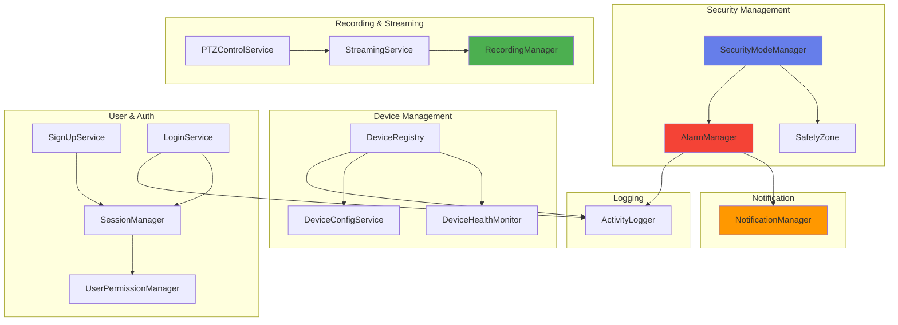
```mermaid
graph TB
    subgraph "Security Management"
        SMM[SecurityModeManager]
        SZ[SafetyZone]
        AM[AlarmManager]
    end

    subgraph "Recording & Streaming"
        RM[RecordingManager]
        SS[StreamingService]
        PTZ[PTZControlService]
    end

    subgraph "Device Management"
        DR[DeviceRegistry]
        DHM[DeviceHealthMonitor]
        DCS[DeviceConfigService]
    end

    subgraph "Notification"
        NM[NotificationManager]
    end

    subgraph "User & Auth"
        SUS[SignUpService]
        LS[LoginService]
        SM[SessionManager]
        UPM[UserPermissionManager]
    end

    subgraph "Logging"
        AL[ActivityLogger]
    end

    SMM --> SZ
    SMM --> AM
    AM --> NM

    SS --> RM
    PTZ --> SS

    DR --> DHM
    DR --> DCS

    LS --> SM
    SUS --> SM
    SM --> UPM

    AM --> AL
    DR --> AL
    LS --> AL

    style SMM fill:#667eea
    style AM fill:#F44336
    style RM fill:#4CAF50
    style NM fill:#FF9800
```

---

## Security & Zone Management

### 1. SecurityModeManager

**Responsibility:** Security mode and zone management, arming/disarming logic

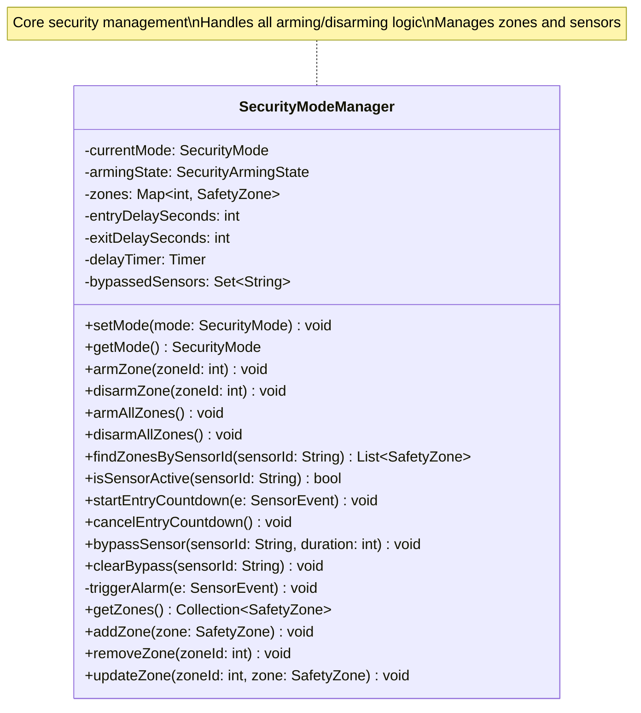
```mermaid
classDiagram
    direction TB

    class SecurityModeManager {
        -currentMode: SecurityMode
        -armingState: SecurityArmingState
        -zones: Map~int, SafetyZone~
        -entryDelaySeconds: int
        -exitDelaySeconds: int
        -delayTimer: Timer
        -bypassedSensors: Set~String~
        +setMode(mode: SecurityMode) void
        +getMode() SecurityMode
        +armZone(zoneId: int) void
        +disarmZone(zoneId: int) void
        +armAllZones() void
        +disarmAllZones() void
        +findZonesBySensorId(sensorId: String) List~SafetyZone~
        +isSensorActive(sensorId: String) bool
        +startEntryCountdown(e: SensorEvent) void
        +cancelEntryCountdown() void
        +bypassSensor(sensorId: String, duration: int) void
        +clearBypass(sensorId: String) void
        -triggerAlarm(e: SensorEvent) void
        +getZones() Collection~SafetyZone~
        +addZone(zone: SafetyZone) void
        +removeZone(zoneId: int) void
        +updateZone(zoneId: int, zone: SafetyZone) void
    }

    note for SecurityModeManager "Core security management\nHandles all arming/disarming logic\nManages zones and sensors"
```

---

### 2. SafetyZone

**Responsibility:** Security zone definition and sensor membership management

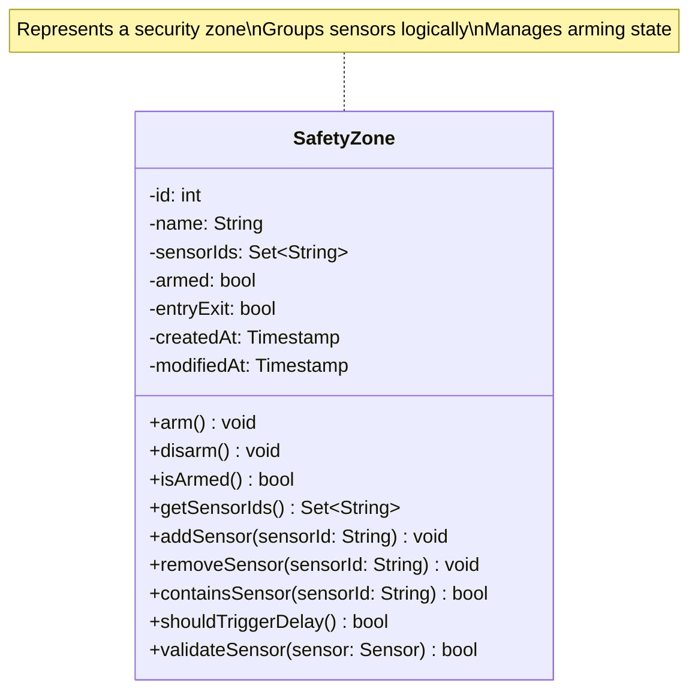
```mermaid
classDiagram
    direction TB

    class SafetyZone {
        -id: int
        -name: String
        -sensorIds: Set~String~
        -armed: bool
        -entryExit: bool
        -createdAt: Timestamp
        -modifiedAt: Timestamp
        +arm() void
        +disarm() void
        +isArmed() bool
        +getSensorIds() Set~String~
        +addSensor(sensorId: String) void
        +removeSensor(sensorId: String) void
        +containsSensor(sensorId: String) bool
        +shouldTriggerDelay() bool
        +validateSensor(sensor: Sensor) bool
    }

    note for SafetyZone "Represents a security zone\nGroups sensors logically\nManages arming state"
```

---

### 3. AlarmManager

**Responsibility:** Alarm triggering, verification, and escalation logic

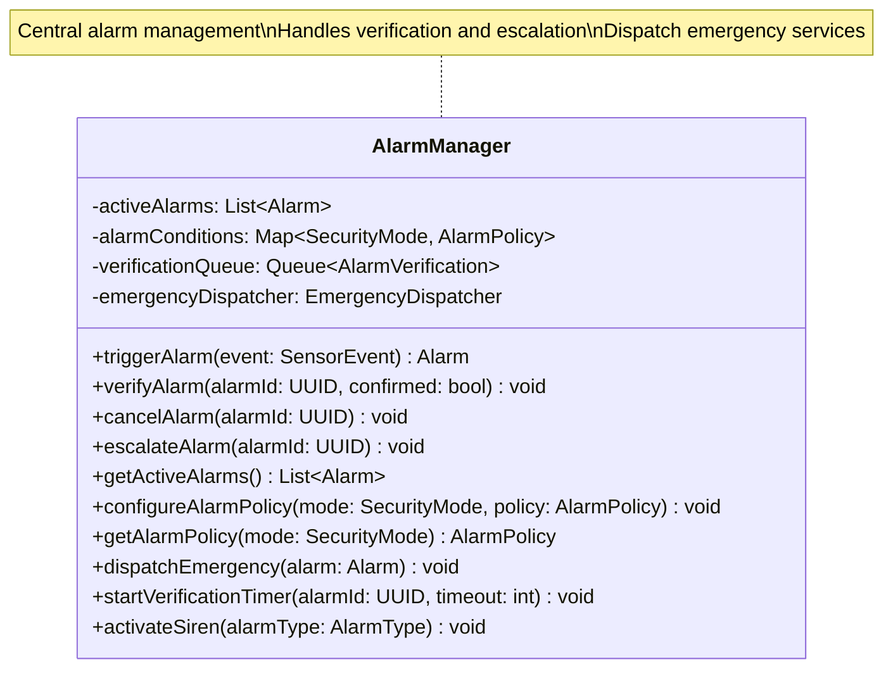
```mermaid
classDiagram
    direction TB

    class AlarmManager {
        -activeAlarms: List~Alarm~
        -alarmConditions: Map~SecurityMode, AlarmPolicy~
        -verificationQueue: Queue~AlarmVerification~
        -emergencyDispatcher: EmergencyDispatcher
        +triggerAlarm(event: SensorEvent) Alarm
        +verifyAlarm(alarmId: UUID, confirmed: bool) void
        +cancelAlarm(alarmId: UUID) void
        +escalateAlarm(alarmId: UUID) void
        +getActiveAlarms() List~Alarm~
        +configureAlarmPolicy(mode: SecurityMode, policy: AlarmPolicy) void
        +getAlarmPolicy(mode: SecurityMode) AlarmPolicy
        +dispatchEmergency(alarm: Alarm) void
        +startVerificationTimer(alarmId: UUID, timeout: int) void
        +activateSiren(alarmType: AlarmType) void
    }

    note for AlarmManager "Central alarm management\nHandles verification and escalation\nDispatch emergency services"
```

---

## Recording & Streaming Management

### 4. RecordingManager

**Responsibility:** Recording management, storage, search, and export

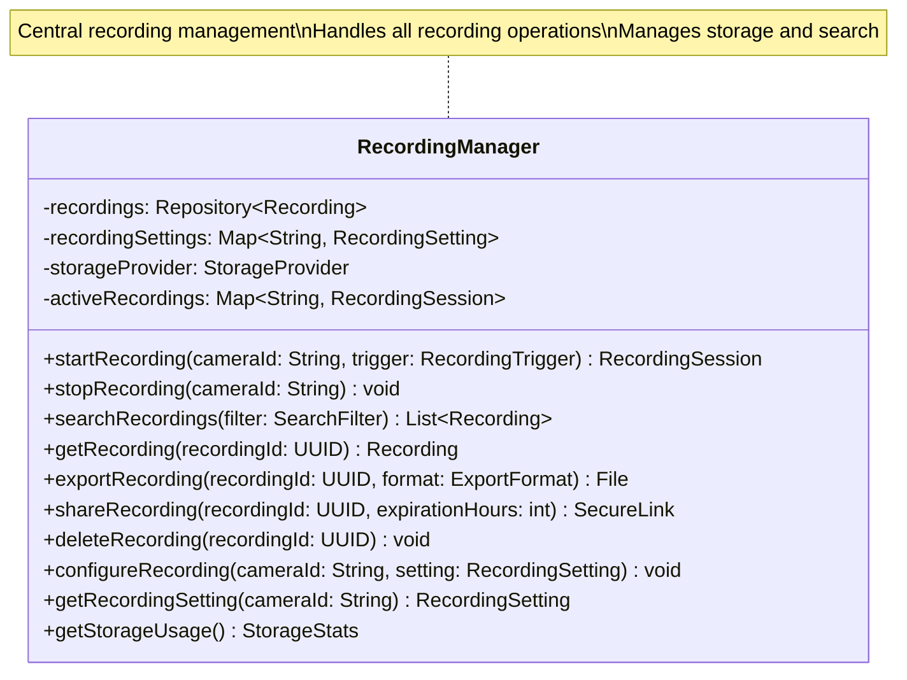
```mermaid
classDiagram
    direction TB

    class RecordingManager {
        -recordings: Repository~Recording~
        -recordingSettings: Map~String, RecordingSetting~
        -storageProvider: StorageProvider
        -activeRecordings: Map~String, RecordingSession~
        +startRecording(cameraId: String, trigger: RecordingTrigger) RecordingSession
        +stopRecording(cameraId: String) void
        +searchRecordings(filter: SearchFilter) List~Recording~
        +getRecording(recordingId: UUID) Recording
        +exportRecording(recordingId: UUID, format: ExportFormat) File
        +shareRecording(recordingId: UUID, expirationHours: int) SecureLink
        +deleteRecording(recordingId: UUID) void
        +configureRecording(cameraId: String, setting: RecordingSetting) void
        +getRecordingSetting(cameraId: String) RecordingSetting
        +getStorageUsage() StorageStats
    }

    note for RecordingManager "Central recording management\nHandles all recording operations\nManages storage and search"
```

---

### 5. StreamingService

**Responsibility:** Camera streaming and session management (excluding PTZ)

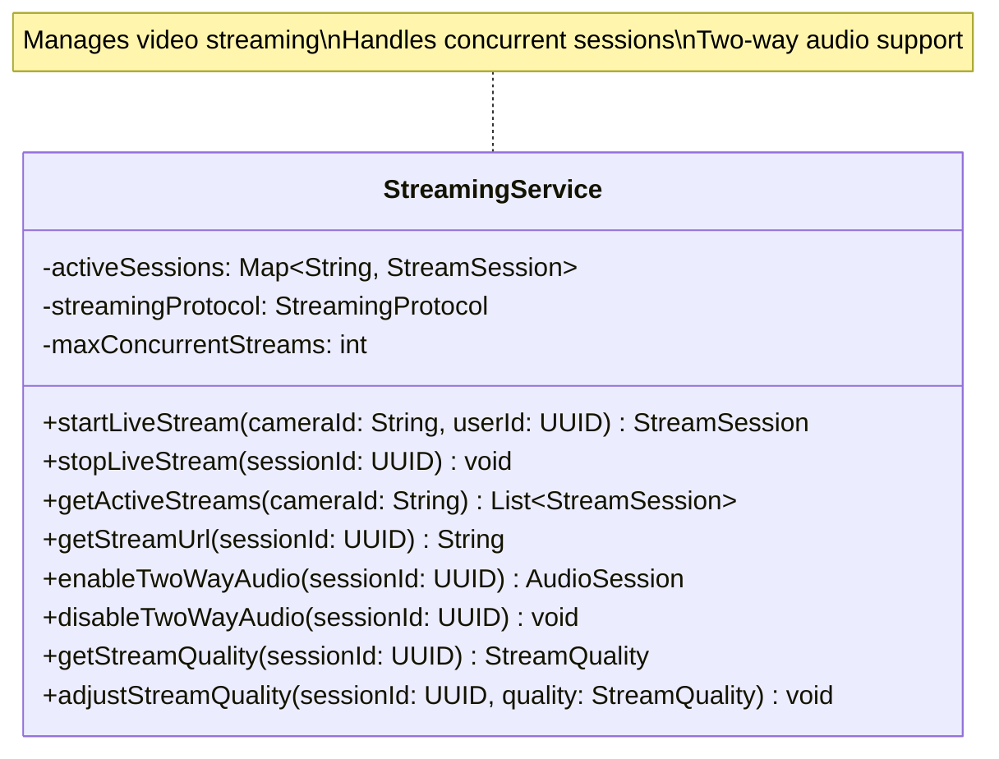
```mermaid
classDiagram
    direction TB

    class StreamingService {
        -activeSessions: Map~String, StreamSession~
        -streamingProtocol: StreamingProtocol
        -maxConcurrentStreams: int
        +startLiveStream(cameraId: String, userId: UUID) StreamSession
        +stopLiveStream(sessionId: UUID) void
        +getActiveStreams(cameraId: String) List~StreamSession~
        +getStreamUrl(sessionId: UUID) String
        +enableTwoWayAudio(sessionId: UUID) AudioSession
        +disableTwoWayAudio(sessionId: UUID) void
        +getStreamQuality(sessionId: UUID) StreamQuality
        +adjustStreamQuality(sessionId: UUID, quality: StreamQuality) void
    }

    note for StreamingService "Manages video streaming\nHandles concurrent sessions\nTwo-way audio support"
```

---

### 6. PTZControlService

**Responsibility:** PTZ control and lock management

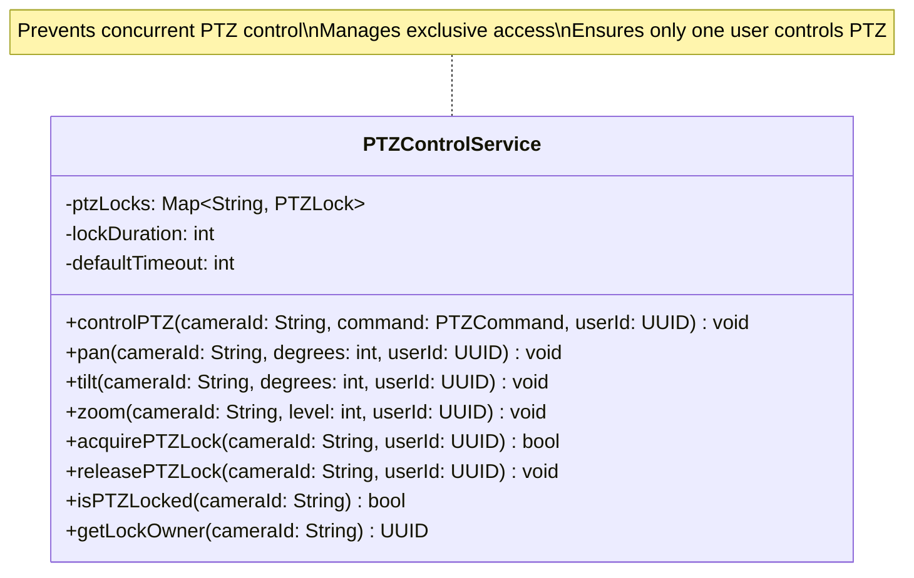
```mermaid
classDiagram
    direction TB

    class PTZControlService {
        -ptzLocks: Map~String, PTZLock~
        -lockDuration: int
        -defaultTimeout: int
        +controlPTZ(cameraId: String, command: PTZCommand, userId: UUID) void
        +pan(cameraId: String, degrees: int, userId: UUID) void
        +tilt(cameraId: String, degrees: int, userId: UUID) void
        +zoom(cameraId: String, level: int, userId: UUID) void
        +acquirePTZLock(cameraId: String, userId: UUID) bool
        +releasePTZLock(cameraId: String, userId: UUID) void
        +isPTZLocked(cameraId: String) bool
        +getLockOwner(cameraId: String) UUID
    }

    note for PTZControlService "Prevents concurrent PTZ control\nManages exclusive access\nEnsures only one user controls PTZ"
```

---

## Device Management

### 7. DeviceRegistry

**Responsibility:** Device registration and discovery

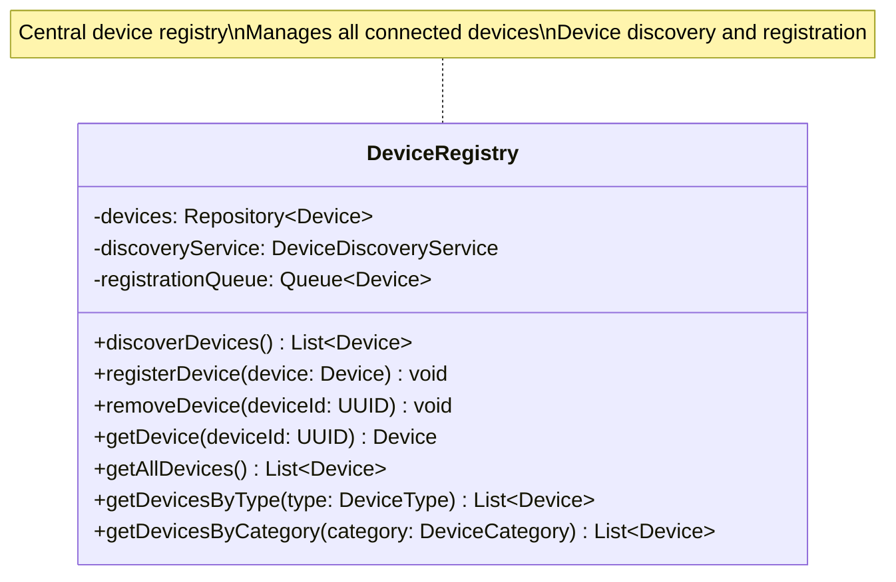
```mermaid
classDiagram
    direction TB

    class DeviceRegistry {
        -devices: Repository~Device~
        -discoveryService: DeviceDiscoveryService
        -registrationQueue: Queue~Device~
        +discoverDevices() List~Device~
        +registerDevice(device: Device) void
        +removeDevice(deviceId: UUID) void
        +getDevice(deviceId: UUID) Device
        +getAllDevices() List~Device~
        +getDevicesByType(type: DeviceType) List~Device~
        +getDevicesByCategory(category: DeviceCategory) List~Device~
    }

    note for DeviceRegistry "Central device registry\nManages all connected devices\nDevice discovery and registration"
```

---

### 8. DeviceHealthMonitor

**Responsibility:** Device status monitoring and health checks

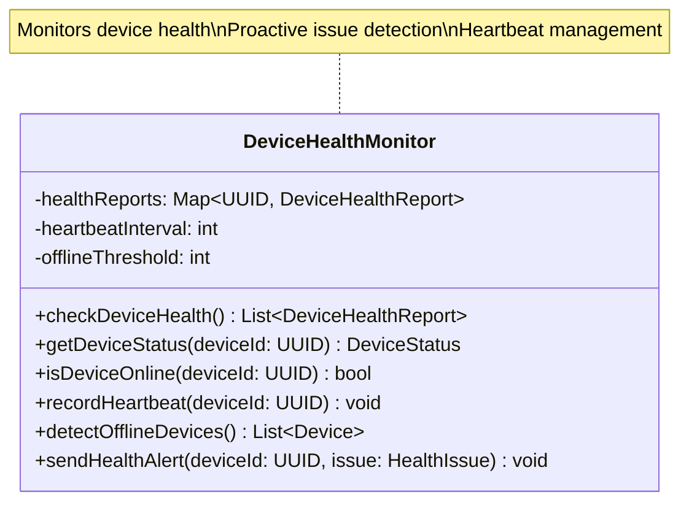
```mermaid
classDiagram
    direction TB

    class DeviceHealthMonitor {
        -healthReports: Map~UUID, DeviceHealthReport~
        -heartbeatInterval: int
        -offlineThreshold: int
        +checkDeviceHealth() List~DeviceHealthReport~
        +getDeviceStatus(deviceId: UUID) DeviceStatus
        +isDeviceOnline(deviceId: UUID) bool
        +recordHeartbeat(deviceId: UUID) void
        +detectOfflineDevices() List~Device~
        +sendHealthAlert(deviceId: UUID, issue: HealthIssue) void
    }

    note for DeviceHealthMonitor "Monitors device health\nProactive issue detection\nHeartbeat management"
```

---

### 9. DeviceConfigService

**Responsibility:** Device configuration management

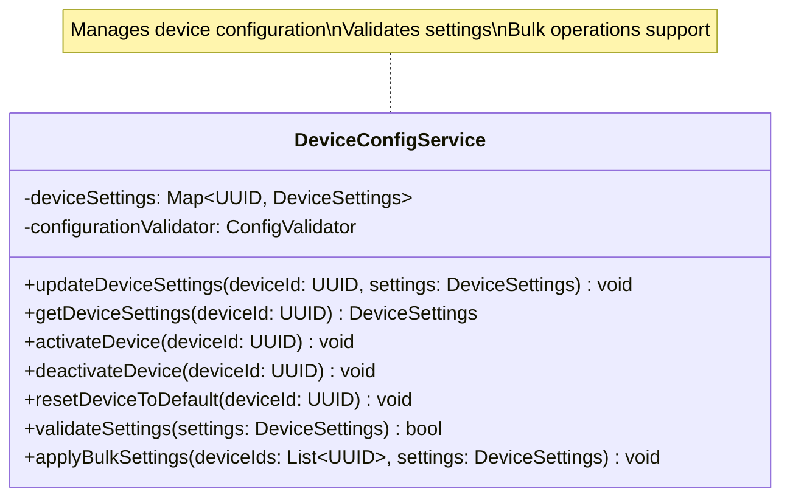
```mermaid
classDiagram
    direction TB

    class DeviceConfigService {
        -deviceSettings: Map~UUID, DeviceSettings~
        -configurationValidator: ConfigValidator
        +updateDeviceSettings(deviceId: UUID, settings: DeviceSettings) void
        +getDeviceSettings(deviceId: UUID) DeviceSettings
        +activateDevice(deviceId: UUID) void
        +deactivateDevice(deviceId: UUID) void
        +resetDeviceToDefault(deviceId: UUID) void
        +validateSettings(settings: DeviceSettings) bool
        +applyBulkSettings(deviceIds: List~UUID~, settings: DeviceSettings) void
    }

    note for DeviceConfigService "Manages device configuration\nValidates settings\nBulk operations support"
```

---

## Notification Management

### 10. NotificationManager

**Responsibility:** Notification delivery, cooldown management, and policy enforcement

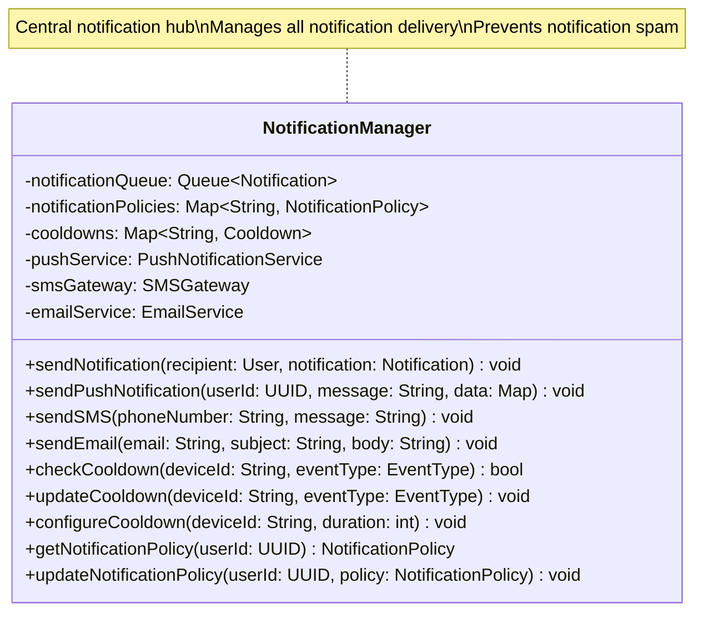
```mermaid
classDiagram
    direction TB

    class NotificationManager {
        -notificationQueue: Queue~Notification~
        -notificationPolicies: Map~String, NotificationPolicy~
        -cooldowns: Map~String, Cooldown~
        -pushService: PushNotificationService
        -smsGateway: SMSGateway
        -emailService: EmailService
        +sendNotification(recipient: User, notification: Notification) void
        +sendPushNotification(userId: UUID, message: String, data: Map) void
        +sendSMS(phoneNumber: String, message: String) void
        +sendEmail(email: String, subject: String, body: String) void
        +checkCooldown(deviceId: String, eventType: EventType) bool
        +updateCooldown(deviceId: String, eventType: EventType) void
        +configureCooldown(deviceId: String, duration: int) void
        +getNotificationPolicy(userId: UUID) NotificationPolicy
        +updateNotificationPolicy(userId: UUID, policy: NotificationPolicy) void
    }

    note for NotificationManager "Central notification hub\nManages all notification delivery\nPrevents notification spam"
```

---

## User & Authentication Management

### 11. SignUpService

**Responsibility:** User registration and verification

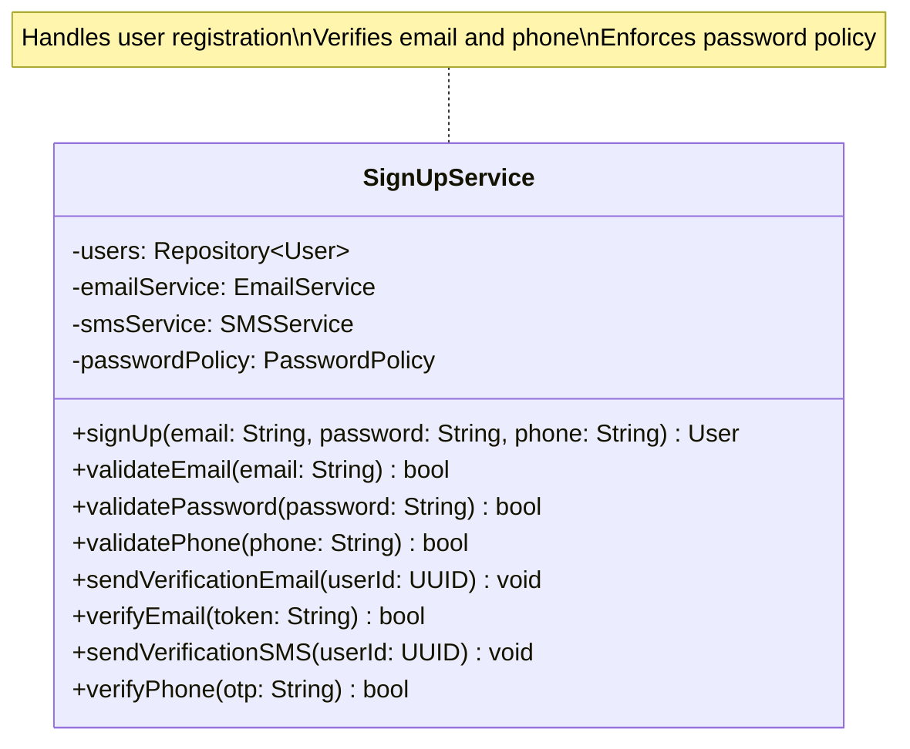
```mermaid
classDiagram
    direction TB

    class SignUpService {
        -users: Repository~User~
        -emailService: EmailService
        -smsService: SMSService
        -passwordPolicy: PasswordPolicy
        +signUp(email: String, password: String, phone: String) User
        +validateEmail(email: String) bool
        +validatePassword(password: String) bool
        +validatePhone(phone: String) bool
        +sendVerificationEmail(userId: UUID) void
        +verifyEmail(token: String) bool
        +sendVerificationSMS(userId: UUID) void
        +verifyPhone(otp: String) bool
    }

    note for SignUpService "Handles user registration\nVerifies email and phone\nEnforces password policy"
```

---

### 12. LoginService

**Responsibility:** Login and logout processing

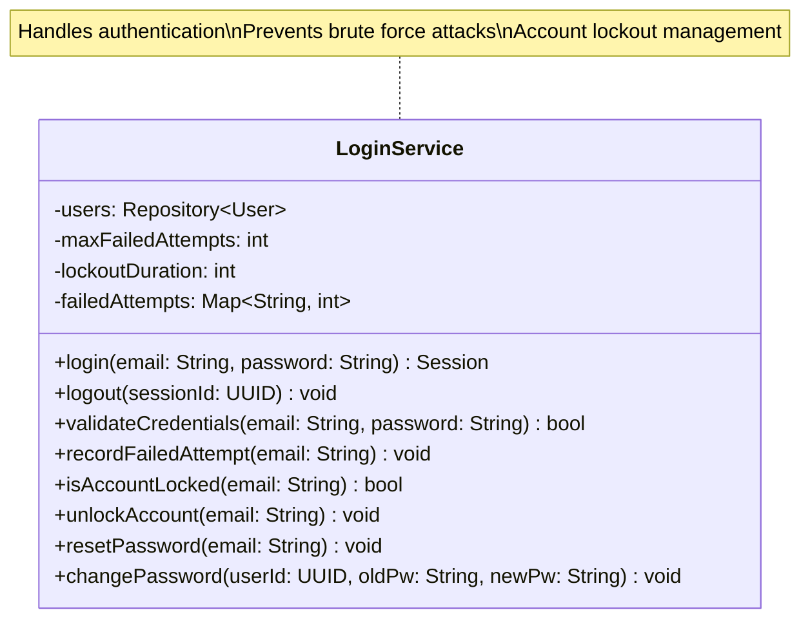
```mermaid
classDiagram
    direction TB

    class LoginService {
        -users: Repository~User~
        -maxFailedAttempts: int
        -lockoutDuration: int
        -failedAttempts: Map~String, int~
        +login(email: String, password: String) Session
        +logout(sessionId: UUID) void
        +validateCredentials(email: String, password: String) bool
        +recordFailedAttempt(email: String) void
        +isAccountLocked(email: String) bool
        +unlockAccount(email: String) void
        +resetPassword(email: String) void
        +changePassword(userId: UUID, oldPw: String, newPw: String) void
    }

    note for LoginService "Handles authentication\nPrevents brute force attacks\nAccount lockout management"
```

---

### 13. SessionManager

**Responsibility:** Session creation and management

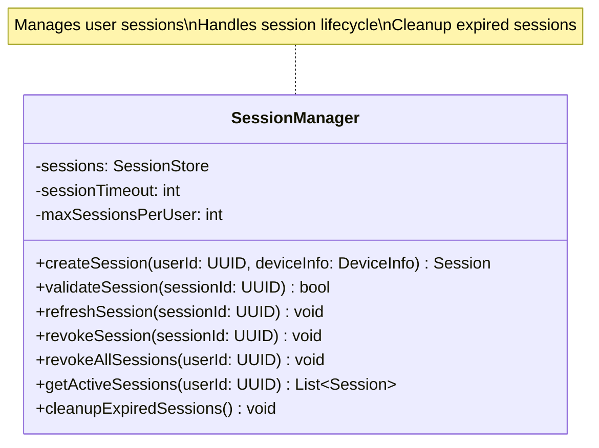
```mermaid
classDiagram
    direction TB

    class SessionManager {
        -sessions: SessionStore
        -sessionTimeout: int
        -maxSessionsPerUser: int
        +createSession(userId: UUID, deviceInfo: DeviceInfo) Session
        +validateSession(sessionId: UUID) bool
        +refreshSession(sessionId: UUID) void
        +revokeSession(sessionId: UUID) void
        +revokeAllSessions(userId: UUID) void
        +getActiveSessions(userId: UUID) List~Session~
        +cleanupExpiredSessions() void
    }

    note for SessionManager "Manages user sessions\nHandles session lifecycle\nCleanup expired sessions"
```

---

### 14. UserPermissionManager

**Responsibility:** User permission management and role-based access control

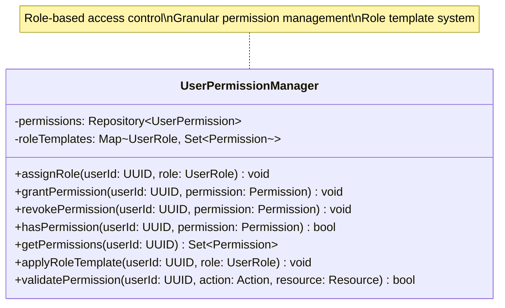
```mermaid
classDiagram
    direction TB

    class UserPermissionManager {
        -permissions: Repository~UserPermission~
        -roleTemplates: Map~UserRole, Set~Permission~~
        +assignRole(userId: UUID, role: UserRole) void
        +grantPermission(userId: UUID, permission: Permission) void
        +revokePermission(userId: UUID, permission: Permission) void
        +hasPermission(userId: UUID, permission: Permission) bool
        +getPermissions(userId: UUID) Set~Permission~
        +applyRoleTemplate(userId: UUID, role: UserRole) void
        +validatePermission(userId: UUID, action: Action, resource: Resource) bool
    }

    note for UserPermissionManager "Role-based access control\nGranular permission management\nRole template system"
```

---

## Logging & Monitoring

### 15. ActivityLogger

**Responsibility:** System event logging, timeline generation, and audit trail

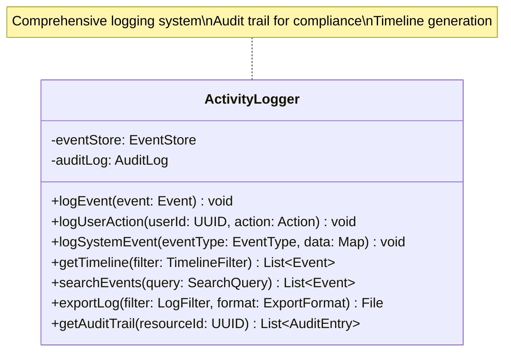
```mermaid
classDiagram
    direction TB

    class ActivityLogger {
        -eventStore: EventStore
        -auditLog: AuditLog
        +logEvent(event: Event) void
        +logUserAction(userId: UUID, action: Action) void
        +logSystemEvent(eventType: EventType, data: Map) void
        +getTimeline(filter: TimelineFilter) List~Event~
        +searchEvents(query: SearchQuery) List~Event~
        +exportLog(filter: LogFilter, format: ExportFormat) File
        +getAuditTrail(resourceId: UUID) List~AuditEntry~
    }

    note for ActivityLogger "Comprehensive logging system\nAudit trail for compliance\nTimeline generation"
```

---

## Component Relationships

### Service Dependencies

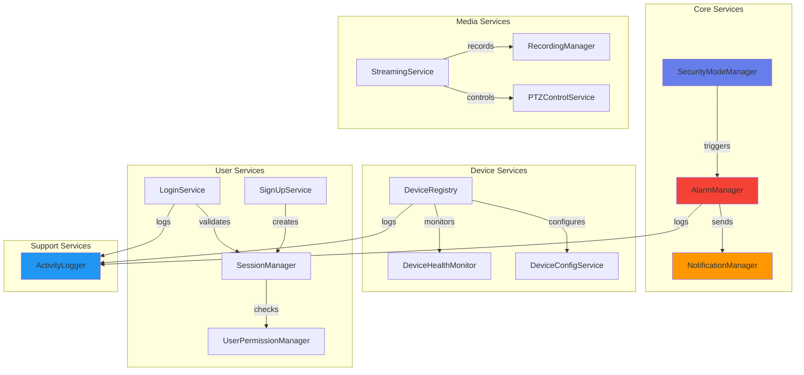
```mermaid
graph TB
    subgraph "Core Services"
        SMM[SecurityModeManager]
        AM[AlarmManager]
        NM[NotificationManager]
    end

    subgraph "Device Services"
        DR[DeviceRegistry]
        DHM[DeviceHealthMonitor]
        DCS[DeviceConfigService]
    end

    subgraph "Media Services"
        RM[RecordingManager]
        SS[StreamingService]
        PTZ[PTZControlService]
    end

    subgraph "User Services"
        SUS[SignUpService]
        LS[LoginService]
        SM[SessionManager]
        UPM[UserPermissionManager]
    end

    subgraph "Support Services"
        AL[ActivityLogger]
    end

    SMM -->|triggers| AM
    AM -->|sends| NM

    DR -->|monitors| DHM
    DR -->|configures| DCS

    SS -->|records| RM
    SS -->|controls| PTZ

    SUS -->|creates| SM
    LS -->|validates| SM
    SM -->|checks| UPM

    AM -->|logs| AL
    LS -->|logs| AL
    DR -->|logs| AL

    style SMM fill:#667eea
    style AM fill:#F44336
    style NM fill:#FF9800
    style AL fill:#2196F3
```

### Data Flow Between Layers

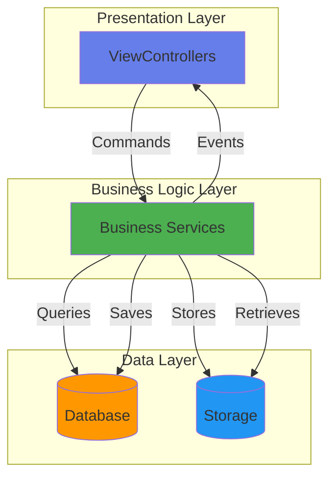
```mermaid
graph TB
    subgraph "Presentation Layer"
        UI[ViewControllers]
    end

    subgraph "Business Logic Layer"
        BL[Business Services]
    end

    subgraph "Data Layer"
        DB[(Database)]
        Storage[(Storage)]
    end

    UI -->|Commands| BL
    BL -->|Events| UI
    BL -->|Queries| DB
    BL -->|Saves| DB
    BL -->|Stores| Storage
    BL -->|Retrieves| Storage

    style UI fill:#667eea
    style BL fill:#4CAF50
    style DB fill:#FF9800
    style Storage fill:#2196F3
```

---

## Design Principles

### SOLID Principles

**Single Responsibility Principle (SRP)**

- Each service class has a single, well-defined responsibility

**Open/Closed Principle (OCP)**

- Services are open for extension through interfaces and inheritance

**Liskov Substitution Principle (LSP)**

- Interfaces can be substituted with implementations

**Interface Segregation Principle (ISP)**

- Focused interfaces (StorageProvider, EventStore, etc.)

**Dependency Inversion Principle (DIP)**

- Services depend on abstractions (interfaces) not concretions

---

## Statistics

| Category                | Count |
| ----------------------- | ----- |
| **Core Services**       | 15    |
| **Security Management** | 3     |
| **Recording/Streaming** | 3     |
| **Device Management**   | 3     |
| **User/Auth**           | 4     |
| **Notification**        | 1     |
| **Logging**             | 1     |

---

## Key Features

### ✅ Modularity

- Each service is independent and focused
- Clear boundaries between components
- Easy to test and maintain

### ✅ Scalability

- Services can be deployed independently
- Horizontal scaling support
- Load balancing ready

### ✅ Security

- Role-based access control
- Session management
- Audit logging

### ✅ Reliability

- Health monitoring
- Error handling
- Automatic recovery

### ✅ Performance

- Efficient caching
- Connection pooling
- Async operations

---

**Document Version:** 1.0.0  
**Last Updated:** 2025-11-11  
**Author:** SafeHome Development Team  
**Layer:** Business Logic Layer
