# SafeHome Business Logic Layer - Class Diagrams

> Detailed UML Class Diagrams for 11 Core Business Logic Components in the Backend Layer

## 📑 Table of Contents

- [Complete Business Logic Layer Integration Diagram](#complete-business-logic-layer-integration-diagram)
- [Security Management](#security-management)
  - [1. SecurityModeManager](#1-securitymodemanager)
  - [2. AlarmManager](#2-alarmmanager)
- [Recording & Streaming Management](#recording--streaming-management)
  - [3. RecordingManager](#3-recordingmanager)
  - [4. StreamingService](#4-streamingservice)
  - [5. PTZControlService](#5-ptzcontrolservice)
- [Notification Management](#notification-management)
  - [6. NotificationManager](#6-notificationmanager)
- [Device Management](#device-management)
  - [7. DeviceRegistry](#7-deviceregistry)
  - [8. DeviceHealthMonitor](#8-devicehealthmonitor)
  - [9. DeviceConfigService](#9-deviceconfigservice)
- [User & Authentication Management](#user--authentication-management)
  - [10. LoginManager](#10-loginmanager)
  - [11. UserPermissionManager](#11-userpermissionmanager)

---

## Complete Business Logic Layer Integration Diagram

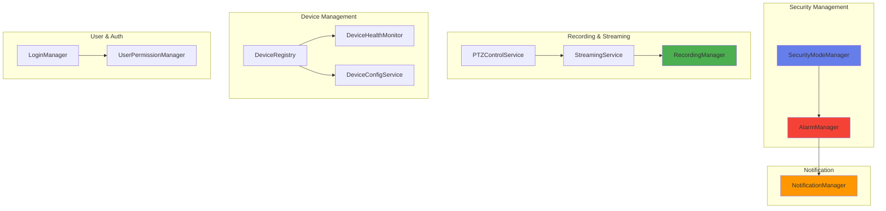

---

## Security Management

### 1. SecurityModeManager

**Responsibility:** Security mode and zone management, arming/disarming logic

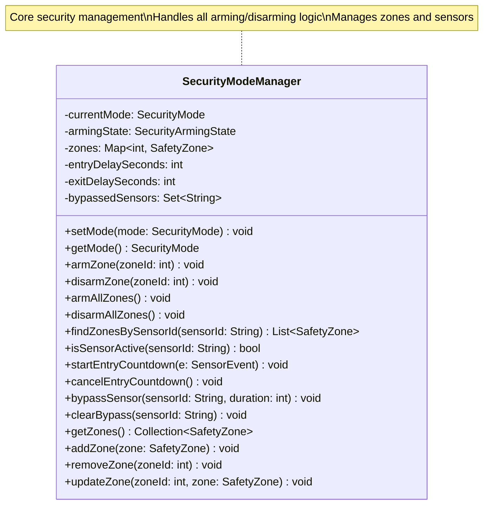

---

### 2. AlarmManager

**Responsibility:** Alarm triggering, verification, and escalation logic

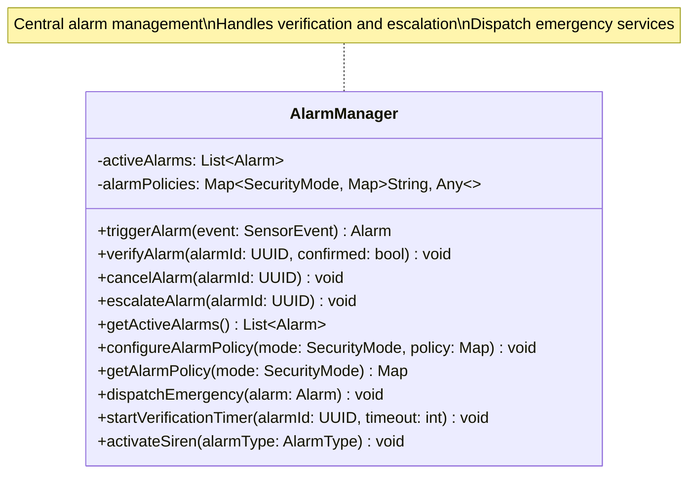

---

## Recording & Streaming Management

### 3. RecordingManager

**Responsibility:** Recording management, storage, search, and export

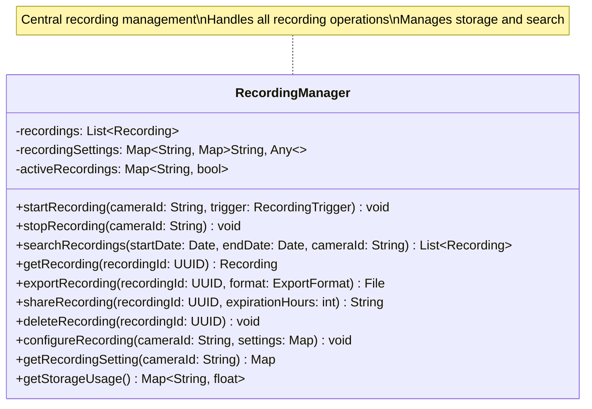

---

### 4. StreamingService

**Responsibility:** Camera streaming and session management (excluding PTZ)

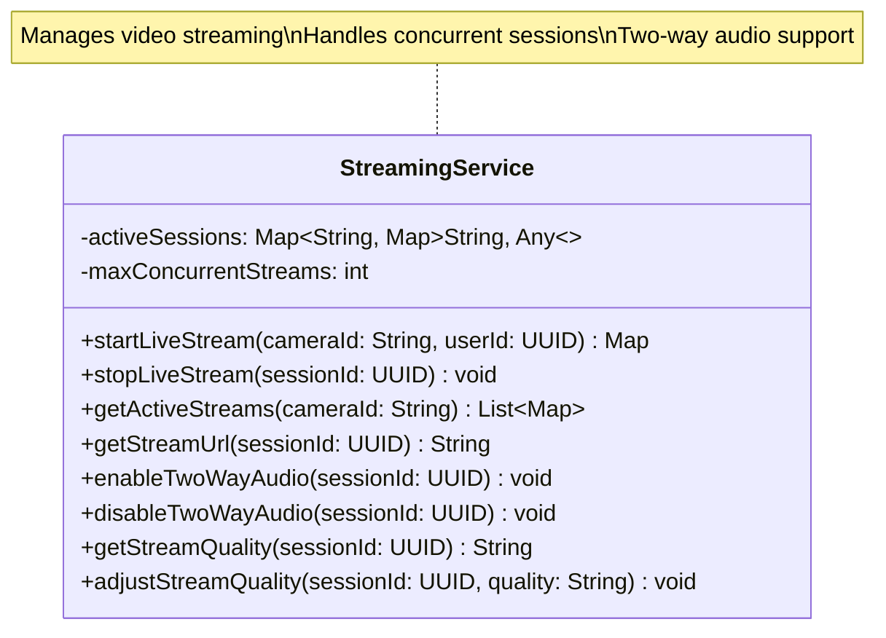

---

### 5. PTZControlService

**Responsibility:** PTZ control and lock management

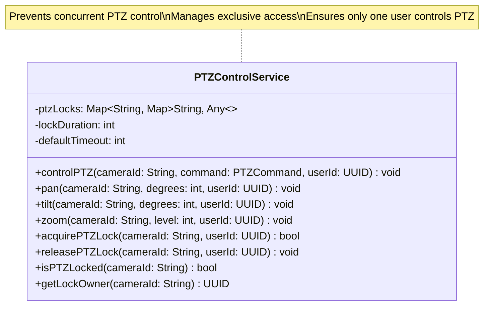

---

## Notification Management

### 6. NotificationManager

**Responsibility:** Notification sending, cooldown management, policy application

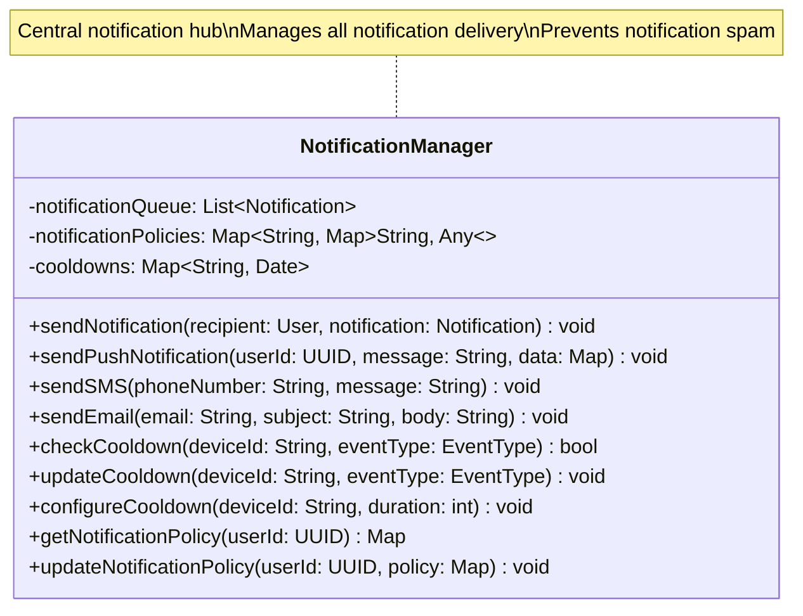

---

## Device Management

### 7. DeviceRegistry

**Responsibility:** Device registration and discovery

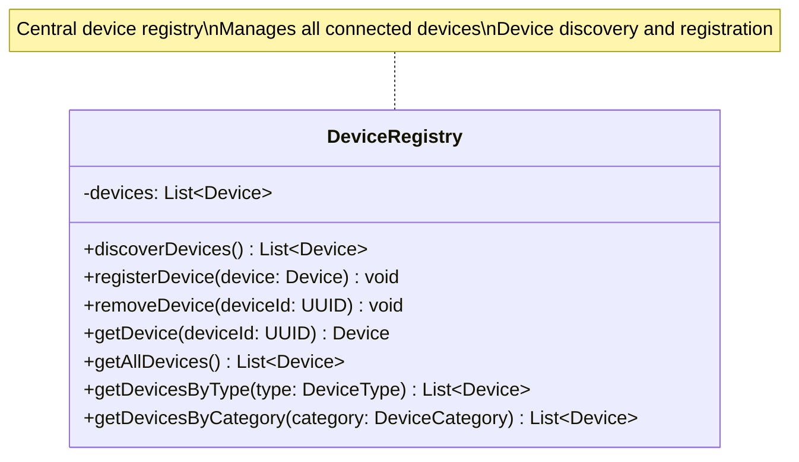

---

### 8. DeviceHealthMonitor

**Responsibility:** Device status monitoring and health checks

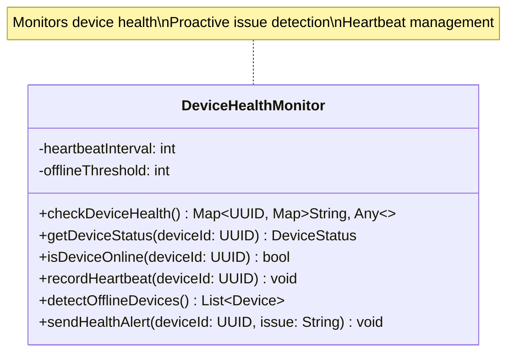

---

### 9. DeviceConfigService

**Responsibility:** Device configuration management

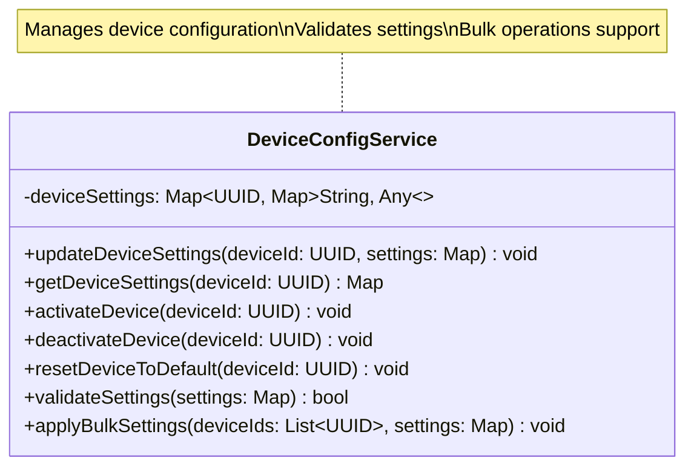

---

## User & Authentication Management

### 10. LoginManager

**Responsibility:** Login and logout processing

---

### 11. UserPermissionManager

**Responsibility:** User permission management and role-based access control

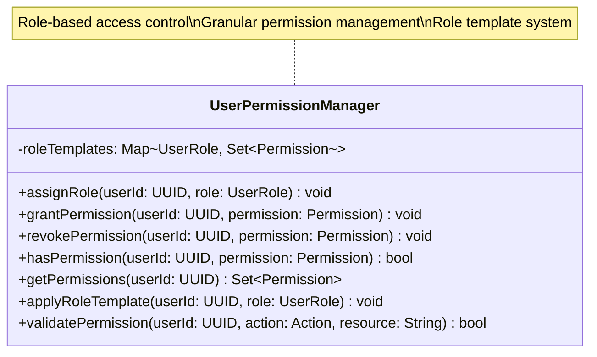

---

## Component Relationships

### Service Dependencies

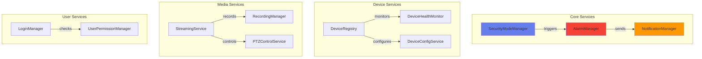

---

## Design Principles

### SOLID Principles

**Single Responsibility Principle (SRP)**

- Each service class has a single, well-defined responsibility

**Open/Closed Principle (OCP)**

- Services are open for extension through interfaces and inheritance

**Liskov Substitution Principle (LSP)**

- Interfaces can be substituted with implementations

**Interface Segregation Principle (ISP)**

- Focused interfaces for each service

**Dependency Inversion Principle (DIP)**

- Services depend on abstractions (interfaces) not concretions

---

## Statistics

| Category                | Count  |
| ----------------------- | ------ |
| **Core Services**       | 11     |
| **Security**            | 2      |
| **Recording/Streaming** | 3      |
| **Device Management**   | 3      |
| **Notification**        | 1      |
| **User/Auth**           | 2      |
| **Total Classes**       | **11** |

---

## Key Features

### ✅ Modularity

- Each service is independent and focused
- Clear boundaries between components
- Easy to test and maintain

### ✅ Scalability

- Services can be deployed independently
- Horizontal scaling support
- Load balancing ready

### ✅ Security

- Role-based access control
- Account lockout mechanism
- Audit logging support

### ✅ Reliability

- Health monitoring
- Error handling
- Automatic recovery

---

**Document Version:** 1.0.0  
**Last Updated:** 2025-11-11  
**Author:** SafeHome Development Team  
**Layer:** Business Logic Layer
