# SafeHome Data Layer - Class Diagrams

> Detailed UML Class Diagrams for 11 Domain Models in the Data Layer

## 📑 Table of Contents

- [Complete Data Layer Integration Diagram](#complete-data-layer-integration-diagram)
- [Core Entities](#core-entities)
  - [1. User](#1-user)
  - [2. Device (Abstract)](#2-device-abstract)
  - [3. Sensor (extends Device)](#3-sensor-extends-device)
  - [4. Camera (extends Device)](#4-camera-extends-device)
- [Supporting Entities](#supporting-entities)
  - [5. PTZControl](#5-ptzcontrol)
  - [6. Recording](#6-recording)
  - [7. Alarm](#7-alarm)
  - [8. SensorEvent](#8-sensorevent)
  - [9. Session](#9-session)
  - [10. Notification](#10-notification)
  - [11. SafetyZone](#11-safetyzone)
- [Device Hierarchy](#device-hierarchy)
- [Entity Relationships](#entity-relationships)

---

## Complete Data Layer Integration Diagram

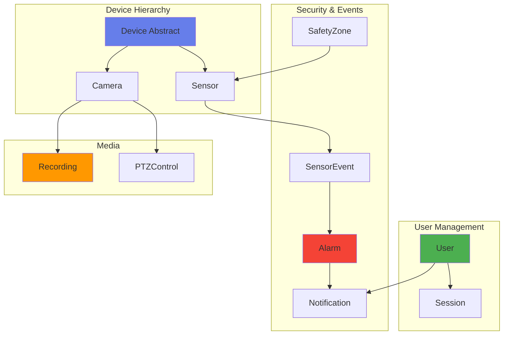

---

## Core Entities

### 1. User

**Responsibility:** User entity and profile information

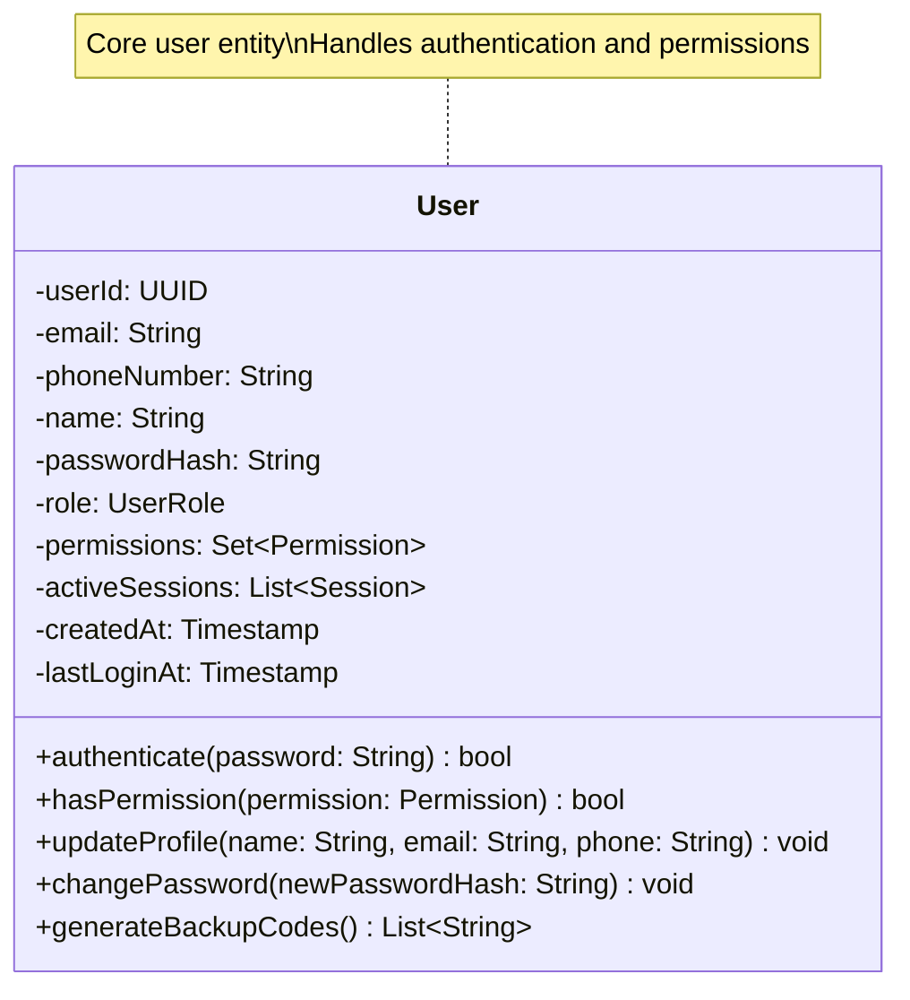

---

### 2. Device (Abstract)

**Responsibility:** Base device entity and common behaviors

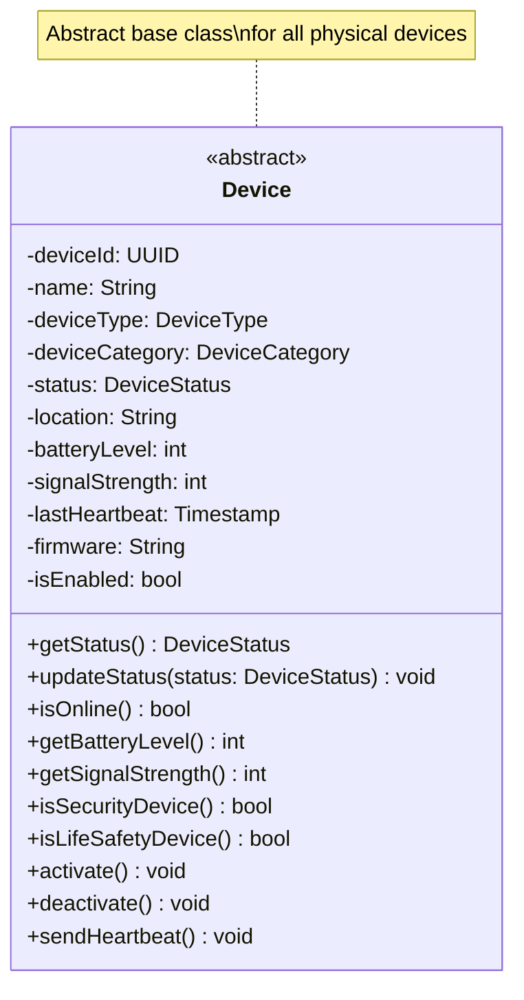

---

### 3. Sensor (extends Device)

**Responsibility:** Common sensor functionality and event detection

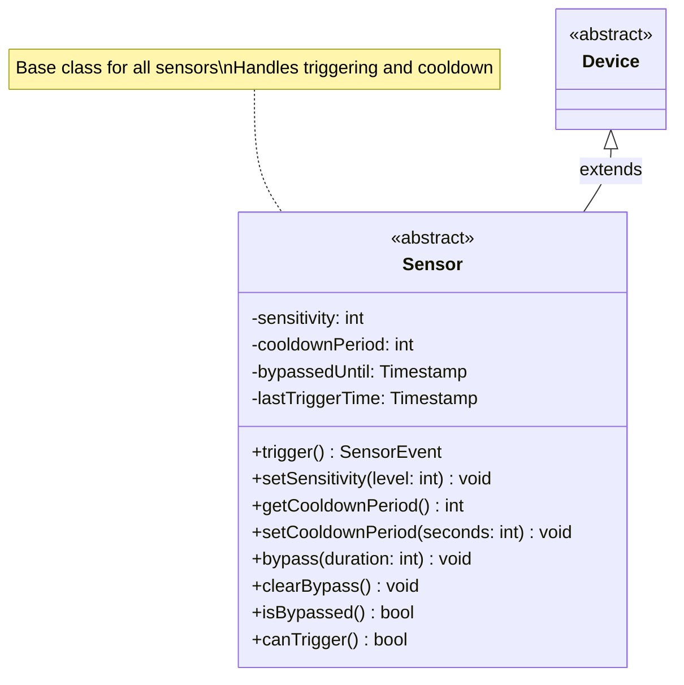

---

### 4. Camera (extends Device)

**Responsibility:** Camera functionality and streaming control

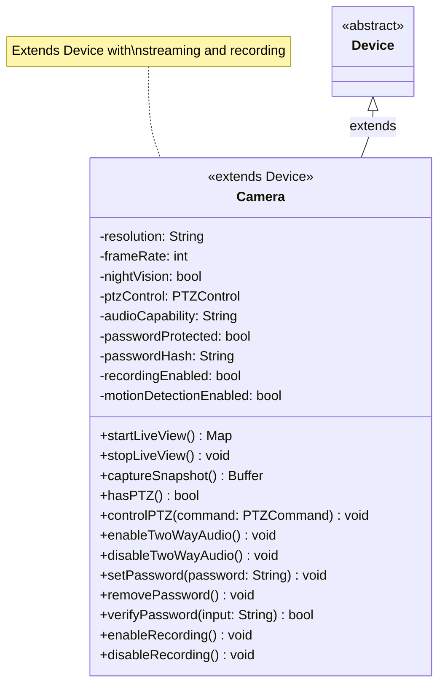

---

## Supporting Entities

### 5. PTZControl

**Responsibility:** Pan-Tilt-Zoom control and constraint management

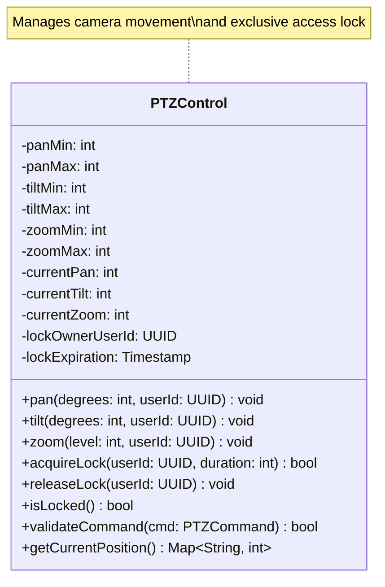

---

### 6. Recording

**Responsibility:** Recording metadata and file information

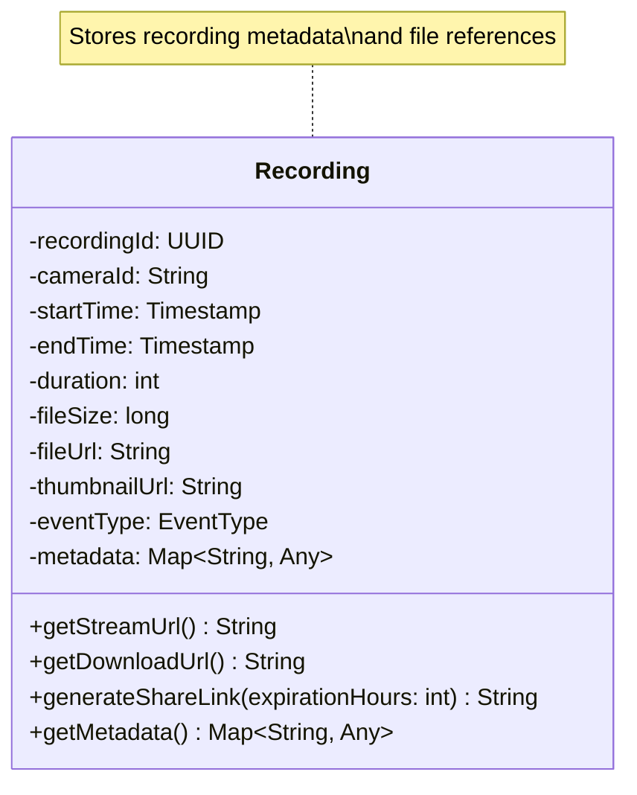

---

### 7. Alarm

**Responsibility:** Alarm state and history management

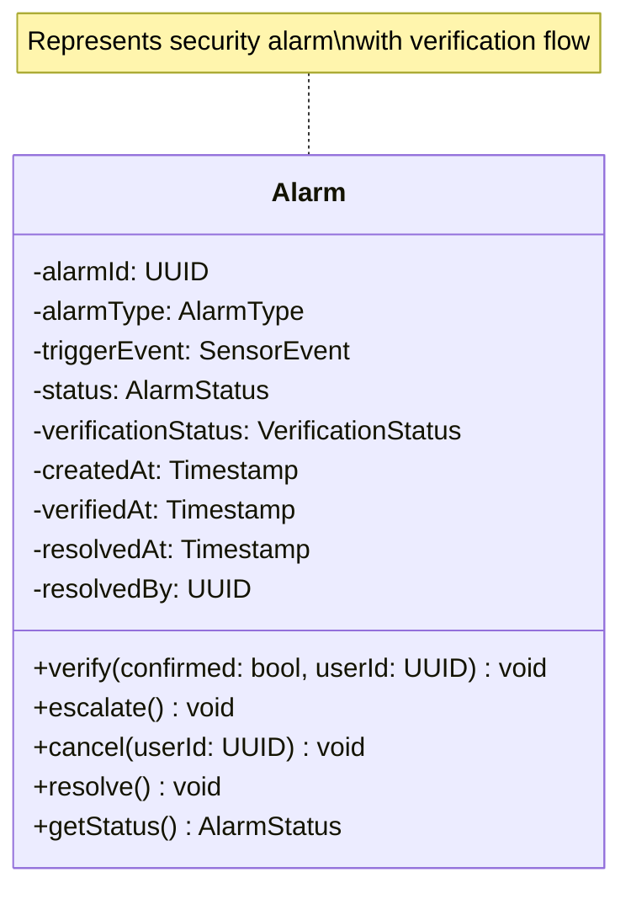

---

### 8. SensorEvent

**Responsibility:** Sensor event data

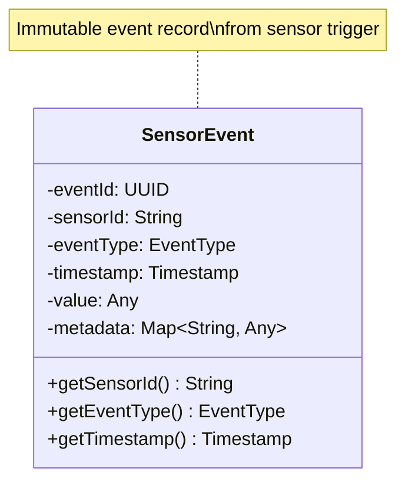

---

### 9. Session

**Responsibility:** User session information

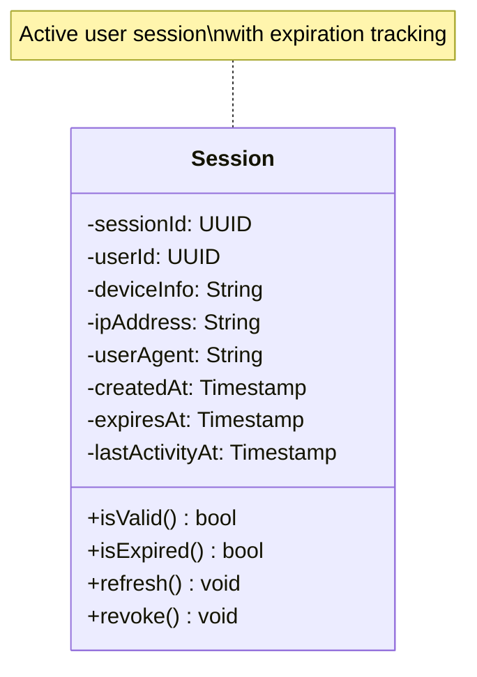

---

### 10. Notification

**Responsibility:** Notification message information

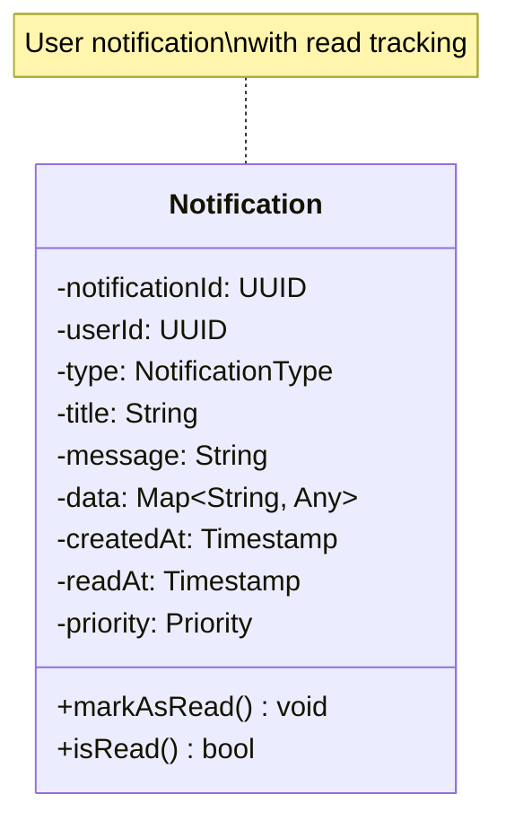

---

### 11. SafetyZone

**Responsibility:** Security zone definition and sensor membership management

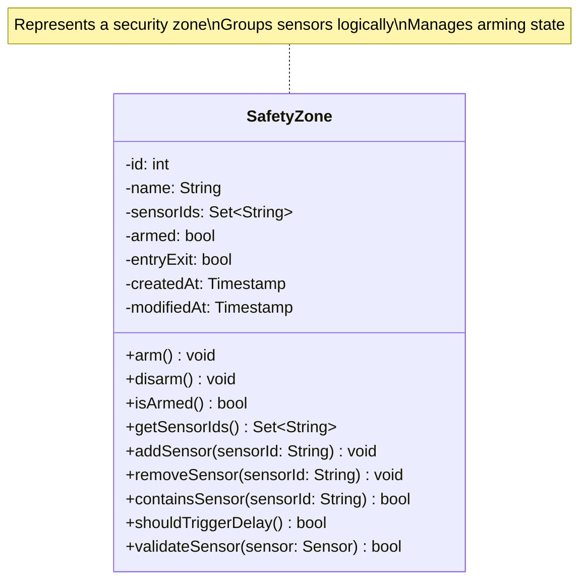

---

## Device Hierarchy

### Complete Device Class Hierarchy

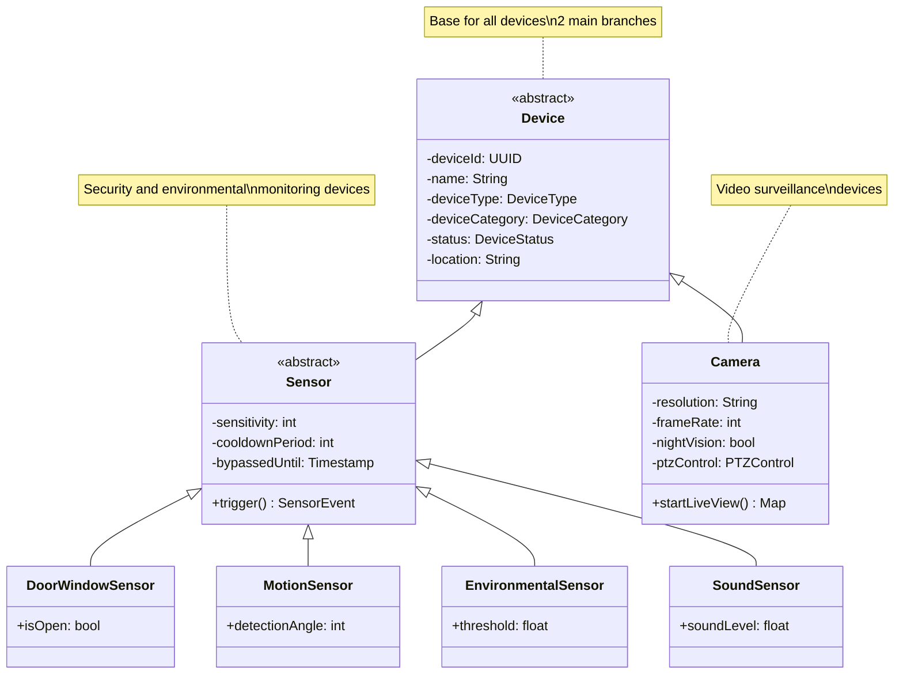

---

## Entity Relationships

### Core Entity Relationships

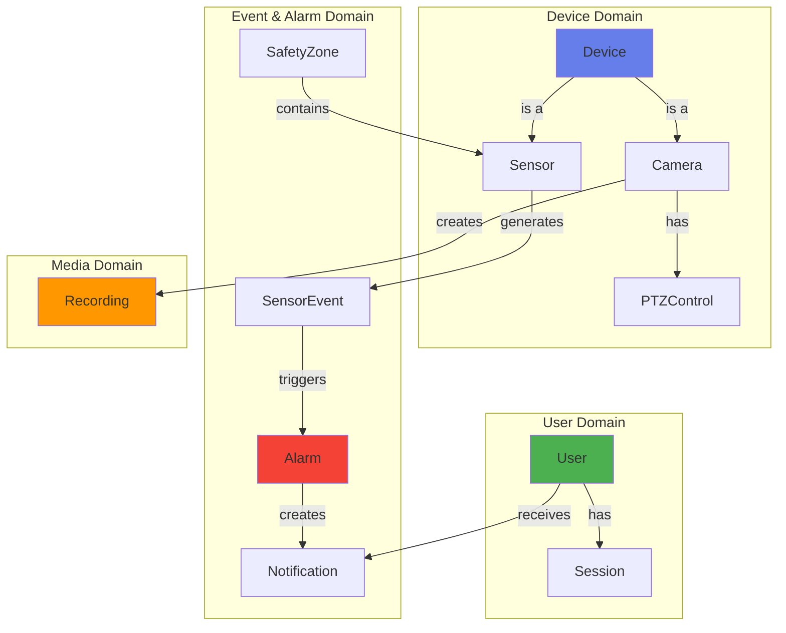

---

## Design Characteristics

### 1. Entity Relationships

**One-to-Many:**

- User → Session (one user can have multiple active sessions)
- User → Notification (one user receives many notifications)
- Camera → Recording (one camera creates many recordings)
- Sensor → SensorEvent (one sensor generates many events)
- SafetyZone → Sensor (one zone contains many sensors)

**One-to-One:**

- Camera → PTZControl (one camera has one PTZ control)
- Alarm → SensorEvent (one alarm is triggered by one event)

**Many-to-Many:**

- User → Permission (users can have multiple permissions)

### 2. Inheritance Hierarchy

```
Device (Abstract)
├── Sensor (Abstract)
│   ├── DoorWindowSensor
│   ├── MotionSensor
│   ├── EnvironmentalSensor
│   └── SoundSensor
└── Camera
```

---

## Enumerations Summary

| Enumeration            | Values                                                     | Usage                 |
| ---------------------- | ---------------------------------------------------------- | --------------------- |
| **UserRole**           | ADMIN, STANDARD, GUEST                                     | User access control   |
| **DeviceType**         | SENSOR, CAMERA, etc.                                       | Device categorization |
| **DeviceCategory**     | SECURITY, LIFE_SAFETY, ENVIRONMENT, AUTOMATION, MONITORING | Device grouping       |
| **DeviceStatus**       | ONLINE, OFFLINE, LOW_BATTERY, FAULT, MAINTENANCE           | Device state          |
| **EventType**          | DOOR_OPEN, WINDOW_OPEN, MOTION_DETECTED, etc.              | Event classification  |
| **AlarmType**          | INTRUSION, FIRE, CO, GAS_LEAK, WATER_LEAK, PANIC           | Alarm categorization  |
| **AlarmStatus**        | PENDING, VERIFIED, ESCALATED, CANCELLED, RESOLVED          | Alarm lifecycle       |
| **VerificationStatus** | PENDING, CONFIRMED, FALSE_ALARM, TIMEOUT                   | Alarm verification    |
| **NotificationType**   | ALARM, DEVICE_STATUS, RECORDING_READY, SYSTEM_UPDATE       | Notification type     |
| **Priority**           | LOW, MEDIUM, HIGH, CRITICAL                                | Importance level      |
| **PTZCommand**         | PAN_LEFT, PAN_RIGHT, TILT_UP, TILT_DOWN, ZOOM_IN, ZOOM_OUT | Camera control        |

---

## Statistics

| Category                  | Count  |
| ------------------------- | ------ |
| **Core Entities**         | 11     |
| **Abstract Classes**      | 2      |
| **Concrete Device Types** | 4+     |
| **Total Classes**         | **11** |

---

## Key Features

### ✅ Domain-Driven Design

- Clear entity boundaries
- Rich domain models
- Encapsulated business logic

### ✅ Type Safety

- Strong typing with enumerations
- Nullable types explicitly defined
- Simple value types (String, int, etc.)

### ✅ Extensibility

- Abstract base classes
- Well-defined inheritance hierarchy
- Open for extension

### ✅ Data Integrity

- Validation methods
- State management
- Timestamp tracking

### ✅ Persistence Ready

- Unique identifiers (UUID)
- Audit fields (createdAt, lastLoginAt)
- Simple relationship mappings

---

**Document Version:** 1.0.0  
**Last Updated:** 2025-11-11  
**Author:** SafeHome Development Team  
**Layer:** Data Layer (Domain Models)
