# SafeHome Data Layer - Class Diagrams

> Detailed UML Class Diagrams for Domain Models in the Data Layer

## 📑 Table of Contents

- [Complete Data Layer Integration Diagram](#complete-data-layer-integration-diagram)
- [Core Entities](#core-entities)
  - [1. User](#1-user)
  - [2. Device (Abstract)](#2-device-abstract)
  - [3. Sensor (extends Device)](#3-sensor-extends-device)
  - [4. Camera (extends Device)](#4-camera-extends-device)
- [Supporting Entities](#supporting-entities)
  - [5. PTZControl](#5-ptzcontrol)
  - [6. Recording](#6-recording)
  - [7. Alarm](#7-alarm)
  - [8. SensorEvent](#8-sensorevent)
  - [9. Session](#9-session)
  - [10. Notification](#10-notification)
- [Device Hierarchy](#device-hierarchy)
- [Entity Relationships](#entity-relationships)

---

## Complete Data Layer Integration Diagram

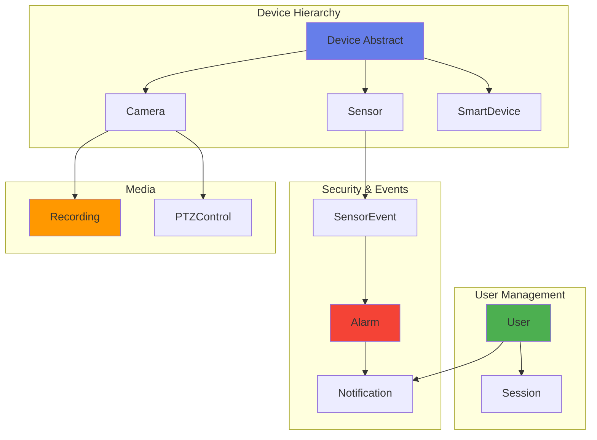

---

## Core Entities

### 1. User

**Responsibility:** User entity and profile information

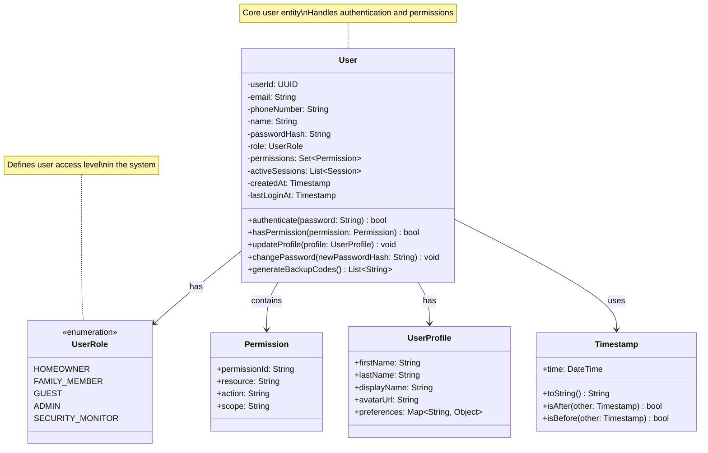

---

### 2. Device (Abstract)

**Responsibility:** Base device entity and common behaviors

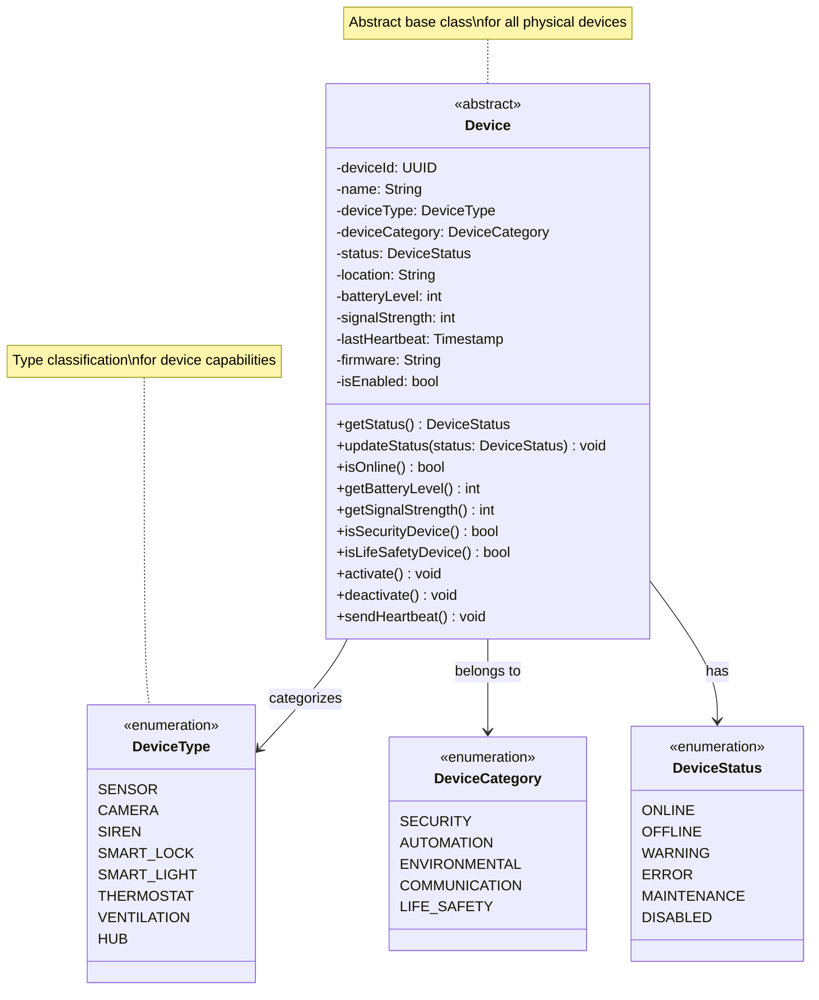

---

### 3. Sensor (extends Device)

**Responsibility:** Common sensor functionality and event detection

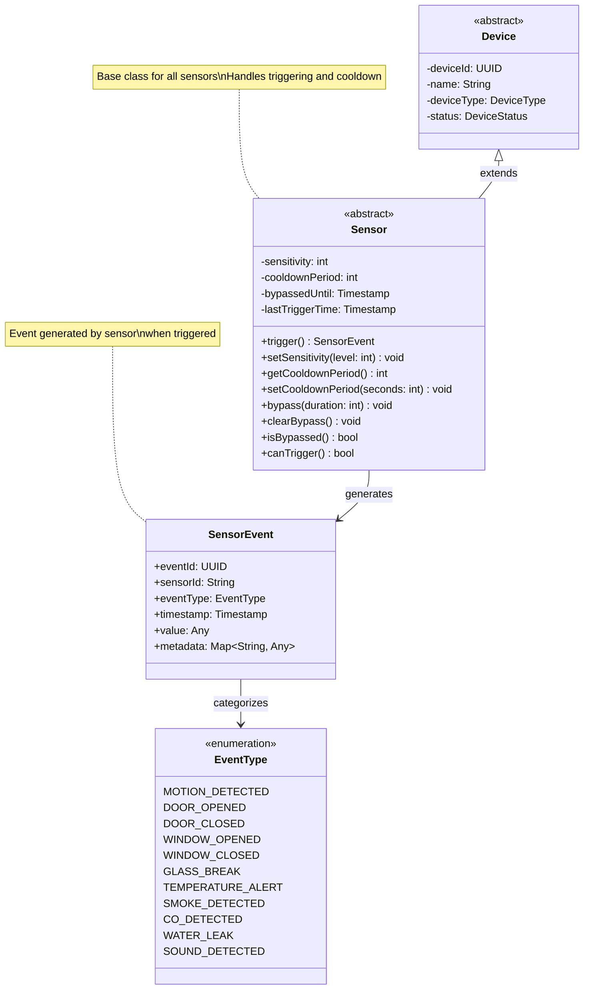

---

### 4. Camera (extends Device)

**Responsibility:** Camera functionality and streaming control

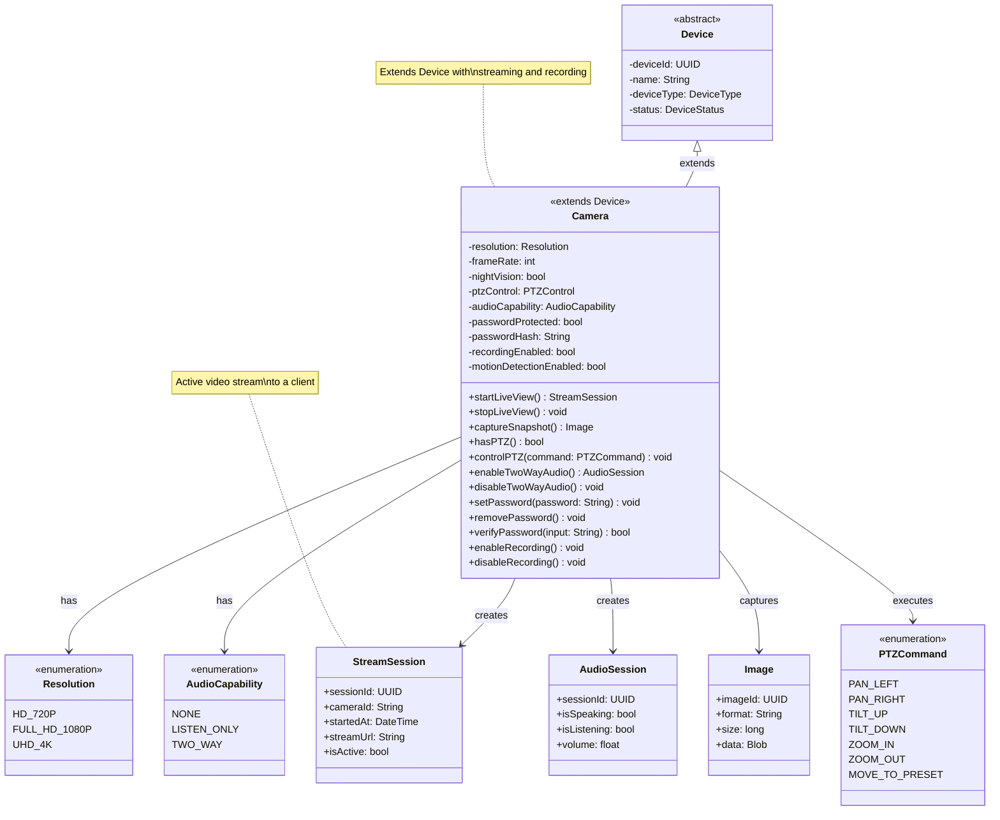

---

## Supporting Entities

### 5. PTZControl

**Responsibility:** Pan-Tilt-Zoom control and constraint management

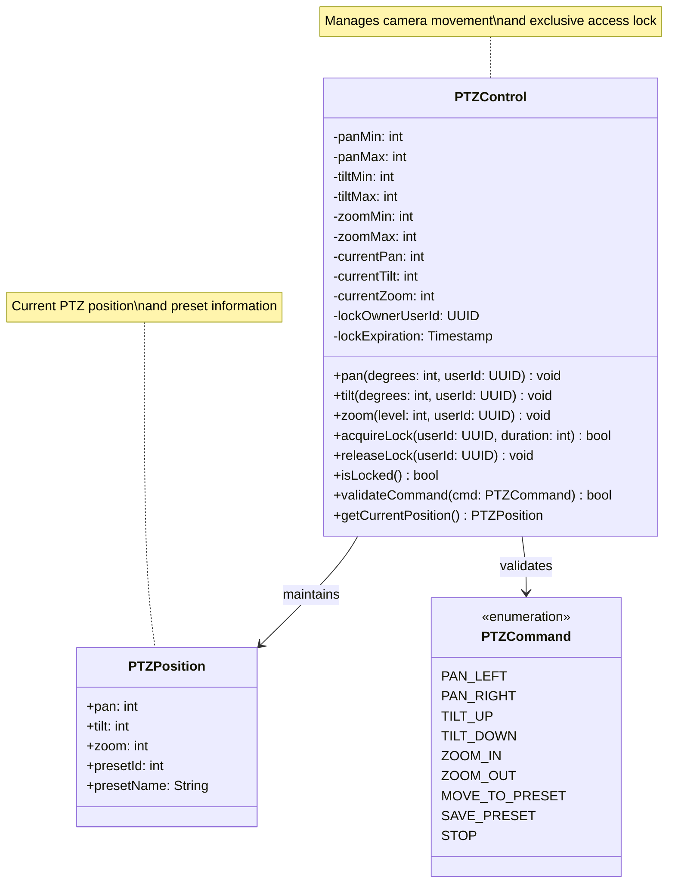

---

### 6. Recording

**Responsibility:** Recording metadata and file information

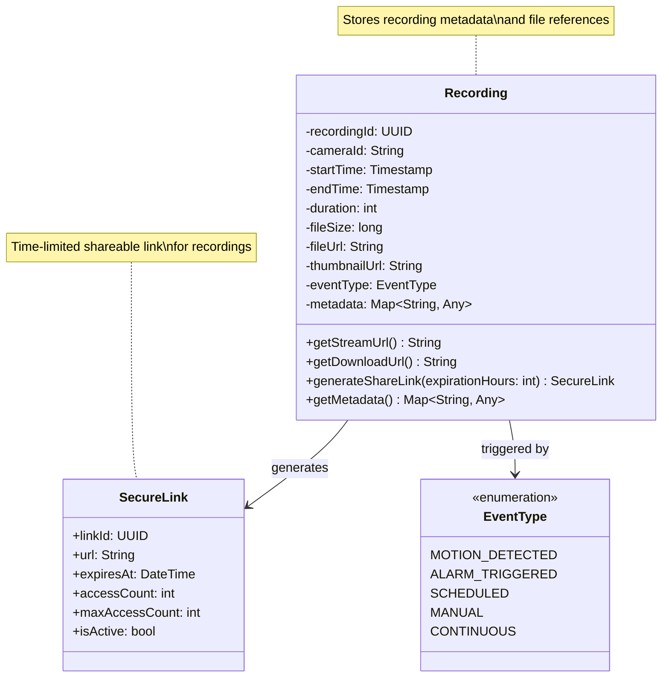

---

### 7. Alarm

**Responsibility:** Alarm state and history management

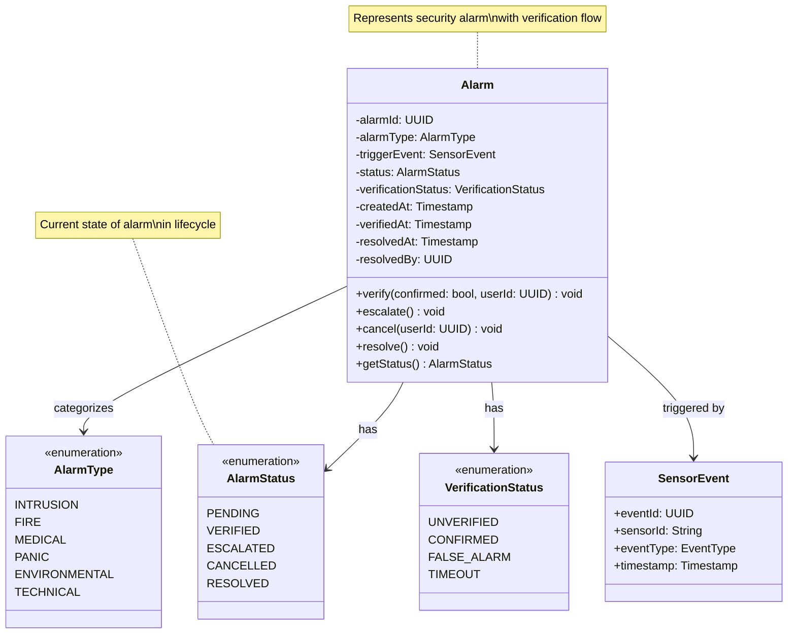

---

### 8. SensorEvent

**Responsibility:** Sensor event data

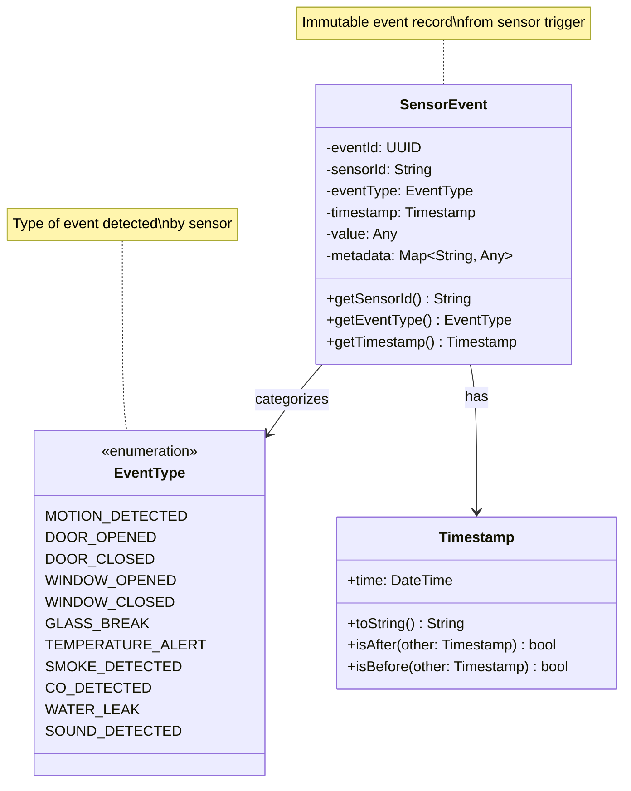

---

### 9. Session

**Responsibility:** User session information

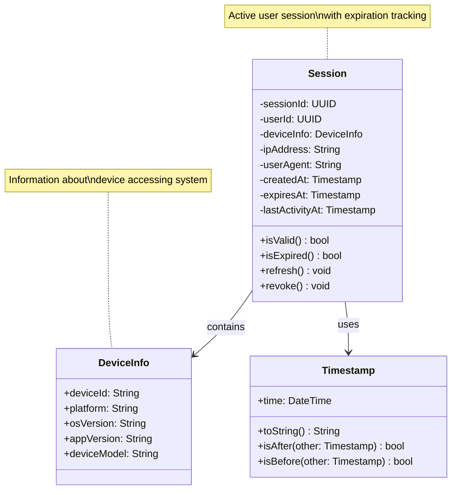

---

### 10. Notification

**Responsibility:** Notification message information

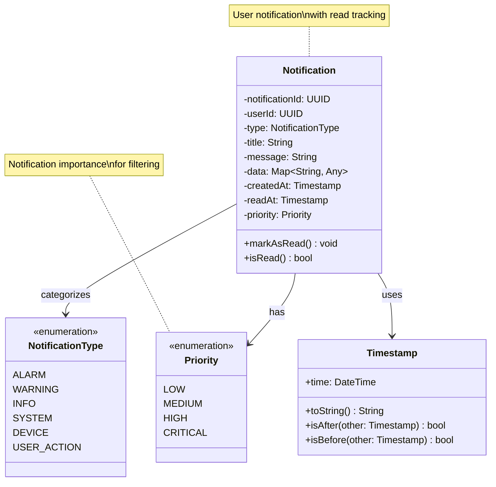

---

## Device Hierarchy

### Complete Device Class Hierarchy

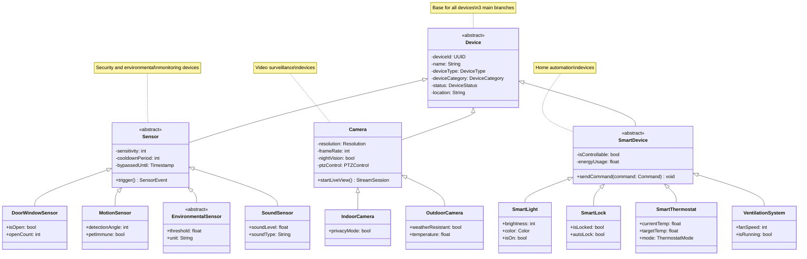

---

## Entity Relationships

### Core Entity Relationships

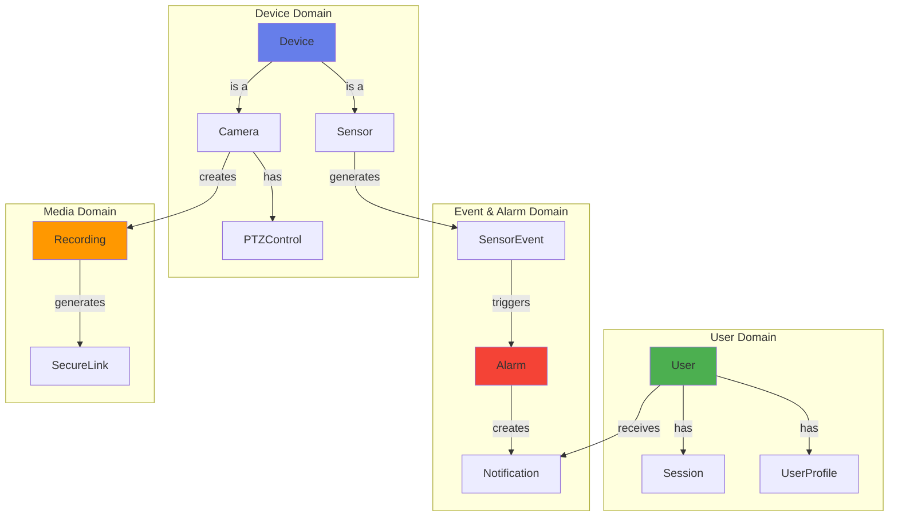

### Data Flow Diagram

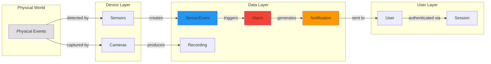

---

## Design Characteristics

### 1. Entity Relationships

**One-to-Many:**

- User → Session (one user can have multiple active sessions)
- User → Notification (one user receives many notifications)
- Camera → Recording (one camera creates many recordings)
- Sensor → SensorEvent (one sensor generates many events)

**One-to-One:**

- Camera → PTZControl (one camera has one PTZ control)
- Alarm → SensorEvent (one alarm is triggered by one event)

**Many-to-Many:**

- User → Permission (users can have multiple permissions)

### 2. Inheritance Hierarchy

```
Device (Abstract)
├── Sensor (Abstract)
│   ├── DoorWindowSensor
│   ├── MotionSensor
│   ├── EnvironmentalSensor (Abstract)
│   └── SoundSensor
├── Camera
│   ├── IndoorCamera
│   └── OutdoorCamera
└── SmartDevice (Abstract)
    ├── SmartLight
    ├── SmartLock
    ├── SmartThermostat
    └── VentilationSystem
```

### 3. Key Patterns

**Value Objects:**

- Timestamp
- Resolution
- PTZPosition
- DeviceInfo

**Entities:**

- User
- Device (and all subclasses)
- Alarm
- Recording
- Session

**Domain Events:**

- SensorEvent
- Notification

---

## Enumerations Summary

| Enumeration            | Values                                                                       | Usage                 |
| ---------------------- | ---------------------------------------------------------------------------- | --------------------- |
| **UserRole**           | HOMEOWNER, FAMILY_MEMBER, GUEST, ADMIN, SECURITY_MONITOR                     | User access control   |
| **DeviceType**         | SENSOR, CAMERA, SIREN, SMART_LOCK, SMART_LIGHT, THERMOSTAT, VENTILATION, HUB | Device categorization |
| **DeviceCategory**     | SECURITY, AUTOMATION, ENVIRONMENTAL, COMMUNICATION, LIFE_SAFETY              | Device grouping       |
| **DeviceStatus**       | ONLINE, OFFLINE, WARNING, ERROR, MAINTENANCE, DISABLED                       | Device state          |
| **EventType**          | MOTION_DETECTED, DOOR_OPENED, GLASS_BREAK, etc.                              | Event classification  |
| **AlarmType**          | INTRUSION, FIRE, MEDICAL, PANIC, ENVIRONMENTAL, TECHNICAL                    | Alarm categorization  |
| **AlarmStatus**        | PENDING, VERIFIED, ESCALATED, CANCELLED, RESOLVED                            | Alarm lifecycle       |
| **VerificationStatus** | UNVERIFIED, CONFIRMED, FALSE_ALARM, TIMEOUT                                  | Alarm verification    |
| **NotificationType**   | ALARM, WARNING, INFO, SYSTEM, DEVICE, USER_ACTION                            | Notification type     |
| **Priority**           | LOW, MEDIUM, HIGH, CRITICAL                                                  | Importance level      |
| **Resolution**         | HD_720P, FULL_HD_1080P, UHD_4K                                               | Video quality         |
| **AudioCapability**    | NONE, LISTEN_ONLY, TWO_WAY                                                   | Audio features        |
| **PTZCommand**         | PAN_LEFT, PAN_RIGHT, TILT_UP, etc.                                           | Camera control        |

---

## Statistics

| Category                    | Count  |
| --------------------------- | ------ |
| **Core Entities**           | 10     |
| **Abstract Classes**        | 4      |
| **Concrete Device Classes** | 12     |
| **Enumerations**            | 13     |
| **Value Objects**           | 8      |
| **Total Classes**           | **37** |

---

## Key Features

### ✅ Domain-Driven Design

- Clear entity boundaries
- Rich domain models
- Encapsulated business logic

### ✅ Type Safety

- Strong typing with enumerations
- Nullable types explicitly defined
- Value objects for complex types

### ✅ Extensibility

- Abstract base classes
- Well-defined inheritance hierarchy
- Open for extension

### ✅ Data Integrity

- Validation methods
- State management
- Timestamp tracking

### ✅ Persistence Ready

- Unique identifiers (UUID)
- Audit fields (createdAt, updatedAt)
- Relationship mappings

---

**Document Version:** 1.0.0  
**Last Updated:** 2025-11-11  
**Author:** SafeHome Development Team  
**Layer:** Data Layer (Domain Models)
