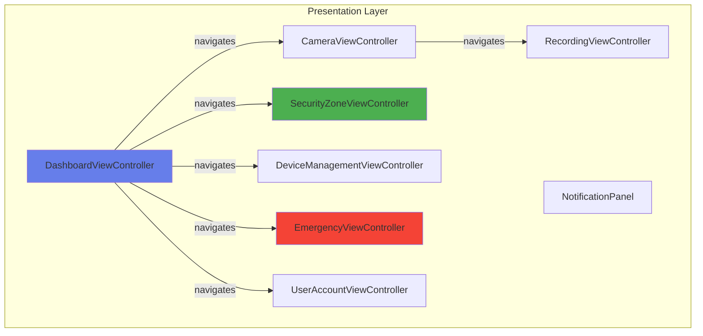
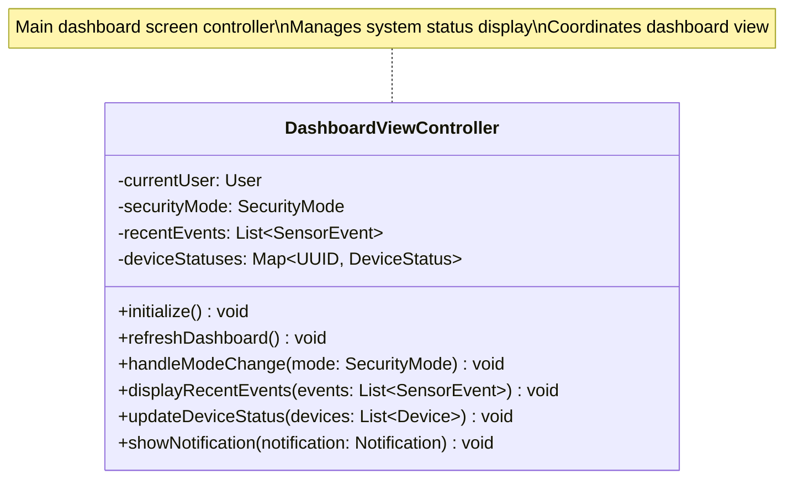
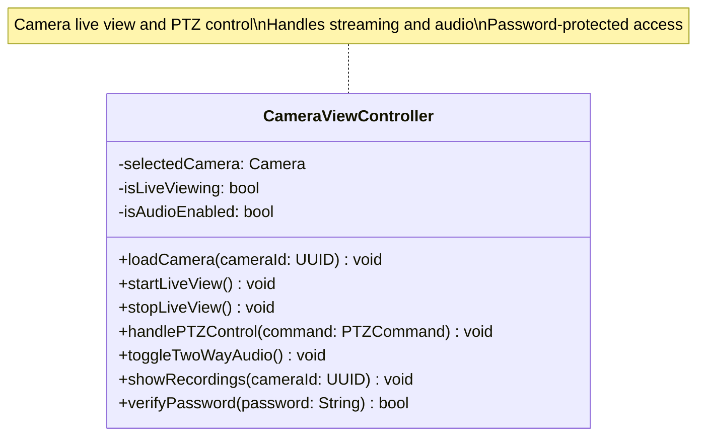
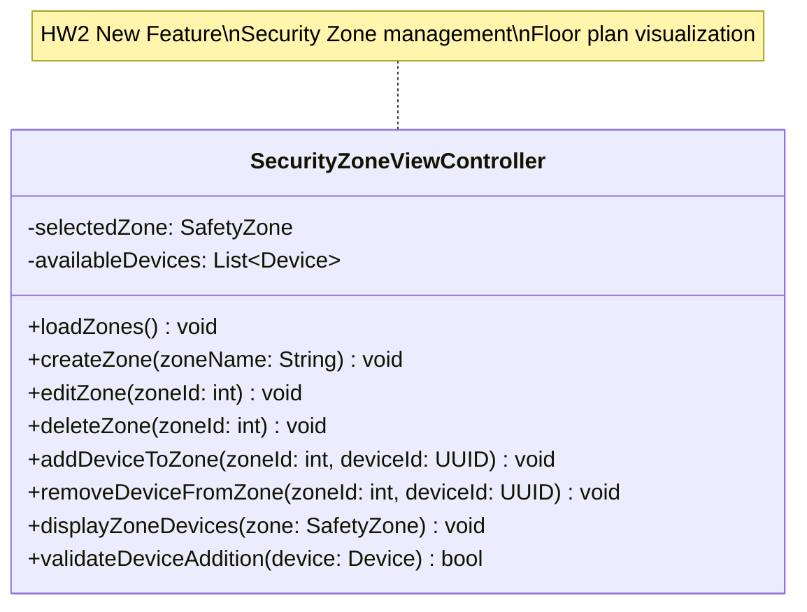
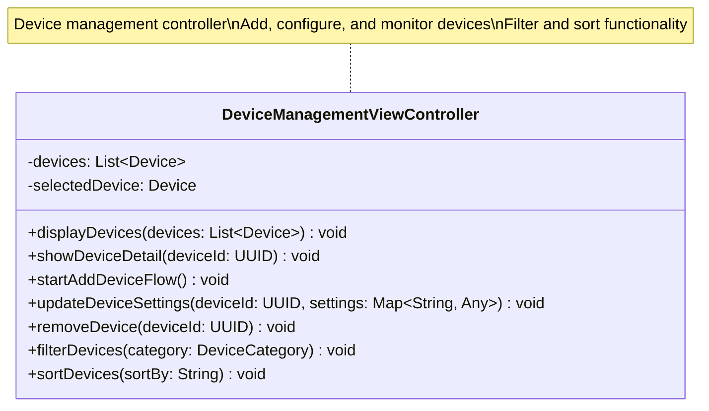
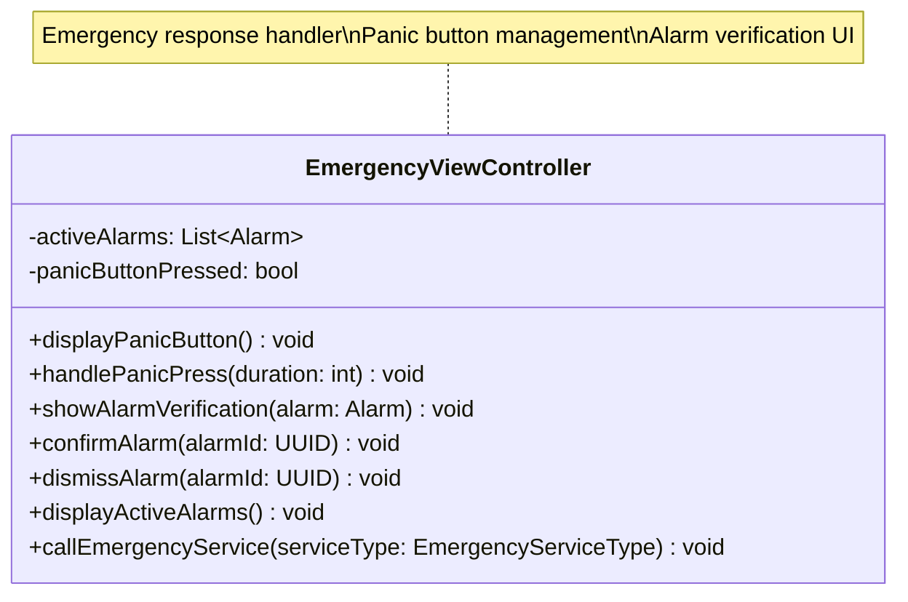
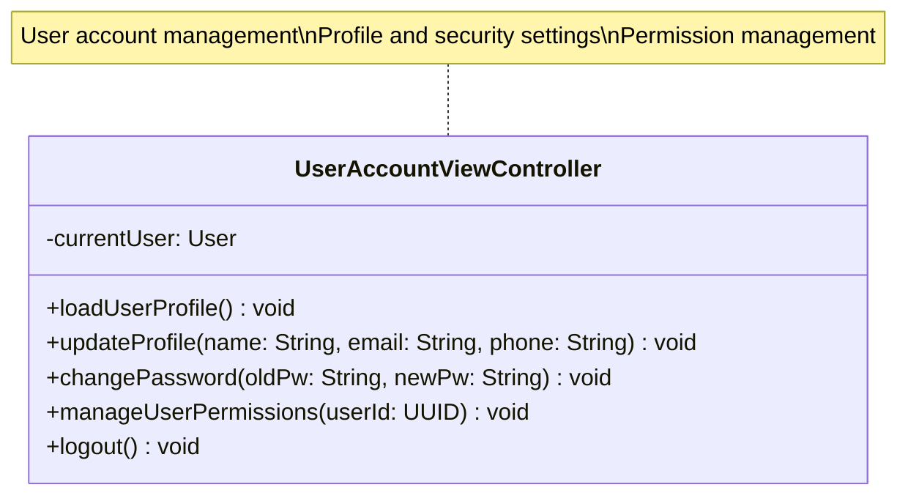
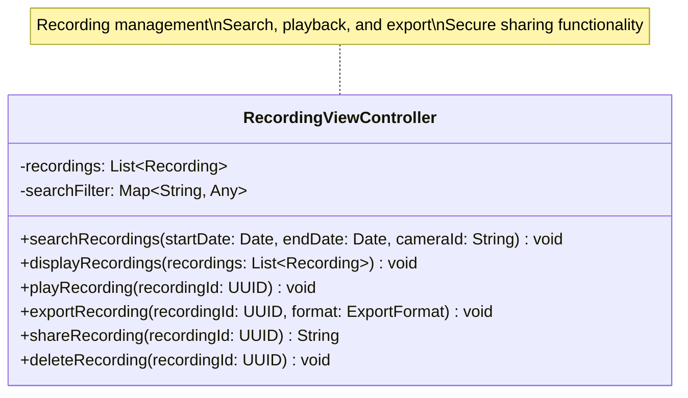
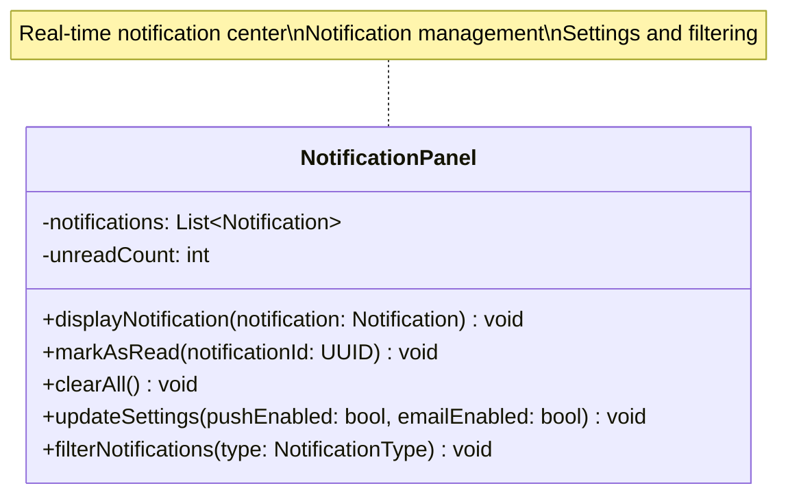
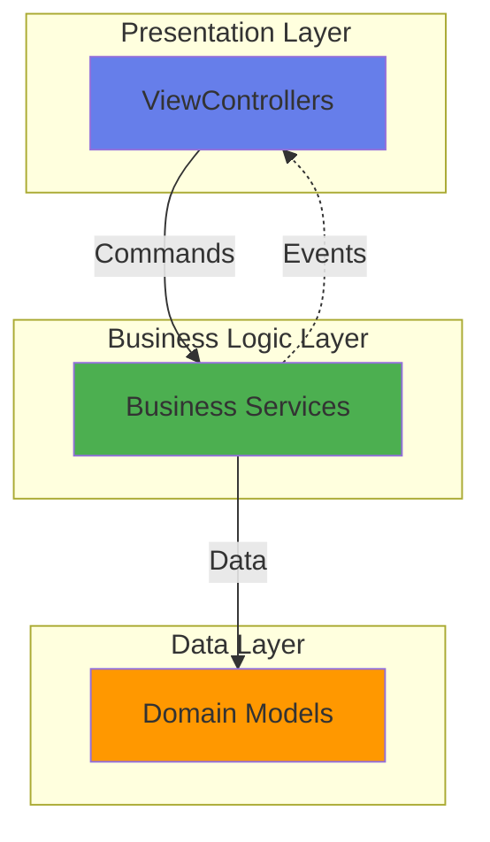

# SafeHome Presentation Layer - Class Diagrams

> Detailed UML Class Diagrams for 8 ViewControllers and Components in the Presentation Layer

## 📑 Table of Contents

- [Complete Presentation Layer Integration Diagram](#complete-presentation-layer-integration-diagram)
- [1. DashboardViewController](#1-dashboardviewcontroller)
- [2. CameraViewController](#2-cameraviewcontroller)
- [3. SecurityZoneViewController](#3-securityzoneviewcontroller)
- [4. DeviceManagementViewController](#4-devicemanagementviewcontroller)
- [5. EmergencyViewController](#5-emergencyviewcontroller)
- [6. UserAccountViewController](#6-useraccountviewcontroller)
- [7. RecordingViewController](#7-recordingviewcontroller)
- [8. NotificationPanel](#8-notificationpanel)

---

## Complete Presentation Layer Integration Diagram

---

## 1. DashboardViewController

**Purpose:** Main dashboard screen controller and state management

---

## 2. CameraViewController

**Purpose:** Camera live view, recording playback, PTZ control UI

---

## 3. SecurityZoneViewController

**Purpose:** Security Zone configuration and management UI

---

## 4. DeviceManagementViewController

**Purpose:** Device registration, configuration, status monitoring UI

---

## 5. EmergencyViewController

**Purpose:** Emergency response UI (Panic Button, Alarm Verification)

---

## 6. UserAccountViewController

**Purpose:** User account management and settings UI

---

## 7. RecordingViewController

**Purpose:** Recording search, playback, and export UI

---

## 8. NotificationPanel

**Purpose:** Real-time notification display and management

---

## Layer Architecture

---

## Design Patterns

### MVC (Model-View-Controller) Pattern

- **ViewController**: Handles user input and coordinates view updates
- **Business Logic**: Service layer processing
- **Model**: Domain objects from Data Layer

### Command Pattern

- User actions encapsulated as commands
- Separation of UI and business logic

---

## Key Principles

### ✅ Separation of Concerns

- Each ViewController has single responsibility
- Clear separation between UI and business logic

### ✅ Low Coupling

- ViewControllers depend on service interfaces
- Minimal direct dependencies

### ✅ High Cohesion

- Related functionality grouped together
- Clear boundaries between controllers

---

## Statistics

| Category           | Count |
| ------------------ | ----- |
| **ViewController** | 7     |
| **Component**      | 1     |
| **Total Classes**  | **8** |

---

**Document Version:** 1.0.0  
**Last Updated:** 2025-11-11  
**Author:** SafeHome Development Team  
**Layer:** Presentation Layer
