# SafeHome Presentation Layer - Class Diagrams

> Detailed UML Class Diagrams for 8 Core ViewControllers and Components in the Presentation Layer

## 📑 Table of Contents

- [Complete Presentation Layer Integration Diagram](#complete-presentation-layer-integration-diagram)
- [1. DashboardViewController](#1-dashboardviewcontroller)
- [2. CameraViewController](#2-cameraviewcontroller)
- [3. SecurityZoneViewController](#3-securityzoneviewcontroller)
- [4. DeviceManagementViewController](#4-devicemanagementviewcontroller)
- [5. EmergencyViewController](#5-emergencyviewcontroller)
- [6. UserAccountViewController](#6-useraccountviewcontroller)
- [7. RecordingViewController](#7-recordingviewcontroller)
- [8. NotificationPanel](#8-notificationpanel)
- [Class Relationships and Interactions](#class-relationships-and-interactions)

---

## Complete Presentation Layer Integration Diagram

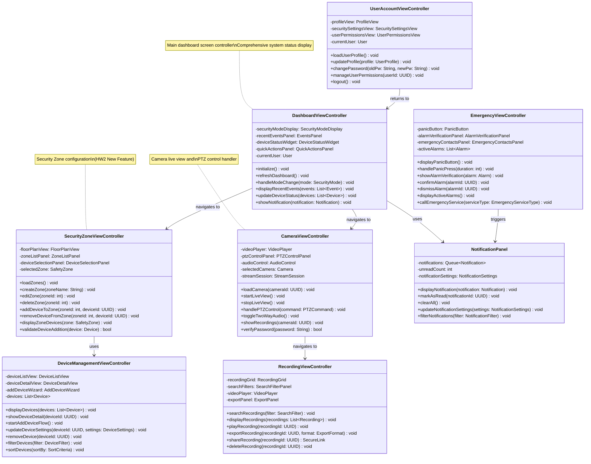

---

## 1. DashboardViewController

**Responsibility:** Main dashboard screen control and status management

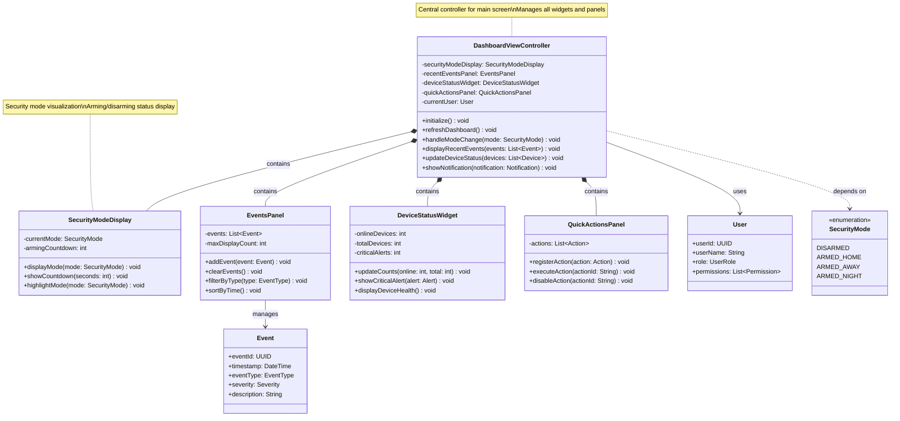

---

## 2. CameraViewController

**Responsibility:** Camera live view, recording playback, PTZ control UI

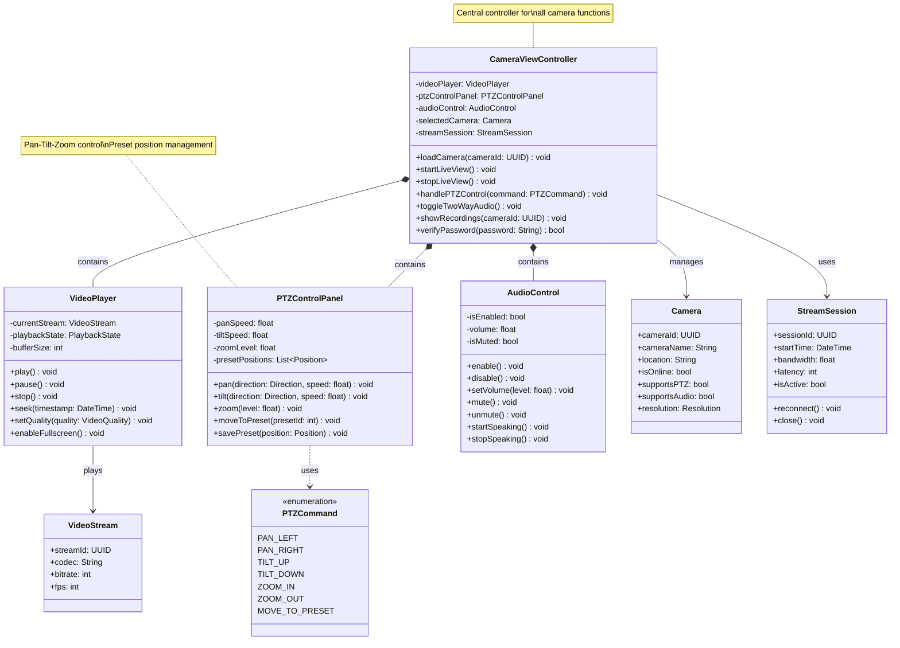

---

## 3. SecurityZoneViewController

**Responsibility:** Security Zone configuration and management UI (HW2 New Feature)

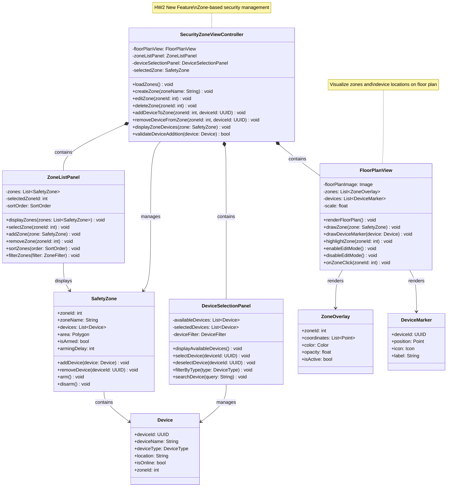

---

## 4. DeviceManagementViewController

**Responsibility:** Device addition, configuration, and status monitoring UI

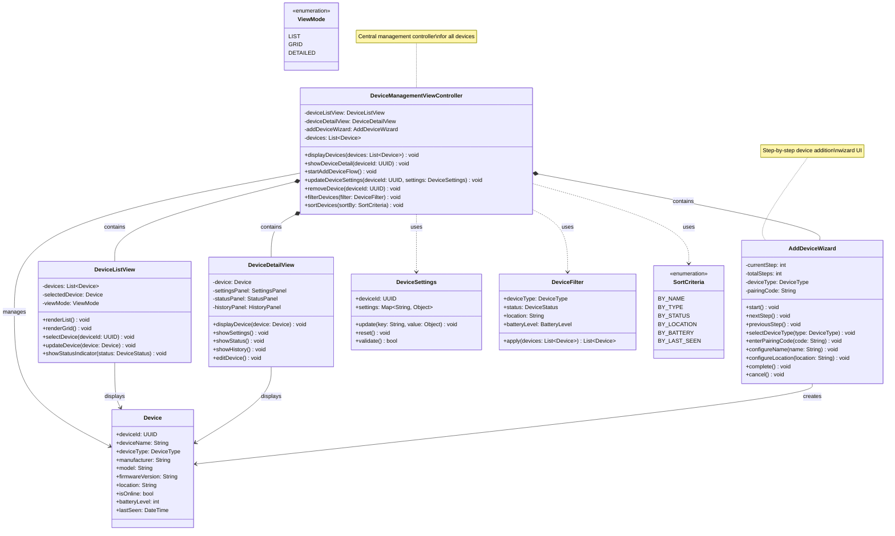

---

## 5. EmergencyViewController

**Responsibility:** Emergency response UI (Panic Button, Alarm Verification)

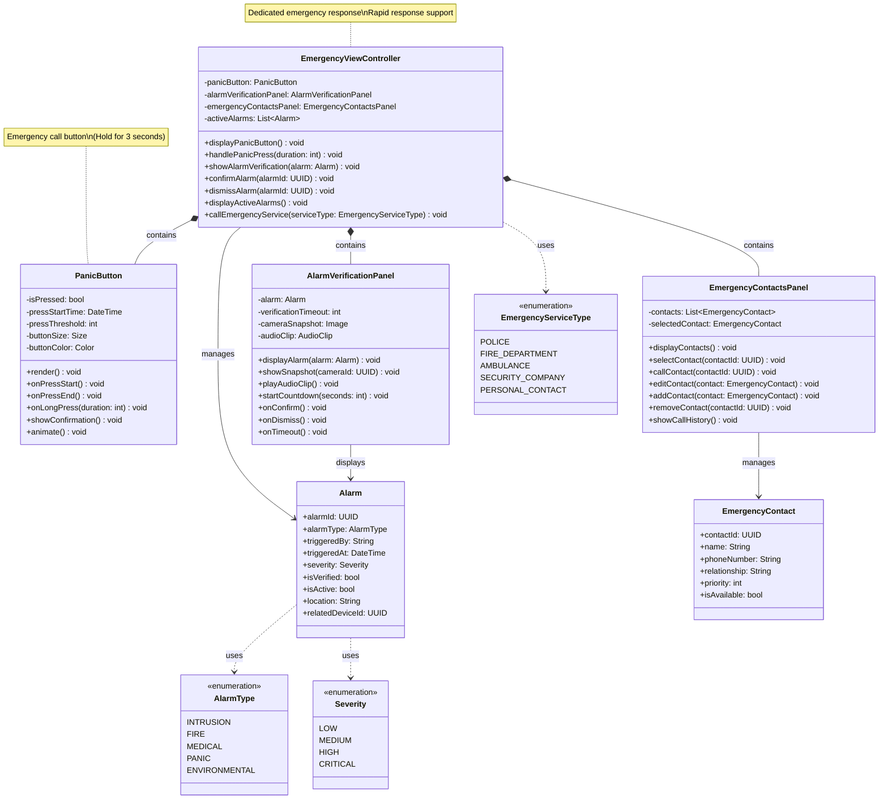

---

## 6. UserAccountViewController

**Responsibility:** User account management and settings UI

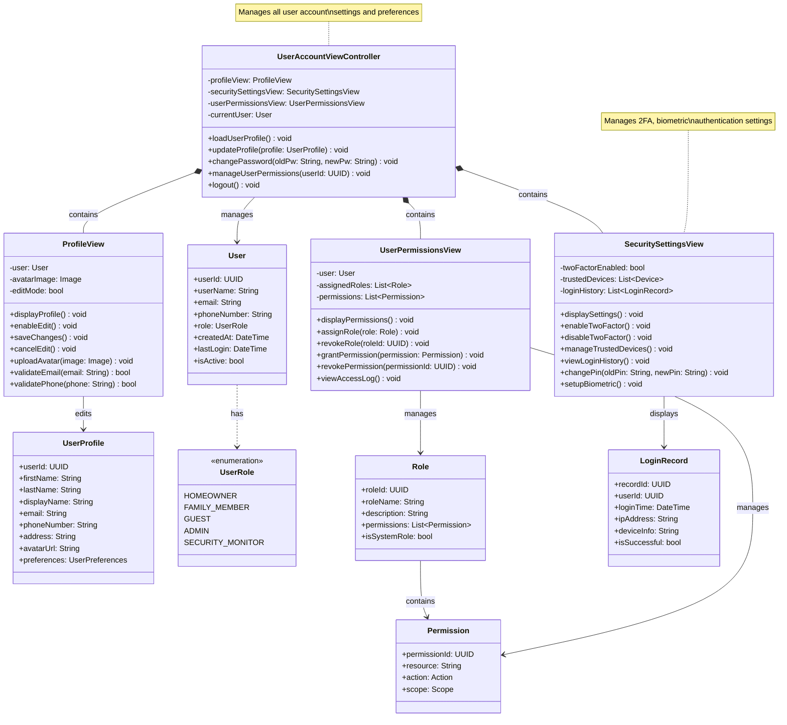

---

## 7. RecordingViewController

**Responsibility:** Recording search, playback, and export UI

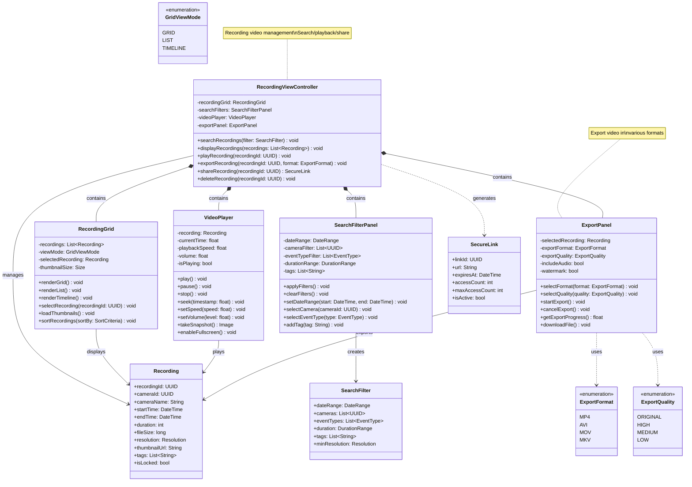

---

## 8. NotificationPanel

**Responsibility:** Real-time notification display and management

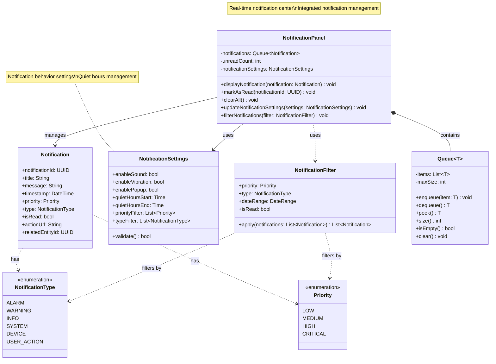

---

## Class Relationships and Interactions

### Main Navigation Flow

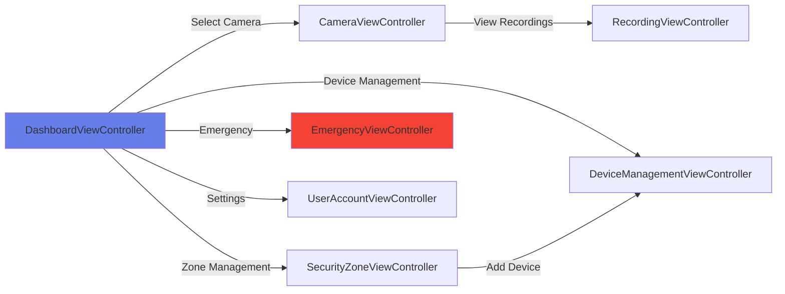

### Data Flow

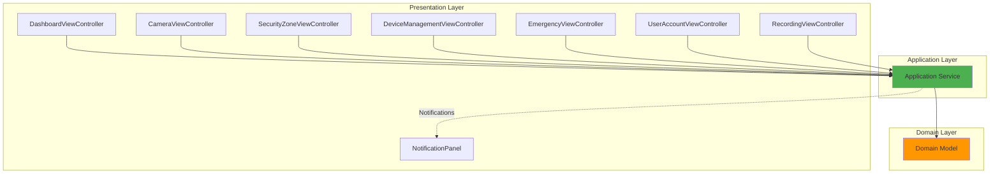

### Component Dependencies

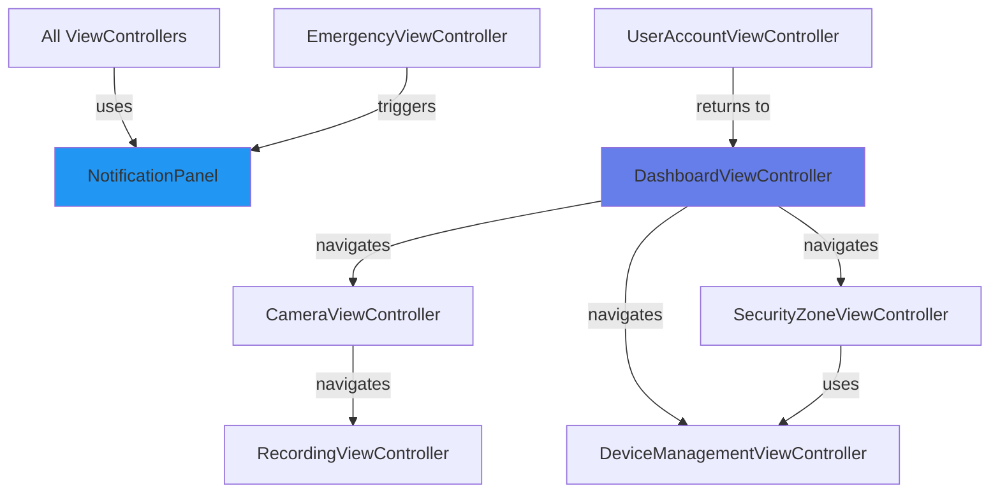

---

## Design Patterns and Principles

### 1. MVC (Model-View-Controller) Pattern

- **ViewController**: Handles user input and coordinates view updates
- **View Components**: UI rendering (Panel, Grid, Player, etc.)
- **Model**: Domain objects (User, Device, Recording, etc.)

### 2. Composite Pattern

- Each ViewController contains multiple child View components
- Forms hierarchical UI structure

### 3. Observer Pattern

- NotificationPanel observes system events
- Real-time notification display

### 4. Strategy Pattern

- Various filtering strategies (SearchFilter, DeviceFilter, etc.)
- Selectable ExportFormat and ExportQuality

### 5. Command Pattern

- Action execution in QuickActionsPanel
- PTZCommand processing

---

## Key Features

### ✅ Separation of Concerns

- Each ViewController follows Single Responsibility Principle (SRP)
- Separation of View and business logic

### ✅ Reusability

- Panel and View components are reused across multiple Controllers
- VideoPlayer is shared between CameraViewController and RecordingViewController

### ✅ Extensibility

- Easy to add new ViewControllers
- Extensible without modifying existing components

### ✅ Maintainability

- Clear interface and responsibility definitions
- Low coupling, high cohesion

---

## Statistics

| Item                | Count                 |
| ------------------- | --------------------- |
| **ViewController**  | 7                     |
| **Component**       | 1 (NotificationPanel) |
| **View Components** | 20+                   |
| **Domain Objects**  | 15+                   |
| **Enumerations**    | 10+                   |
| **Total Classes**   | **50+**               |

---

**Document Version:** 1.0.0  
**Last Updated:** 2025-11-11  
**Author:** SafeHome Development Team  
**Layer:** Presentation Layer
