# SafeHome Presentation Layer - Class Diagrams

> Detailed UML Class Diagrams for 8 Core ViewControllers and Components in the Presentation Layer

## 📑 Table of Contents

- [Complete Presentation Layer Integration Diagram](#complete-presentation-layer-integration-diagram)
- [1. DashboardViewController](#1-dashboardviewcontroller)
- [2. CameraViewController](#2-cameraviewcontroller)
- [3. SecurityZoneViewController](#3-securityzoneviewcontroller)
- [4. DeviceManagementViewController](#4-devicemanagementviewcontroller)
- [5. EmergencyViewController](#5-emergencyviewcontroller)
- [6. UserAccountViewController](#6-useraccountviewcontroller)
- [7. RecordingViewController](#7-recordingviewcontroller)
- [8. NotificationPanel](#8-notificationpanel)

---

## Complete Presentation Layer Integration Diagram

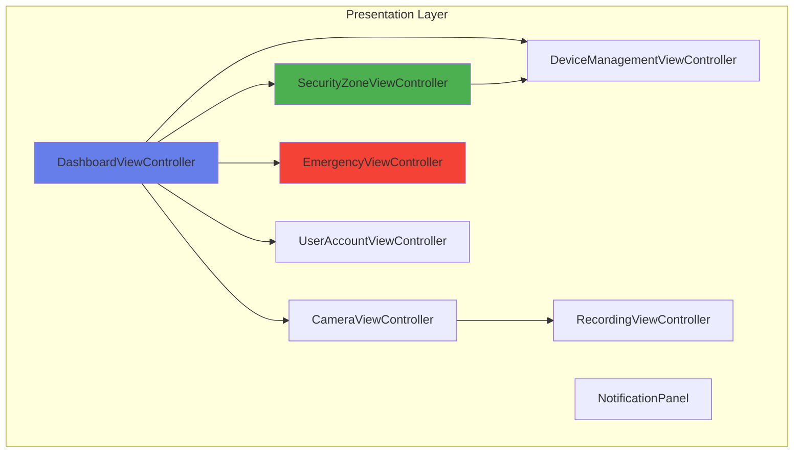

---

## 1. DashboardViewController

**Responsibility:** Main dashboard screen control and status management

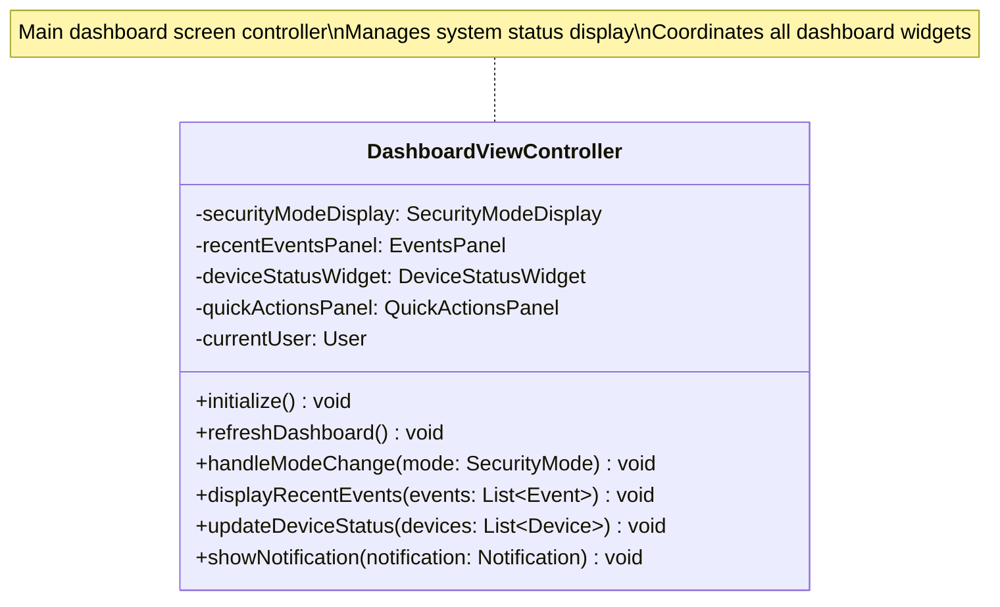

---

## 2. CameraViewController

**Responsibility:** Camera live view, recording playback, PTZ control UI

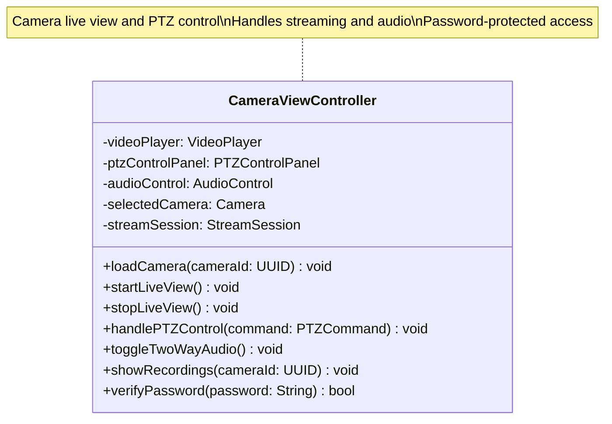

---

## 3. SecurityZoneViewController

**Responsibility:** Security Zone configuration and management UI (HW2 New Feature)

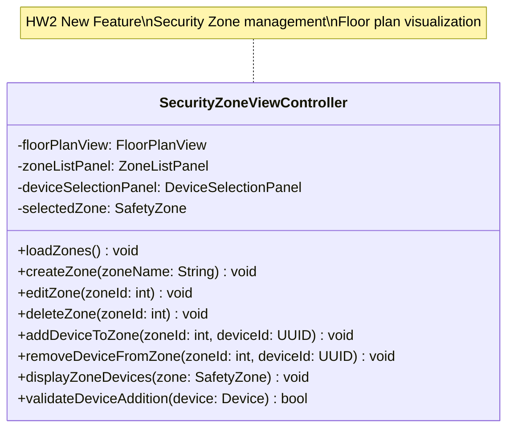

---

## 4. DeviceManagementViewController

**Responsibility:** Device addition, configuration, and status monitoring UI

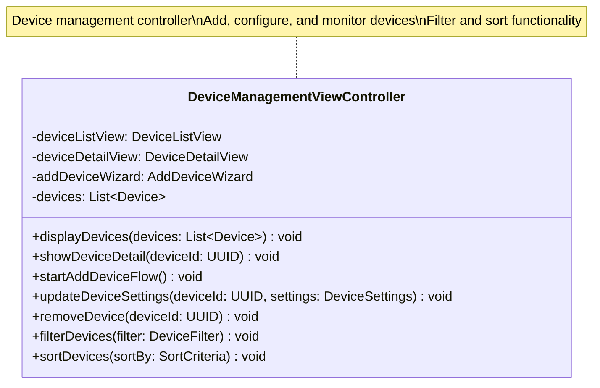

---

## 5. EmergencyViewController

**Responsibility:** Emergency response UI (Panic Button, Alarm Verification)

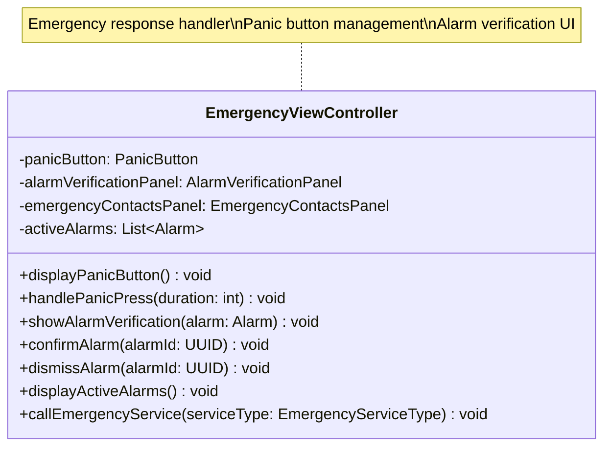

---

## 6. UserAccountViewController

**Responsibility:** User account management and settings UI

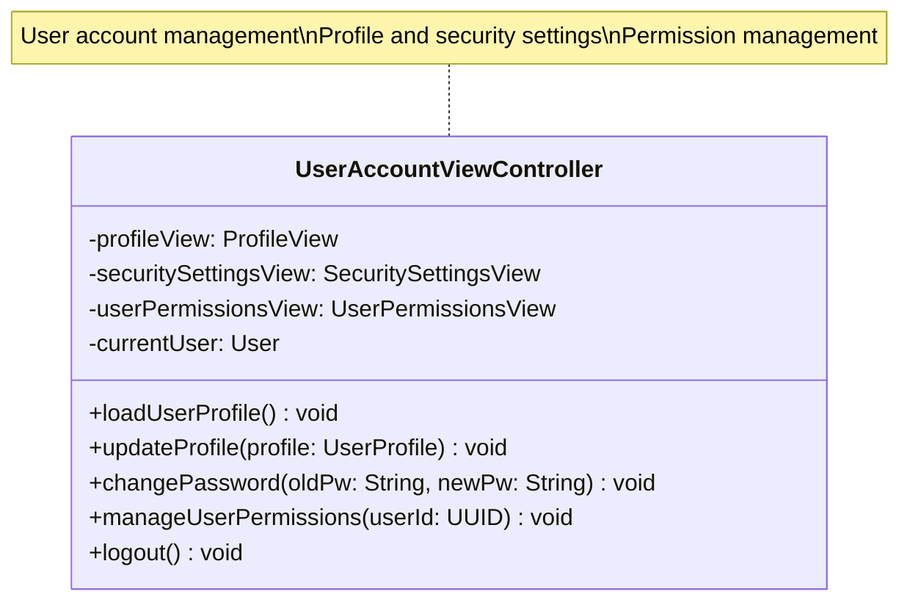

---

## 7. RecordingViewController

**Responsibility:** Recording search, playback, and export UI

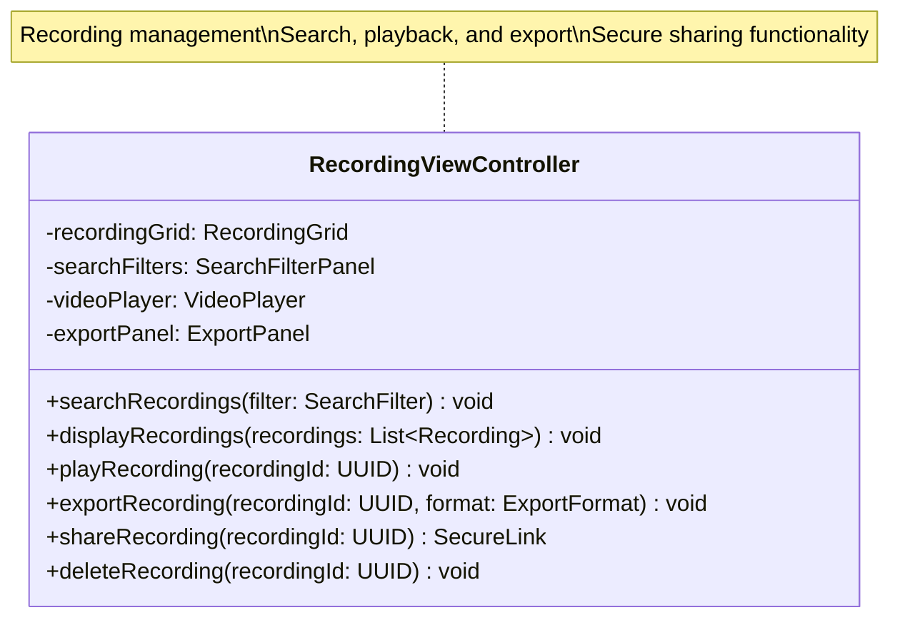

---

## 8. NotificationPanel

**Responsibility:** Real-time notification display and management

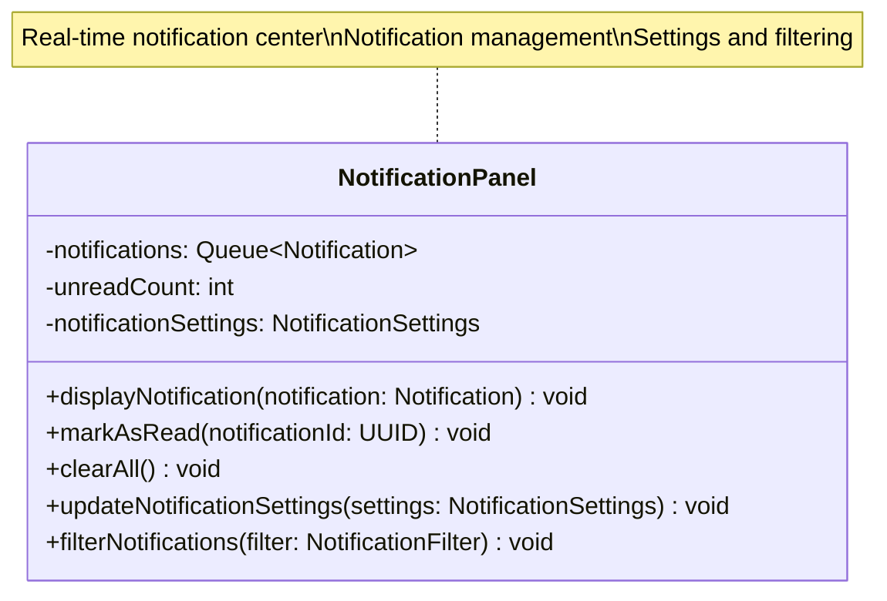

---

## Component Relationships

### Navigation Flow

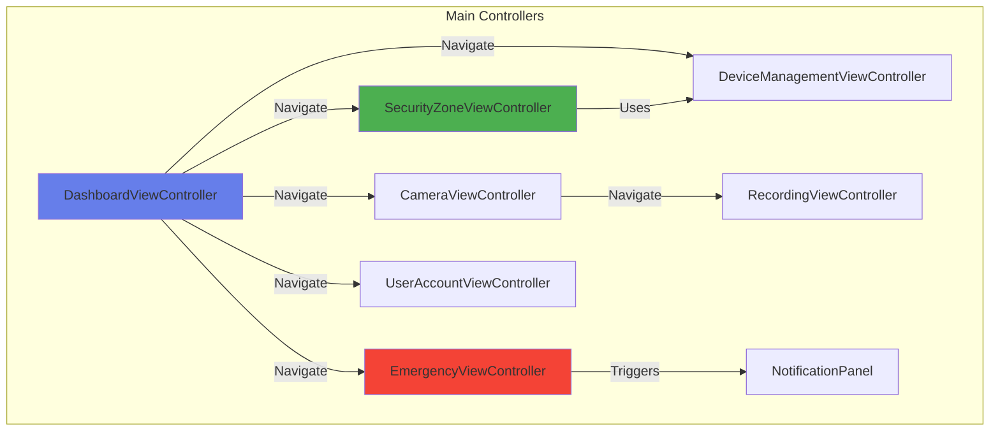

### Layer Architecture

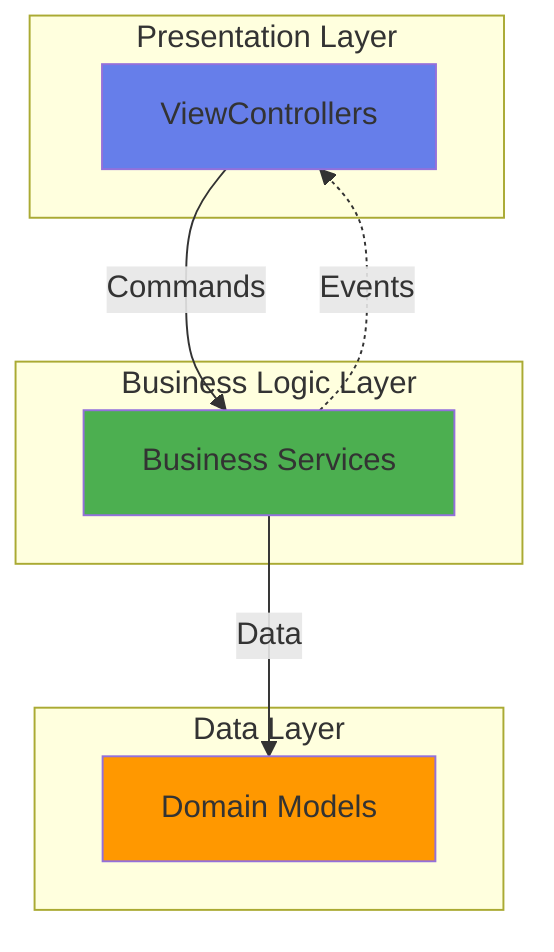

---

## Design Patterns

### 1. MVC (Model-View-Controller) Pattern

- **ViewController**: Handles user input and coordinates view updates
- **View Components**: UI rendering (Panel, Grid, Player, etc.)
- **Model**: Domain objects from Data Layer

### 2. Composite Pattern

- Each ViewController contains multiple child View components
- Hierarchical UI structure

### 3. Observer Pattern

- NotificationPanel observes system events
- Real-time updates across controllers

### 4. Command Pattern

- User actions encapsulated as commands
- Undo/redo functionality support

---

## Key Principles

### ✅ Separation of Concerns

- Each ViewController has single responsibility
- Clear separation between UI and business logic

### ✅ Reusability

- View components are reused across controllers
- Common patterns shared between similar UIs

### ✅ Extensibility

- Easy to add new ViewControllers
- Plugin-based architecture for new features

### ✅ Maintainability

- Clear interfaces and responsibilities
- Low coupling, high cohesion

---

## Statistics

| Category           | Count |
| ------------------ | ----- |
| **ViewController** | 7     |
| **Component**      | 1     |
| **Total Classes**  | **8** |

---

**Document Version:** 1.0.0  
**Last Updated:** 2025-11-11  
**Author:** SafeHome Development Team  
**Layer:** Presentation Layer
