# SafeHome Presentation Layer - Class Diagrams

> Presentation Layer의 8개 핵심 ViewController 및 Component에 대한 상세 UML Class Diagram

## 📑 목차

- [전체 Presentation Layer 통합 다이어그램](#전체-presentation-layer-통합-다이어그램)
- [1. DashboardViewController](#1-dashboardviewcontroller)
- [2. CameraViewController](#2-cameraviewcontroller)
- [3. SecurityZoneViewController](#3-securityzoneviewcontroller)
- [4. DeviceManagementViewController](#4-devicemanagementviewcontroller)
- [5. EmergencyViewController](#5-emergencyviewcontroller)
- [6. UserAccountViewController](#6-useraccountviewcontroller)
- [7. RecordingViewController](#7-recordingviewcontroller)
- [8. NotificationPanel](#8-notificationpanel)
- [클래스 간 관계 및 상호작용](#클래스-간-관계-및-상호작용)

---

## 전체 Presentation Layer 통합 다이어그램

```mermaid
classDiagram
    class DashboardViewController {
        -securityModeDisplay: SecurityModeDisplay
        -recentEventsPanel: EventsPanel
        -deviceStatusWidget: DeviceStatusWidget
        -quickActionsPanel: QuickActionsPanel
        -currentUser: User
        +initialize() void
        +refreshDashboard() void
        +handleModeChange(mode: SecurityMode) void
        +displayRecentEvents(events: List~Event~) void
        +updateDeviceStatus(devices: List~Device~) void
        +showNotification(notification: Notification) void
    }

    class CameraViewController {
        -videoPlayer: VideoPlayer
        -ptzControlPanel: PTZControlPanel
        -audioControl: AudioControl
        -selectedCamera: Camera
        -streamSession: StreamSession
        +loadCamera(cameraId: UUID) void
        +startLiveView() void
        +stopLiveView() void
        +handlePTZControl(command: PTZCommand) void
        +toggleTwoWayAudio() void
        +showRecordings(cameraId: UUID) void
        +verifyPassword(password: String) bool
    }

    class SecurityZoneViewController {
        -floorPlanView: FloorPlanView
        -zoneListPanel: ZoneListPanel
        -deviceSelectionPanel: DeviceSelectionPanel
        -selectedZone: SafetyZone
        +loadZones() void
        +createZone(zoneName: String) void
        +editZone(zoneId: int) void
        +deleteZone(zoneId: int) void
        +addDeviceToZone(zoneId: int, deviceId: UUID) void
        +removeDeviceFromZone(zoneId: int, deviceId: UUID) void
        +displayZoneDevices(zone: SafetyZone) void
        +validateDeviceAddition(device: Device) bool
    }

    class DeviceManagementViewController {
        -deviceListView: DeviceListView
        -deviceDetailView: DeviceDetailView
        -addDeviceWizard: AddDeviceWizard
        -devices: List~Device~
        +displayDevices(devices: List~Device~) void
        +showDeviceDetail(deviceId: UUID) void
        +startAddDeviceFlow() void
        +updateDeviceSettings(deviceId: UUID, settings: DeviceSettings) void
        +removeDevice(deviceId: UUID) void
        +filterDevices(filter: DeviceFilter) void
        +sortDevices(sortBy: SortCriteria) void
    }

    class EmergencyViewController {
        -panicButton: PanicButton
        -alarmVerificationPanel: AlarmVerificationPanel
        -emergencyContactsPanel: EmergencyContactsPanel
        -activeAlarms: List~Alarm~
        +displayPanicButton() void
        +handlePanicPress(duration: int) void
        +showAlarmVerification(alarm: Alarm) void
        +confirmAlarm(alarmId: UUID) void
        +dismissAlarm(alarmId: UUID) void
        +displayActiveAlarms() void
        +callEmergencyService(serviceType: EmergencyServiceType) void
    }

    class UserAccountViewController {
        -profileView: ProfileView
        -securitySettingsView: SecuritySettingsView
        -userPermissionsView: UserPermissionsView
        -currentUser: User
        +loadUserProfile() void
        +updateProfile(profile: UserProfile) void
        +changePassword(oldPw: String, newPw: String) void
        +manageUserPermissions(userId: UUID) void
        +logout() void
    }

    class RecordingViewController {
        -recordingGrid: RecordingGrid
        -searchFilters: SearchFilterPanel
        -videoPlayer: VideoPlayer
        -exportPanel: ExportPanel
        +searchRecordings(filter: SearchFilter) void
        +displayRecordings(recordings: List~Recording~) void
        +playRecording(recordingId: UUID) void
        +exportRecording(recordingId: UUID, format: ExportFormat) void
        +shareRecording(recordingId: UUID) SecureLink
        +deleteRecording(recordingId: UUID) void
    }

    class NotificationPanel {
        -notifications: Queue~Notification~
        -unreadCount: int
        -notificationSettings: NotificationSettings
        +displayNotification(notification: Notification) void
        +markAsRead(notificationId: UUID) void
        +clearAll() void
        +updateNotificationSettings(settings: NotificationSettings) void
        +filterNotifications(filter: NotificationFilter) void
    }

    %% Relationships
    DashboardViewController --> NotificationPanel : uses
    DashboardViewController --> SecurityZoneViewController : navigates to
    DashboardViewController --> CameraViewController : navigates to

    CameraViewController --> RecordingViewController : navigates to

    SecurityZoneViewController --> DeviceManagementViewController : uses

    EmergencyViewController --> NotificationPanel : triggers

    UserAccountViewController --> DashboardViewController : returns to

    note for DashboardViewController "메인 대시보드 화면 제어\n시스템 상태 종합 표시"
    note for CameraViewController "카메라 라이브뷰 및\nPTZ 제어 담당"
    note for SecurityZoneViewController "Security Zone 설정 관리\n(HW2 신규 기능)"
```

---

## 1. DashboardViewController

**책임:** 메인 대시보드 화면 제어 및 상태 관리

```mermaid
classDiagram
    class DashboardViewController {
        -securityModeDisplay: SecurityModeDisplay
        -recentEventsPanel: EventsPanel
        -deviceStatusWidget: DeviceStatusWidget
        -quickActionsPanel: QuickActionsPanel
        -currentUser: User
        +initialize() void
        +refreshDashboard() void
        +handleModeChange(mode: SecurityMode) void
        +displayRecentEvents(events: List~Event~) void
        +updateDeviceStatus(devices: List~Device~) void
        +showNotification(notification: Notification) void
    }

    class SecurityModeDisplay {
        -currentMode: SecurityMode
        -armingCountdown: int
        +displayMode(mode: SecurityMode) void
        +showCountdown(seconds: int) void
        +highlightMode(mode: SecurityMode) void
    }

    class EventsPanel {
        -events: List~Event~
        -maxDisplayCount: int
        +addEvent(event: Event) void
        +clearEvents() void
        +filterByType(type: EventType) void
        +sortByTime() void
    }

    class DeviceStatusWidget {
        -onlineDevices: int
        -totalDevices: int
        -criticalAlerts: int
        +updateCounts(online: int, total: int) void
        +showCriticalAlert(alert: Alert) void
        +displayDeviceHealth() void
    }

    class QuickActionsPanel {
        -actions: List~Action~
        +registerAction(action: Action) void
        +executeAction(actionId: String) void
        +disableAction(actionId: String) void
    }

    class User {
        +userId: UUID
        +userName: String
        +role: UserRole
        +permissions: List~Permission~
    }

    class SecurityMode {
        <<enumeration>>
        DISARMED
        ARMED_HOME
        ARMED_AWAY
        ARMED_NIGHT
    }

    class Event {
        +eventId: UUID
        +timestamp: DateTime
        +eventType: EventType
        +severity: Severity
        +description: String
    }

    DashboardViewController *-- SecurityModeDisplay : contains
    DashboardViewController *-- EventsPanel : contains
    DashboardViewController *-- DeviceStatusWidget : contains
    DashboardViewController *-- QuickActionsPanel : contains
    DashboardViewController --> User : uses
    DashboardViewController ..> SecurityMode : depends on
    EventsPanel --> Event : manages

    note for DashboardViewController "메인 화면의 중앙 컨트롤러\n모든 위젯과 패널 관리"
    note for SecurityModeDisplay "보안 모드 시각화\n아밍/디스아밍 상태 표시"
```

---

## 2. CameraViewController

**책임:** 카메라 라이브뷰, 녹화 재생, PTZ 제어 UI

```mermaid
classDiagram
    class CameraViewController {
        -videoPlayer: VideoPlayer
        -ptzControlPanel: PTZControlPanel
        -audioControl: AudioControl
        -selectedCamera: Camera
        -streamSession: StreamSession
        +loadCamera(cameraId: UUID) void
        +startLiveView() void
        +stopLiveView() void
        +handlePTZControl(command: PTZCommand) void
        +toggleTwoWayAudio() void
        +showRecordings(cameraId: UUID) void
        +verifyPassword(password: String) bool
    }

    class VideoPlayer {
        -currentStream: VideoStream
        -playbackState: PlaybackState
        -bufferSize: int
        +play() void
        +pause() void
        +stop() void
        +seek(timestamp: DateTime) void
        +setQuality(quality: VideoQuality) void
        +enableFullscreen() void
    }

    class PTZControlPanel {
        -panSpeed: float
        -tiltSpeed: float
        -zoomLevel: float
        -presetPositions: List~Position~
        +pan(direction: Direction, speed: float) void
        +tilt(direction: Direction, speed: float) void
        +zoom(level: float) void
        +moveToPreset(presetId: int) void
        +savePreset(position: Position) void
    }

    class AudioControl {
        -isEnabled: bool
        -volume: float
        -isMuted: bool
        +enable() void
        +disable() void
        +setVolume(level: float) void
        +mute() void
        +unmute() void
        +startSpeaking() void
        +stopSpeaking() void
    }

    class Camera {
        +cameraId: UUID
        +cameraName: String
        +location: String
        +isOnline: bool
        +supportsPTZ: bool
        +supportsAudio: bool
        +resolution: Resolution
    }

    class StreamSession {
        +sessionId: UUID
        +startTime: DateTime
        +bandwidth: float
        +latency: int
        +isActive: bool
        +reconnect() void
        +close() void
    }

    class PTZCommand {
        <<enumeration>>
        PAN_LEFT
        PAN_RIGHT
        TILT_UP
        TILT_DOWN
        ZOOM_IN
        ZOOM_OUT
        MOVE_TO_PRESET
    }

    class VideoStream {
        +streamId: UUID
        +codec: String
        +bitrate: int
        +fps: int
    }

    CameraViewController *-- VideoPlayer : contains
    CameraViewController *-- PTZControlPanel : contains
    CameraViewController *-- AudioControl : contains
    CameraViewController --> Camera : manages
    CameraViewController --> StreamSession : uses
    VideoPlayer --> VideoStream : plays
    PTZControlPanel ..> PTZCommand : uses

    note for CameraViewController "카메라 모든 기능의\n중앙 컨트롤러"
    note for PTZControlPanel "Pan-Tilt-Zoom 제어\n프리셋 위치 관리"
```

---

## 3. SecurityZoneViewController

**책임:** Security Zone 설정 및 관리 UI (HW2 신규 기능)

```mermaid
classDiagram
    class SecurityZoneViewController {
        -floorPlanView: FloorPlanView
        -zoneListPanel: ZoneListPanel
        -deviceSelectionPanel: DeviceSelectionPanel
        -selectedZone: SafetyZone
        +loadZones() void
        +createZone(zoneName: String) void
        +editZone(zoneId: int) void
        +deleteZone(zoneId: int) void
        +addDeviceToZone(zoneId: int, deviceId: UUID) void
        +removeDeviceFromZone(zoneId: int, deviceId: UUID) void
        +displayZoneDevices(zone: SafetyZone) void
        +validateDeviceAddition(device: Device) bool
    }

    class FloorPlanView {
        -floorPlanImage: Image
        -zones: List~ZoneOverlay~
        -devices: List~DeviceMarker~
        -scale: float
        +renderFloorPlan() void
        +drawZone(zone: SafetyZone) void
        +drawDeviceMarker(device: Device) void
        +highlightZone(zoneId: int) void
        +enableEditMode() void
        +disableEditMode() void
        +onZoneClick(zoneId: int) void
    }

    class ZoneListPanel {
        -zones: List~SafetyZone~
        -selectedZoneId: int
        -sortOrder: SortOrder
        +displayZones(zones: List~SafetyZone~) void
        +selectZone(zoneId: int) void
        +addZone(zone: SafetyZone) void
        +removeZone(zoneId: int) void
        +sortZones(order: SortOrder) void
        +filterZones(filter: ZoneFilter) void
    }

    class DeviceSelectionPanel {
        -availableDevices: List~Device~
        -selectedDevices: List~Device~
        -deviceFilter: DeviceFilter
        +displayAvailableDevices() void
        +selectDevice(deviceId: UUID) void
        +deselectDevice(deviceId: UUID) void
        +filterByType(type: DeviceType) void
        +searchDevice(query: String) void
    }

    class SafetyZone {
        +zoneId: int
        +zoneName: String
        +devices: List~Device~
        +area: Polygon
        +isArmed: bool
        +armingDelay: int
        +addDevice(device: Device) void
        +removeDevice(deviceId: UUID) void
        +arm() void
        +disarm() void
    }

    class Device {
        +deviceId: UUID
        +deviceName: String
        +deviceType: DeviceType
        +location: String
        +isOnline: bool
        +zoneId: int
    }

    class ZoneOverlay {
        +zoneId: int
        +coordinates: List~Point~
        +color: Color
        +opacity: float
        +isActive: bool
    }

    class DeviceMarker {
        +deviceId: UUID
        +position: Point
        +icon: Icon
        +label: String
    }

    SecurityZoneViewController *-- FloorPlanView : contains
    SecurityZoneViewController *-- ZoneListPanel : contains
    SecurityZoneViewController *-- DeviceSelectionPanel : contains
    SecurityZoneViewController --> SafetyZone : manages
    FloorPlanView --> ZoneOverlay : renders
    FloorPlanView --> DeviceMarker : renders
    ZoneListPanel --> SafetyZone : displays
    DeviceSelectionPanel --> Device : manages
    SafetyZone --> Device : contains

    note for SecurityZoneViewController "HW2 신규 기능\nZone 기반 보안 관리"
    note for FloorPlanView "평면도에 Zone과\n장치 위치 시각화"
```

---

## 4. DeviceManagementViewController

**책임:** 장치 추가, 설정, 상태 모니터링 UI

---

## 5. EmergencyViewController

**책임:** 비상 상황 대응 UI (Panic Button, Alarm Verification)

```mermaid
classDiagram
    class EmergencyViewController {
        -panicButton: PanicButton
        -alarmVerificationPanel: AlarmVerificationPanel
        -emergencyContactsPanel: EmergencyContactsPanel
        -activeAlarms: List~Alarm~
        +displayPanicButton() void
        +handlePanicPress(duration: int) void
        +showAlarmVerification(alarm: Alarm) void
        +confirmAlarm(alarmId: UUID) void
        +dismissAlarm(alarmId: UUID) void
        +displayActiveAlarms() void
        +callEmergencyService(serviceType: EmergencyServiceType) void
    }

    class PanicButton {
        -isPressed: bool
        -pressStartTime: DateTime
        -pressThreshold: int
        -buttonSize: Size
        -buttonColor: Color
        +render() void
        +onPressStart() void
        +onPressEnd() void
        +onLongPress(duration: int) void
        +showConfirmation() void
        +animate() void
    }

    class AlarmVerificationPanel {
        -alarm: Alarm
        -verificationTimeout: int
        -cameraSnapshot: Image
        -audioClip: AudioClip
        +displayAlarm(alarm: Alarm) void
        +showSnapshot(cameraId: UUID) void
        +playAudioClip() void
        +startCountdown(seconds: int) void
        +onConfirm() void
        +onDismiss() void
        +onTimeout() void
    }

    class EmergencyContactsPanel {
        -contacts: List~EmergencyContact~
        -selectedContact: EmergencyContact
        +displayContacts() void
        +selectContact(contactId: UUID) void
        +callContact(contactId: UUID) void
        +editContact(contact: EmergencyContact) void
        +addContact(contact: EmergencyContact) void
        +removeContact(contactId: UUID) void
        +showCallHistory() void
    }

    class Alarm {
        +alarmId: UUID
        +alarmType: AlarmType
        +triggeredBy: String
        +triggeredAt: DateTime
        +severity: Severity
        +isVerified: bool
        +isActive: bool
        +location: String
        +relatedDeviceId: UUID
    }

    class EmergencyContact {
        +contactId: UUID
        +name: String
        +phoneNumber: String
        +relationship: String
        +priority: int
        +isAvailable: bool
    }

    class EmergencyServiceType {
        <<enumeration>>
        POLICE
        FIRE_DEPARTMENT
        AMBULANCE
        SECURITY_COMPANY
        PERSONAL_CONTACT
    }

    class AlarmType {
        <<enumeration>>
        INTRUSION
        FIRE
        MEDICAL
        PANIC
        ENVIRONMENTAL
    }

    class Severity {
        <<enumeration>>
        LOW
        MEDIUM
        HIGH
        CRITICAL
    }

    EmergencyViewController *-- PanicButton : contains
    EmergencyViewController *-- AlarmVerificationPanel : contains
    EmergencyViewController *-- EmergencyContactsPanel : contains
    EmergencyViewController --> Alarm : manages
    AlarmVerificationPanel --> Alarm : displays
    EmergencyContactsPanel --> EmergencyContact : manages
    Alarm ..> AlarmType : uses
    Alarm ..> Severity : uses
    EmergencyViewController ..> EmergencyServiceType : uses

    note for EmergencyViewController "비상 상황 전담\n신속한 대응 지원"
    note for PanicButton "긴급 호출 버튼\n(3초 길게 누르기)"
```

---

## 6. UserAccountViewController

**책임:** 사용자 계정 관리 및 설정 UI

```mermaid
classDiagram
    class UserAccountViewController {
        -profileView: ProfileView
        -securitySettingsView: SecuritySettingsView
        -userPermissionsView: UserPermissionsView
        -currentUser: User
        +loadUserProfile() void
        +updateProfile(profile: UserProfile) void
        +changePassword(oldPw: String, newPw: String) void
        +manageUserPermissions(userId: UUID) void
        +logout() void
    }

    class ProfileView {
        -user: User
        -avatarImage: Image
        -editMode: bool
        +displayProfile() void
        +enableEdit() void
        +saveChanges() void
        +cancelEdit() void
        +uploadAvatar(image: Image) void
        +validateEmail(email: String) bool
        +validatePhone(phone: String) bool
    }

    class SecuritySettingsView {
        -twoFactorEnabled: bool
        -trustedDevices: List~Device~
        -loginHistory: List~LoginRecord~
        +displaySettings() void
        +enableTwoFactor() void
        +disableTwoFactor() void
        +manageTrustedDevices() void
        +viewLoginHistory() void
        +changePin(oldPin: String, newPin: String) void
        +setupBiometric() void
    }

    class UserPermissionsView {
        -user: User
        -assignedRoles: List~Role~
        -permissions: List~Permission~
        +displayPermissions() void
        +assignRole(role: Role) void
        +revokeRole(roleId: UUID) void
        +grantPermission(permission: Permission) void
        +revokePermission(permissionId: UUID) void
        +viewAccessLog() void
    }

    class User {
        +userId: UUID
        +userName: String
        +email: String
        +phoneNumber: String
        +role: UserRole
        +createdAt: DateTime
        +lastLogin: DateTime
        +isActive: bool
    }

    class UserProfile {
        +userId: UUID
        +firstName: String
        +lastName: String
        +displayName: String
        +email: String
        +phoneNumber: String
        +address: String
        +avatarUrl: String
        +preferences: UserPreferences
    }

    class UserRole {
        <<enumeration>>
        HOMEOWNER
        FAMILY_MEMBER
        GUEST
        ADMIN
        SECURITY_MONITOR
    }

    class Role {
        +roleId: UUID
        +roleName: String
        +description: String
        +permissions: List~Permission~
        +isSystemRole: bool
    }

    class Permission {
        +permissionId: UUID
        +resource: String
        +action: Action
        +scope: Scope
    }

    class LoginRecord {
        +recordId: UUID
        +userId: UUID
        +loginTime: DateTime
        +ipAddress: String
        +deviceInfo: String
        +isSuccessful: bool
    }

    UserAccountViewController *-- ProfileView : contains
    UserAccountViewController *-- SecuritySettingsView : contains
    UserAccountViewController *-- UserPermissionsView : contains
    UserAccountViewController --> User : manages
    ProfileView --> UserProfile : edits
    SecuritySettingsView --> LoginRecord : displays
    UserPermissionsView --> Role : manages
    UserPermissionsView --> Permission : manages
    User ..> UserRole : has
    Role --> Permission : contains

    note for UserAccountViewController "사용자 계정의\n모든 설정 관리"
    note for SecuritySettingsView "2FA, 생체인증 등\n보안 설정 관리"
```

---

## 7. RecordingViewController

**책임:** 녹화 검색, 재생, 내보내기 UI

```mermaid
classDiagram
    class RecordingViewController {
        -recordingGrid: RecordingGrid
        -searchFilters: SearchFilterPanel
        -videoPlayer: VideoPlayer
        -exportPanel: ExportPanel
        +searchRecordings(filter: SearchFilter) void
        +displayRecordings(recordings: List~Recording~) void
        +playRecording(recordingId: UUID) void
        +exportRecording(recordingId: UUID, format: ExportFormat) void
        +shareRecording(recordingId: UUID) SecureLink
        +deleteRecording(recordingId: UUID) void
    }

    class RecordingGrid {
        -recordings: List~Recording~
        -viewMode: GridViewMode
        -selectedRecording: Recording
        -thumbnailSize: Size
        +renderGrid() void
        +renderList() void
        +renderTimeline() void
        +selectRecording(recordingId: UUID) void
        +loadThumbnails() void
        +sortRecordings(sortBy: SortCriteria) void
    }

    class SearchFilterPanel {
        -dateRange: DateRange
        -cameraFilter: List~UUID~
        -eventTypeFilter: List~EventType~
        -durationRange: DurationRange
        -tags: List~String~
        +applyFilters() void
        +clearFilters() void
        +setDateRange(start: DateTime, end: DateTime) void
        +selectCamera(cameraId: UUID) void
        +selectEventType(type: EventType) void
        +addTag(tag: String) void
    }

    class VideoPlayer {
        -recording: Recording
        -currentTime: float
        -playbackSpeed: float
        -volume: float
        -isPlaying: bool
        +play() void
        +pause() void
        +stop() void
        +seek(timestamp: float) void
        +setSpeed(speed: float) void
        +setVolume(level: float) void
        +takeSnapshot() Image
        +enableFullscreen() void
    }

    class ExportPanel {
        -selectedRecording: Recording
        -exportFormat: ExportFormat
        -exportQuality: ExportQuality
        -includeAudio: bool
        -watermark: bool
        +selectFormat(format: ExportFormat) void
        +selectQuality(quality: ExportQuality) void
        +startExport() void
        +cancelExport() void
        +getExportProgress() float
        +downloadFile() void
    }

    class Recording {
        +recordingId: UUID
        +cameraId: UUID
        +cameraName: String
        +startTime: DateTime
        +endTime: DateTime
        +duration: int
        +fileSize: long
        +resolution: Resolution
        +thumbnailUrl: String
        +tags: List~String~
        +isLocked: bool
    }

    class SearchFilter {
        +dateRange: DateRange
        +cameras: List~UUID~
        +eventTypes: List~EventType~
        +duration: DurationRange
        +tags: List~String~
        +minResolution: Resolution
    }

    class ExportFormat {
        <<enumeration>>
        MP4
        AVI
        MOV
        MKV
    }

    class ExportQuality {
        <<enumeration>>
        ORIGINAL
        HIGH
        MEDIUM
        LOW
    }

    class GridViewMode {
        <<enumeration>>
        GRID
        LIST
        TIMELINE
    }

    class SecureLink {
        +linkId: UUID
        +url: String
        +expiresAt: DateTime
        +accessCount: int
        +maxAccessCount: int
        +isActive: bool
    }

    RecordingViewController *-- RecordingGrid : contains
    RecordingViewController *-- SearchFilterPanel : contains
    RecordingViewController *-- VideoPlayer : contains
    RecordingViewController *-- ExportPanel : contains
    RecordingViewController --> Recording : manages
    RecordingGrid --> Recording : displays
    VideoPlayer --> Recording : plays
    ExportPanel --> Recording : exports
    SearchFilterPanel --> SearchFilter : creates
    ExportPanel ..> ExportFormat : uses
    ExportPanel ..> ExportQuality : uses
    RecordingViewController ..> SecureLink : generates

    note for RecordingViewController "녹화 영상 관리\n검색/재생/공유"
    note for ExportPanel "다양한 형식으로\n영상 내보내기"
```

---

## 8. NotificationPanel

**책임:** 실시간 알림 표시 및 관리

```mermaid
classDiagram
    class NotificationPanel {
        -notifications: Queue~Notification~
        -unreadCount: int
        -notificationSettings: NotificationSettings
        +displayNotification(notification: Notification) void
        +markAsRead(notificationId: UUID) void
        +clearAll() void
        +updateNotificationSettings(settings: NotificationSettings) void
        +filterNotifications(filter: NotificationFilter) void
    }

    class Notification {
        +notificationId: UUID
        +title: String
        +message: String
        +timestamp: DateTime
        +priority: Priority
        +type: NotificationType
        +isRead: bool
        +actionUrl: String
        +relatedEntityId: UUID
    }

    class NotificationSettings {
        +enableSound: bool
        +enableVibration: bool
        +enablePopup: bool
        +quietHoursStart: Time
        +quietHoursEnd: Time
        +priorityFilter: List~Priority~
        +typeFilter: List~NotificationType~
        +validate() bool
    }

    class NotificationFilter {
        +priority: Priority
        +type: NotificationType
        +dateRange: DateRange
        +isRead: bool
        +apply(notifications: List~Notification~) List~Notification~
    }

    class NotificationType {
        <<enumeration>>
        ALARM
        WARNING
        INFO
        SYSTEM
        DEVICE
        USER_ACTION
    }

    class Priority {
        <<enumeration>>
        LOW
        MEDIUM
        HIGH
        CRITICAL
    }

    class Queue~T~ {
        -items: List~T~
        -maxSize: int
        +enqueue(item: T) void
        +dequeue() T
        +peek() T
        +size() int
        +isEmpty() bool
        +clear() void
    }

    NotificationPanel *-- Queue~Notification~ : contains
    NotificationPanel --> Notification : manages
    NotificationPanel --> NotificationSettings : uses
    NotificationPanel ..> NotificationFilter : uses
    Notification ..> NotificationType : has
    Notification ..> Priority : has
    NotificationFilter ..> NotificationType : filters by
    NotificationFilter ..> Priority : filters by

    note for NotificationPanel "실시간 알림 센터\n모든 알림 통합 관리"
    note for NotificationSettings "알림 동작 설정\n조용한 시간 관리"
```

---

## 클래스 간 관계 및 상호작용

### 주요 네비게이션 흐름

### 데이터 흐름

### 컴포넌트 의존성

---

## 설계 패턴 및 원칙

### 1. MVC (Model-View-Controller) 패턴

- **ViewController**: 사용자 입력 처리 및 View 업데이트 조정
- **View Components**: UI 렌더링 (Panel, Grid, Player 등)
- **Model**: Domain 객체 (User, Device, Recording 등)

### 2. Composite Pattern

- 각 ViewController는 여러 하위 View 컴포넌트를 포함
- 계층적 UI 구조 형성

### 3. Observer Pattern

- NotificationPanel이 시스템 이벤트를 관찰
- 실시간 알림 표시

### 4. Strategy Pattern

- SearchFilter, DeviceFilter 등 다양한 필터링 전략
- ExportFormat, ExportQuality 선택 가능

### 5. Command Pattern

- QuickActionsPanel의 Action 실행
- PTZCommand 처리

---

## 주요 특징

### ✅ 역할 분리

- 각 ViewController는 단일 책임 원칙(SRP) 준수
- View와 비즈니스 로직 분리

### ✅ 재사용성

- Panel, View 컴포넌트는 여러 Controller에서 재사용
- VideoPlayer는 CameraViewController와 RecordingViewController에서 공유

### ✅ 확장성

- 새로운 ViewController 추가 용이
- 기존 컴포넌트 수정 없이 확장 가능

### ✅ 유지보수성

- 명확한 인터페이스와 책임 정의
- 낮은 결합도, 높은 응집도

---

## 통계

| 항목                | 개수                    |
| ------------------- | ----------------------- |
| **ViewController**  | 7개                     |
| **Component**       | 1개 (NotificationPanel) |
| **View Components** | 20+ 개                  |
| **Domain Objects**  | 15+ 개                  |
| **Enumerations**    | 10+ 개                  |
| **총 클래스**       | **50+ 개**              |

---

**문서 버전:** 1.0.0  
**최종 업데이트:** 2025-11-11  
**작성자:** SafeHome Development Team  
**레이어:** Presentation Layer
