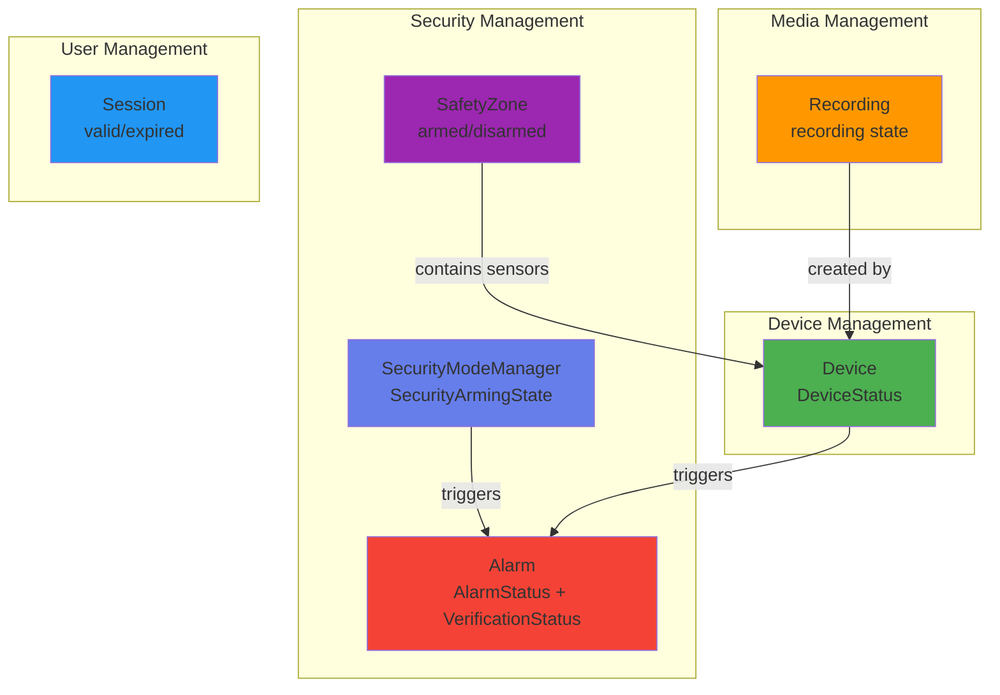
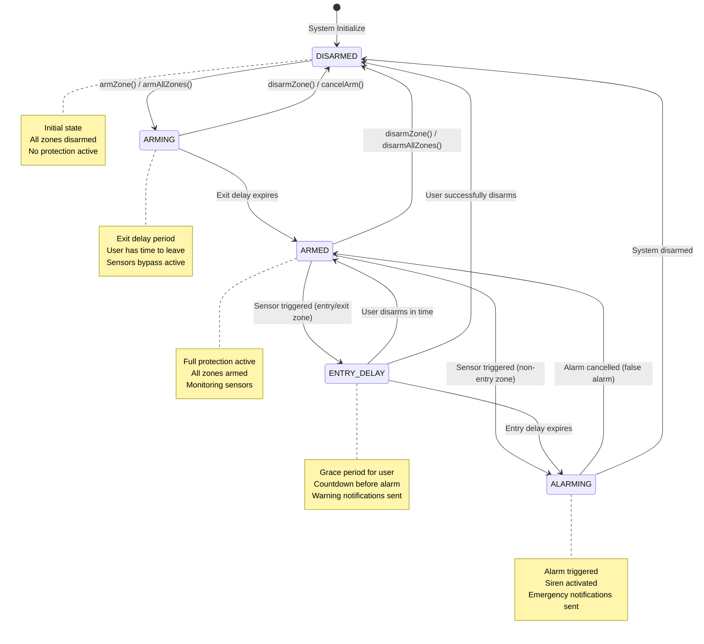
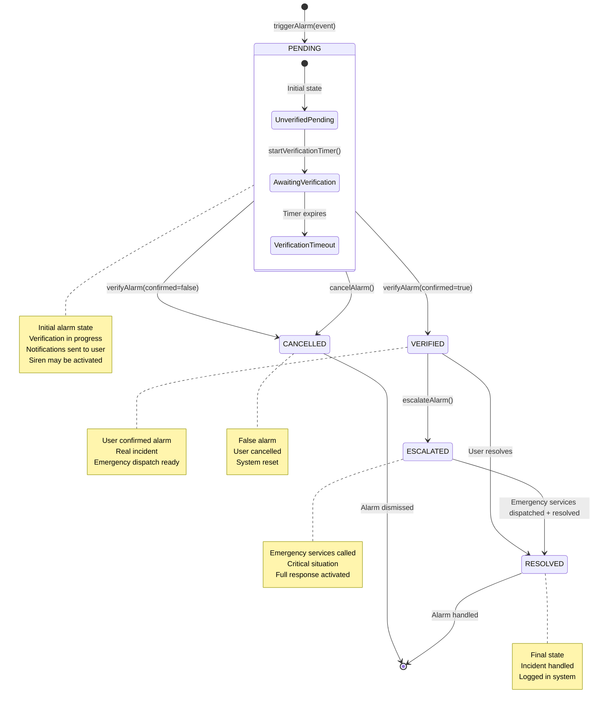
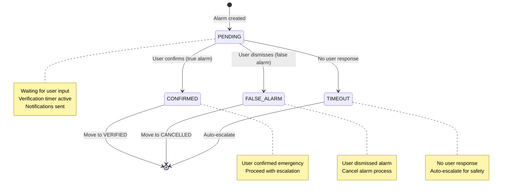
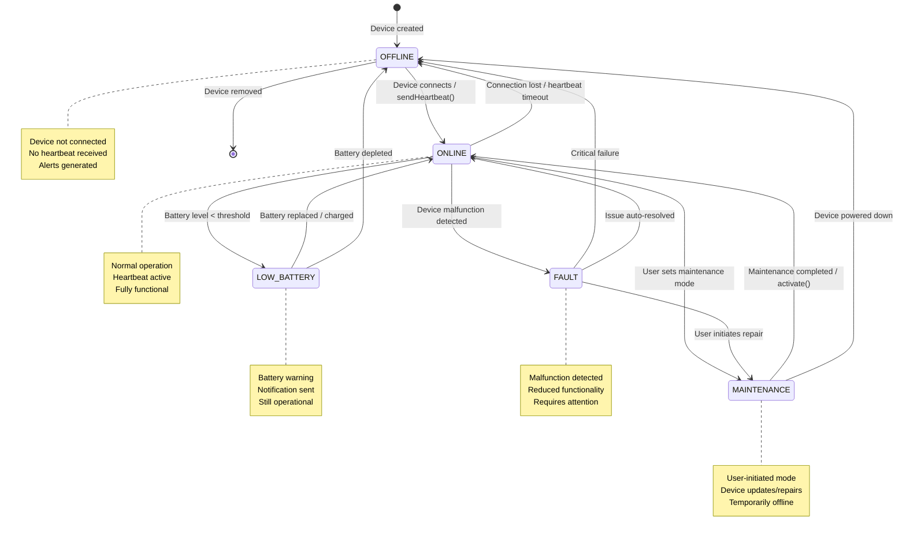
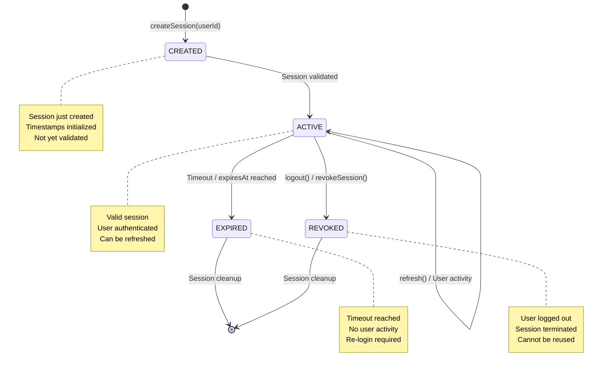
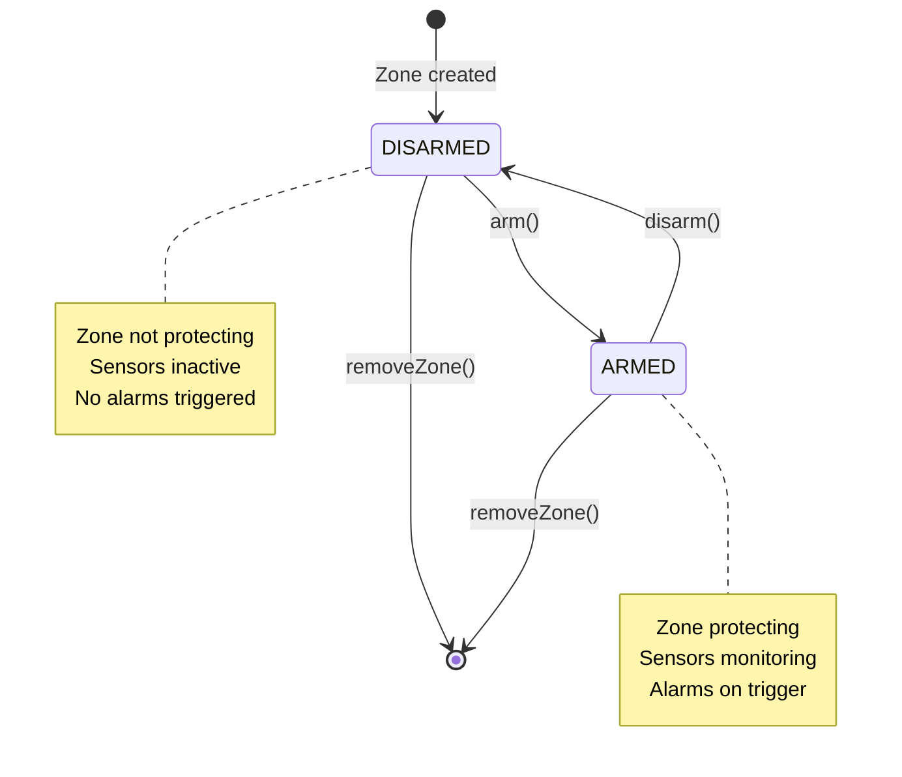
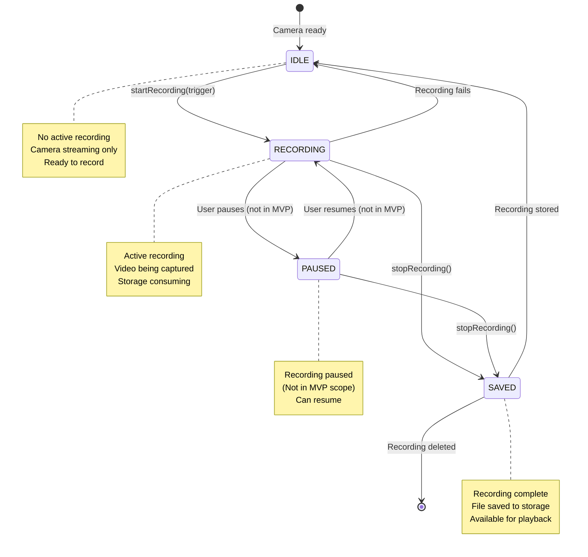

# SafeHome State Diagrams

> Comprehensive State Diagrams for Key Classes with State Transitions

## 📑 Table of Contents

- [Overview: Classes with State Transitions](#overview-classes-with-state-transitions)
- [1. SecurityModeManager State Diagram](#1-securitymodemanager-state-diagram)
- [2. Alarm State Diagram](#2-alarm-state-diagram)
- [3. Device State Diagram](#3-device-state-diagram)
- [4. Session State Diagram](#4-session-state-diagram)
- [5. SafetyZone State Diagram](#5-safetyzone-state-diagram)
- [6. Recording State Diagram](#6-recording-state-diagram)
- [Summary and Design Patterns](#summary-and-design-patterns)

---

## Overview: Classes with State Transitions

Based on the analysis of `wj_safehome_complete_class_diagram.md`, the following 6 classes have significant state transitions:



### Selected Classes Summary

| Class                  | State Enum/Field        | States Count | Complexity |
| ---------------------- | ----------------------- | ------------ | ---------- |
| **SecurityModeManager**| SecurityArmingState     | 5            | High       |
| **Alarm**              | AlarmStatus + Verification | 5 + 4     | High       |
| **Device**             | DeviceStatus            | 5            | Medium     |
| **Session**            | valid/expired           | 3            | Low        |
| **SafetyZone**         | armed/disarmed          | 2            | Low        |
| **Recording**          | active/inactive         | 2            | Low        |

---

## 1. SecurityModeManager State Diagram

**State Enum:** `SecurityArmingState`

**States:** DISARMED, ARMING, ARMED, ENTRY_DELAY, ALARMING



### State Transition Details

| From State    | To State      | Trigger                          | Method Called             |
| ------------- | ------------- | -------------------------------- | ------------------------- |
| DISARMED      | ARMING        | User arms system                 | `armZone()`, `armAllZones()` |
| ARMING        | ARMED         | Exit delay timer expires         | Internal timer            |
| ARMING        | DISARMED      | User cancels arming              | `disarmZone()`            |
| ARMED         | ENTRY_DELAY   | Sensor triggered (entry zone)    | `startEntryCountdown()`   |
| ARMED         | ALARMING      | Sensor triggered (interior zone) | Internal `triggerAlarm()` |
| ENTRY_DELAY   | ARMED         | Valid code entered               | `cancelEntryCountdown()`  |
| ENTRY_DELAY   | ALARMING      | Entry delay timer expires        | Internal timer            |
| ENTRY_DELAY   | DISARMED      | User disarms                     | `disarmZone()`            |
| ALARMING      | ARMED         | False alarm verified             | AlarmManager interaction  |
| ALARMING      | DISARMED      | System disarmed                  | `disarmAllZones()`        |
| ARMED         | DISARMED      | User disarms                     | `disarmZone()`            |

---

## 2. Alarm State Diagram

**State Enums:** `AlarmStatus` + `VerificationStatus`

**AlarmStatus:** PENDING, VERIFIED, ESCALATED, CANCELLED, RESOLVED

**VerificationStatus:** PENDING, CONFIRMED, FALSE_ALARM, TIMEOUT



### Verification Status Sub-State



### State Transition Details

| From State | To State   | Trigger                    | Method Called                  |
| ---------- | ---------- | -------------------------- | ------------------------------ |
| [Initial]  | PENDING    | Sensor event triggers      | `triggerAlarm(event)`          |
| PENDING    | VERIFIED   | User confirms alarm        | `verifyAlarm(id, true)`        |
| PENDING    | CANCELLED  | User dismisses alarm       | `verifyAlarm(id, false)`       |
| PENDING    | CANCELLED  | System cancels             | `cancelAlarm(id)`              |
| VERIFIED   | ESCALATED  | Emergency dispatch needed  | `escalateAlarm(id)`            |
| VERIFIED   | RESOLVED   | Alarm handled locally      | `resolve()`                    |
| ESCALATED  | RESOLVED   | Emergency services respond | External + `resolve()`         |
| CANCELLED  | [End]      | Alarm dismissed            | Cleanup                        |
| RESOLVED   | [End]      | Alarm handled              | Cleanup                        |

---

## 3. Device State Diagram

**State Enum:** `DeviceStatus`

**States:** ONLINE, OFFLINE, LOW_BATTERY, FAULT, MAINTENANCE



### State Transition Details

| From State    | To State      | Trigger                       | Method Called               |
| ------------- | ------------- | ----------------------------- | --------------------------- |
| [Initial]     | OFFLINE       | Device registered             | `registerDevice()`          |
| OFFLINE       | ONLINE        | Device connects               | `sendHeartbeat()`           |
| ONLINE        | OFFLINE       | Connection lost               | Heartbeat timeout           |
| ONLINE        | LOW_BATTERY   | Battery level drops           | `updateStatus(LOW_BATTERY)` |
| ONLINE        | FAULT         | Malfunction detected          | `updateStatus(FAULT)`       |
| ONLINE        | MAINTENANCE   | User sets maintenance         | `updateStatus(MAINTENANCE)` |
| LOW_BATTERY   | ONLINE        | Battery restored              | `updateStatus(ONLINE)`      |
| LOW_BATTERY   | OFFLINE       | Battery depleted              | Connection lost             |
| FAULT         | MAINTENANCE   | Repair initiated              | `updateStatus(MAINTENANCE)` |
| FAULT         | OFFLINE       | Critical failure              | Connection lost             |
| FAULT         | ONLINE        | Issue resolved                | `updateStatus(ONLINE)`      |
| MAINTENANCE   | ONLINE        | Maintenance done              | `activate()`                |
| MAINTENANCE   | OFFLINE       | Device powered down           | `deactivate()`              |
| OFFLINE       | [End]         | Device removed from system    | `removeDevice()`            |

---

## 4. Session State Diagram

**State:** Session validity (derived from timestamps)

**States:** CREATED, ACTIVE, EXPIRED, REVOKED



### State Transition Details

| From State | To State | Trigger                 | Method Called         |
| ---------- | -------- | ----------------------- | --------------------- |
| [Initial]  | CREATED  | User logs in            | `createSession()`     |
| CREATED    | ACTIVE   | Session validated       | `validateSession()`   |
| ACTIVE     | ACTIVE   | User activity           | `refresh()`           |
| ACTIVE     | EXPIRED  | Timeout reached         | System checks         |
| ACTIVE     | REVOKED  | User logs out           | `logout()`, `revoke()`|
| EXPIRED    | [End]    | Session cleaned up      | Garbage collection    |
| REVOKED    | [End]    | Session cleaned up      | Garbage collection    |

---

## 5. SafetyZone State Diagram

**State:** `armed` (boolean)

**States:** DISARMED, ARMED



### State Transition Details

| From State | To State  | Trigger              | Method Called  |
| ---------- | --------- | -------------------- | -------------- |
| [Initial]  | DISARMED  | Zone created         | `createZone()` |
| DISARMED   | ARMED     | User arms zone       | `arm()`        |
| ARMED      | DISARMED  | User disarms zone    | `disarm()`     |
| DISARMED   | [End]     | Zone deleted         | `removeZone()` |
| ARMED      | [End]     | Zone deleted (forced)| `removeZone()` |

---

## 6. Recording State Diagram

**State:** Recording activity (derived from activeRecordings map)

**States:** IDLE, RECORDING, PAUSED, SAVED



### State Transition Details

| From State | To State   | Trigger                 | Method Called                     |
| ---------- | ---------- | ----------------------- | --------------------------------- |
| [Initial]  | IDLE       | Camera initialized      | Camera ready                      |
| IDLE       | RECORDING  | Recording starts        | `startRecording(cameraId, trigger)`|
| RECORDING  | SAVED      | Recording stops         | `stopRecording(cameraId)`         |
| RECORDING  | IDLE       | Recording error         | Error handler                     |
| SAVED      | IDLE       | Recording processed     | Background process                |
| SAVED      | [End]      | Recording deleted       | `deleteRecording(recordingId)`    |

---

## Summary and Design Patterns

### State Pattern Implementation

All state-based classes follow the **State Pattern**:

1. **Context**: The class managing state (e.g., SecurityModeManager)
2. **State**: Enum or boolean representing current state
3. **State Transitions**: Methods that change state with validation
4. **State-Dependent Behavior**: Different actions based on current state

### State Complexity Analysis

| Class                  | State Count | Transitions | Complexity | Pattern Used    |
| ---------------------- | ----------- | ----------- | ---------- | --------------- |
| **SecurityModeManager**| 5           | 11          | High       | State Machine   |
| **Alarm**              | 9 (5+4)     | 13          | Very High  | Composite State |
| **Device**             | 5           | 12          | High       | State Machine   |
| **Session**            | 4           | 6           | Medium     | Simple State    |
| **SafetyZone**         | 2           | 4           | Low        | Boolean State   |
| **Recording**          | 4           | 7           | Medium     | Simple State    |

### Design Principles Applied

**1. Single Responsibility Principle (SRP)**
- Each class manages its own state transitions
- State logic encapsulated within the class

**2. Open/Closed Principle (OCP)**
- State enums can be extended
- New transitions can be added without modifying existing code

**3. State Validation**
- All state transitions validate preconditions
- Invalid transitions prevented at runtime

**4. Event-Driven Architecture**
- State changes trigger events
- Other components can observe state changes
- Loose coupling maintained

### State Transition Patterns

**Pattern 1: Linear State Flow**
```
CREATED → ACTIVE → EXPIRED/REVOKED → END
```
Used by: Session

**Pattern 2: Cyclic State Flow**
```
DISARMED ⟷ ARMING ⟷ ARMED ⟷ ALARMING
```
Used by: SecurityModeManager

**Pattern 3: Tree State Flow**
```
PENDING → VERIFIED → ESCALATED → RESOLVED
       ↘ CANCELLED
```
Used by: Alarm

**Pattern 4: Star State Flow**
```
    ONLINE ↔ OFFLINE
      ↕        ↕
LOW_BATTERY ↔ FAULT ↔ MAINTENANCE
```
Used by: Device

---

## Statistics

| Metric                      | Count |
| --------------------------- | ----- |
| **Classes with States**     | 6     |
| **Total States**            | 28    |
| **Total State Transitions** | 53    |
| **Enums Used**              | 5     |
| **State Patterns Used**     | 4     |

---

## Key Features

### ✅ Comprehensive State Management

- All critical system components have defined states
- Clear state transition rules
- State validation and error handling

### ✅ Traceability

- Each transition linked to specific methods
- State history can be tracked
- Audit trail support

### ✅ Safety

- Invalid transitions prevented
- State consistency guaranteed
- Fail-safe mechanisms

### ✅ Extensibility

- New states can be added
- New transitions defined
- Backward compatible

---

**Document Version:** 1.0.0  
**Last Updated:** 2025-11-11  
**Author:** SafeHome Development Team  
**Purpose:** State Transition Specifications

