# SafeHome UML Class Diagram

> 프론트엔드 클래스 구조를 시각화한 UML 다이어그램

## 📑 목차

- [1. 전체 시스템 아키텍처](#1-전체-시스템-아키텍처)
- [2. Service Layer (서비스 계층)](#2-service-layer-서비스-계층)
  - [2.1 Core Services](#21-core-services)
  - [2.2 Domain Services](#22-domain-services)
- [3. State Management Layer](#3-state-management-layer)
- [4. UI Component Layer](#4-ui-component-layer)
  - [4.1 Page Components](#41-page-components)
  - [4.2 Layout Components](#42-layout-components)
- [5. Utility Layer](#5-utility-layer)
- [6. Types & Interfaces](#6-types--interfaces)
- [7. 클래스 간 관계도](#7-클래스-간-관계도)

---

## 1. 전체 시스템 아키텍처

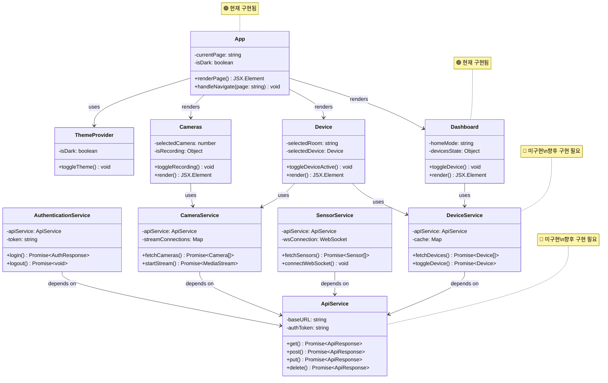

---

## 2. Service Layer (서비스 계층)

### 2.1 Core Services

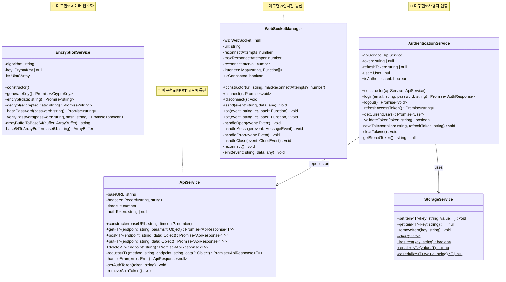

### 2.2 Domain Services

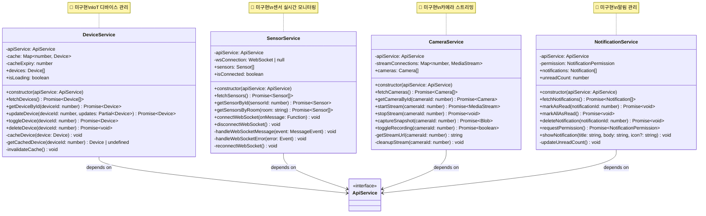

---

## 3. State Management Layer

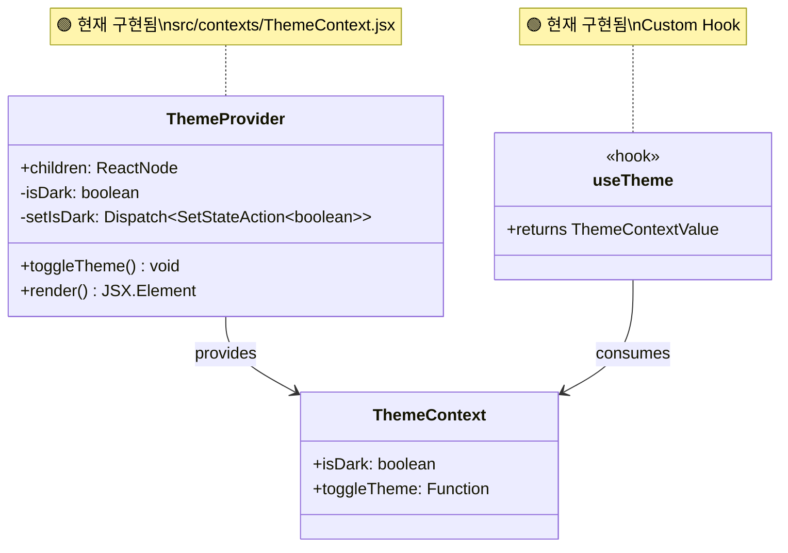

---

## 4. UI Component Layer

### 4.1 Page Components

```mermaid
classDiagram
    class App {
        -currentPage: string
        -setCurrentPage: Dispatch~string~
        -isDark: boolean
        +renderPage() JSX.Element
        +handleNavigate(page: string) void
        +render() JSX.Element
    }
    
    class Dashboard {
        +onNavigate?: Function
        -homeMode: string
        -devicesState: Object
        -modes: Mode[]
        -quickActions: QuickAction[]
        -rooms: Room[]
        -stats: Stat[]
        -recentLogs: ActivityLog[]
        +toggleDevice(device: string) void
        +getLogIcon(type: string) JSX.Element | null
        +render() JSX.Element
    }
    
    class Emergency {
        -isEmergencyActive: boolean
        -emergencyContacts: EmergencyContact[]
        -emergencyActions: EmergencyAction[]
        -recentAlerts: Alert[]
        +getContactIcon(type: string) JSX.Element | null
        +getActionIcon(action: string) JSX.Element | null
        +handleEmergencyToggle() void
        +render() JSX.Element
    }
    
    class Device {
        -selectedRoom: string | null
        -selectedDevice: Device | null
        -selectedCamera: Camera | null
        -rooms: RoomLayout[]
        -devicesByRoom: Record~string, Device[]~
        -camerasByRoom: Record~string, Camera[]~
        +getStatusColor(room: RoomLayout) string
        +toggleDeviceActive() void
        +toggleCameraActive() void
        +render() JSX.Element
    }
    
    class Preference {
        -isDark: boolean
        -toggleTheme: Function
        -settings: PreferenceState
        -settingGroups: SettingGroup[]
        -menuItems: MenuItem[]
        +toggleSetting(key: string) void
        +render() JSX.Element
    }
    
    class Cameras {
        -selectedCamera: number | null
        -isRecording: Record~number, boolean~
        -cameras: Camera[]
        +toggleRecording(id: number) void
        +render() JSX.Element
    }
    
    class FloorPlan {
        -selectedRoom: string | null
        -rooms: FloorPlanRoom[]
        -sensors: FloorPlanSensor[]
        +getStatusColor(status: string) string
        +getSensorIcon(type: string) JSX.Element
        +render() JSX.Element
    }
    
    class Notifications {
        -filter: string
        -notifications: Notification[]
        +getIcon(type: string) JSX.Element | null
        +filteredNotifications() Notification[]
        +unreadCount() number
        +render() JSX.Element
    }
    
    class Sensors {
        -selectedType: string
        -sensors: Sensor[]
        -sensorTypes: SensorType[]
        +getSensorStatus(sensor: Sensor) string
        +getStatusColor(status: string) string
        +filteredSensors() Sensor[]
        +stats() SensorStats
        +render() JSX.Element
    }
    
    class Recordings {
        -selectedVideo: Recording | null
        -isPlaying: boolean
        -recordings: Recording[]
        +handleShare() void
        +handleDownload() void
        +render() JSX.Element
    }

    App --> Dashboard : renders
    App --> Emergency : renders
    App --> Device : renders
    App --> Preference : renders
    App --> Cameras : renders
    App --> FloorPlan : renders
    App --> Notifications : renders
    App --> Sensors : renders
    App --> Recordings : renders
    
    note for App "🟢 현재 구현됨"
    note for Dashboard "🟢 현재 구현됨"
    note for Emergency "🟢 현재 구현됨"
    note for Device "🟢 현재 구현됨"
    note for Preference "🟢 현재 구현됨"
    note for Cameras "🟢 현재 구현됨"
```

### 4.2 Layout Components

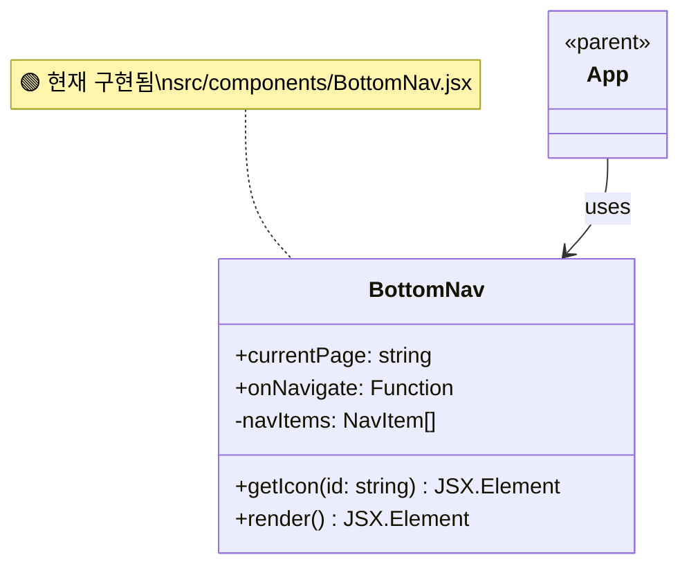

---

## 5. Utility Layer

```mermaid
classDiagram
    class DateFormatter {
        <<utility>>
        +formatDate(date: Date, format: string)$ string
        +formatTime(date: Date)$ string
        +formatDateTime(date: Date)$ string
        +toISO(date: Date)$ string
        +parseISO(dateString: string)$ Date
        +getRelativeTime(date: Date)$ string
        +isToday(date: Date)$ boolean
        +isYesterday(date: Date)$ boolean
    }
    
    class Validator {
        <<utility>>
        +isValidEmail(email: string)$ boolean
        +isValidPassword(password: string)$ boolean
        +isValidPhoneNumber(phone: string)$ boolean
        +isValidUrl(url: string)$ boolean
        +isEmpty(value: string)$ boolean
        +isNumeric(value: string)$ boolean
    }
    
    class ColorUtils {
        <<utility>>
        +hexToRgb(hex: string)$ Object
        +rgbToHex(r: number, g: number, b: number)$ string
        +lighten(color: string, amount: number)$ string
        +darken(color: string, amount: number)$ string
        +getContrastColor(bgColor: string)$ string
    }
    
    class FunctionUtils {
        <<utility>>
        +debounce(func: Function, delay: number)$ Function
        +throttle(func: Function, limit: number)$ Function
        +once(func: Function)$ Function
    }
    
    class useLocalStorage {
        <<hook>>
        +useLocalStorage(key: string, initialValue: any) Array
    }
    
    class useApi {
        <<hook>>
        +useApi(apiFunc: Function, options?: Object) Object
    }
    
    class useWebSocket {
        <<hook>>
        +useWebSocket(url: string, options?: Object) Object
    }
    
    class useMediaQuery {
        <<hook>>
        +useMediaQuery(query: string) boolean
    }
    
    class useDebounce {
        <<hook>>
        +useDebounce(value: any, delay: number) any
    }
    
    note for DateFormatter "🔴 미구현\n날짜 포맷팅"
    note for Validator "🔴 미구현\n유효성 검사"
    note for ColorUtils "🔴 미구현\n색상 유틸리티"
    note for FunctionUtils "🔴 미구현\n함수 유틸리티"
    note for useLocalStorage "🔴 미구현\n로컬스토리지 훅"
    note for useApi "🔴 미구현\nAPI 호출 훅"
    note for useWebSocket "🔴 미구현\nWebSocket 훅"
```

---

## 6. Types & Interfaces

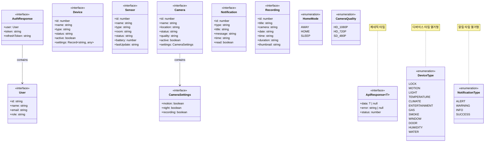

---

## 7. 클래스 간 관계도

### 7.1 의존성 관계 (Dependency)

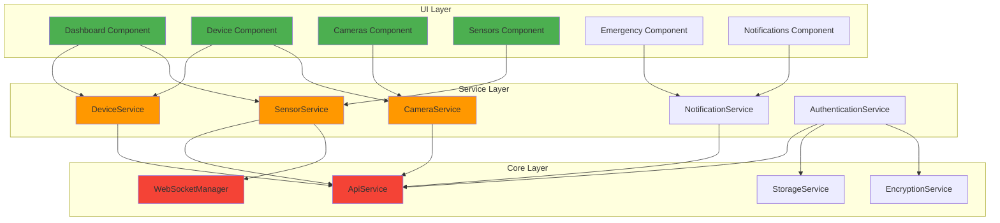

### 7.2 컴포넌트 계층 구조

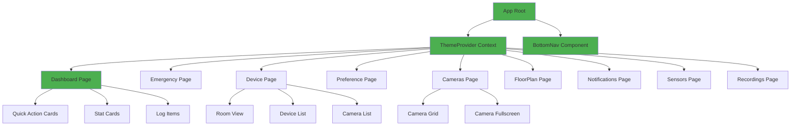

### 7.3 데이터 흐름

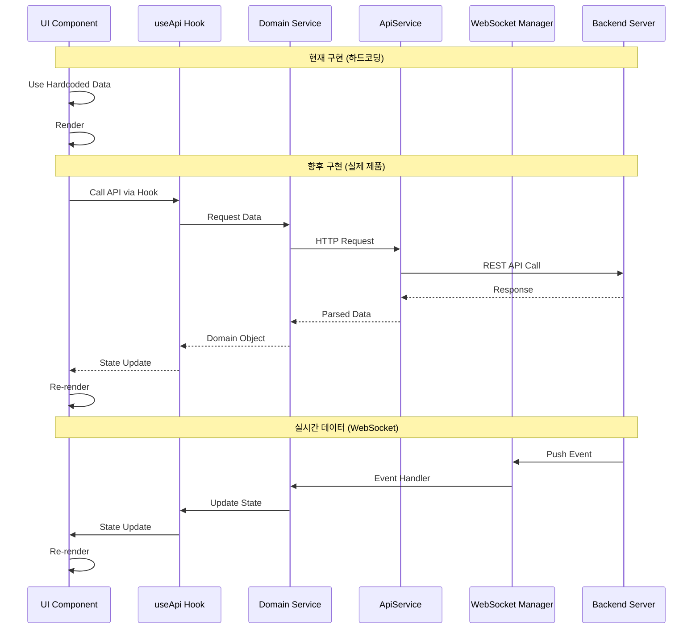

---

## 구현 상태 범례

- 🟢 **현재 구현됨**: 프로토타입에서 작동 중
- 🔴 **미구현**: 향후 구현 필요
- 🟡 **부분 구현**: 기본 구조만 존재

---

## 추가 다이어그램

### 인증 흐름

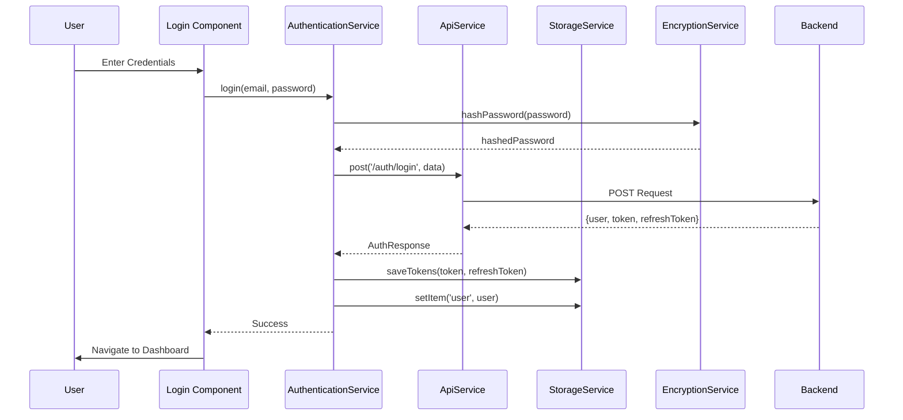

### 센서 실시간 모니터링 흐름

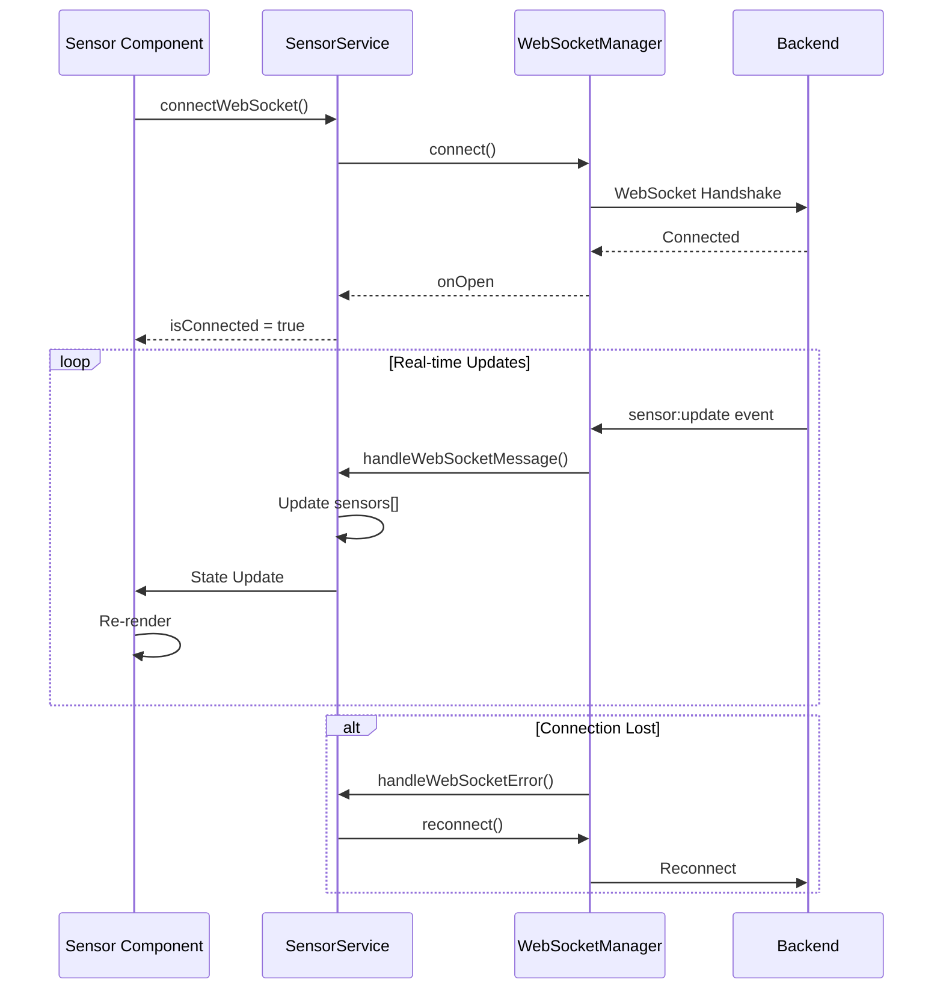

---

## 파일 구조 매핑

```
src/
├── contexts/
│   └── ThemeContext.jsx          # 🟢 ThemeProvider
│
├── components/
│   └── BottomNav.jsx              # 🟢 BottomNav
│
├── pages/
│   ├── Dashboard.jsx              # 🟢 Dashboard
│   ├── Emergency.jsx              # 🟢 Emergency
│   ├── Device.jsx                 # 🟢 Device
│   ├── Preference.jsx             # 🟢 Preference
│   ├── Cameras.jsx                # 🟢 Cameras
│   ├── FloorPlan.jsx              # 🟢 FloorPlan
│   ├── Notifications.jsx          # 🟢 Notifications
│   ├── Sensors.jsx                # 🟢 Sensors
│   └── Recordings.jsx             # 🟢 Recordings
│
└── (향후 추가 필요)
    ├── services/                  # 🔴 Service Layer
    │   ├── api/
    │   │   ├── ApiService.ts
    │   │   └── EncryptionService.ts
    │   ├── auth/
    │   │   └── AuthenticationService.ts
    │   ├── domain/
    │   │   ├── DeviceService.ts
    │   │   ├── SensorService.ts
    │   │   ├── CameraService.ts
    │   │   └── NotificationService.ts
    │   ├── realtime/
    │   │   └── WebSocketManager.ts
    │   └── storage/
    │       └── StorageService.ts
    │
    ├── utils/                     # 🔴 Utility Classes
    │   ├── DateFormatter.ts
    │   ├── Validator.ts
    │   ├── ColorUtils.ts
    │   └── FunctionUtils.ts
    │
    ├── hooks/                     # 🔴 Custom Hooks
    │   ├── useLocalStorage.ts
    │   ├── useApi.ts
    │   ├── useWebSocket.ts
    │   ├── useMediaQuery.ts
    │   └── useDebounce.ts
    │
    ├── types/                     # 🔴 TypeScript Types
    │   ├── api.types.ts
    │   ├── device.types.ts
    │   ├── sensor.types.ts
    │   ├── camera.types.ts
    │   └── notification.types.ts
    │
    └── constants/                 # 🔴 Constants & Enums
        ├── ApiEndpoints.ts
        ├── StorageKeys.ts
        ├── WebSocketEvents.ts
        └── enums.ts
```

---

## 참고 자료

- 📄 [클래스 구조 분석 문서](./class_analysis.md)
- 📘 [Mermaid 문서](https://mermaid.js.org/)
- 🎨 [UML 클래스 다이어그램 가이드](https://www.uml-diagrams.org/class-diagrams-overview.html)

---

**문서 버전:** 1.0.0  
**최종 업데이트:** 2025-11-09  
**작성자:** SafeHome Development Team

