# SafeHome Overall System Class Diagram

> Comprehensive UML Class Diagrams for the Entire SafeHome Security System

## 📑 Table of Contents

- [System Architecture Overview](#system-architecture-overview)
- [1. Base Classes & Common Abstractions](#1-base-classes--common-abstractions)
- [2. Actors, Account & Authentication](#2-actors-account--authentication)
- [3. Core Platform (Hub/Cloud/Config/Log)](#3-core-platform-hubcloudconfiglog)
- [4. Security Modes & Zones](#4-security-modes--zones)
- [5. Devices & Sensors](#5-devices--sensors)
- [6. Surveillance, Media & Audio](#6-surveillance-media--audio)
- [7. Notifications & Automation](#7-notifications--automation)
- [8. Incidents, Verification & Emergency](#8-incidents-verification--emergency)
- [9. Device Onboarding](#9-device-onboarding)
- [10. Commands, DTOs & Reports](#10-commands-dtos--reports)
- [Complete System Integration](#complete-system-integration)

---

## System Architecture Overview

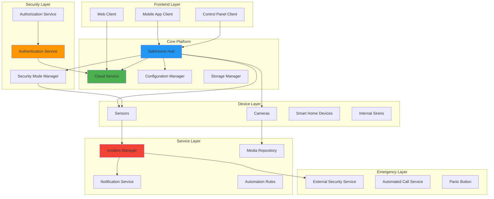

---

## 1. Base Classes & Common Abstractions

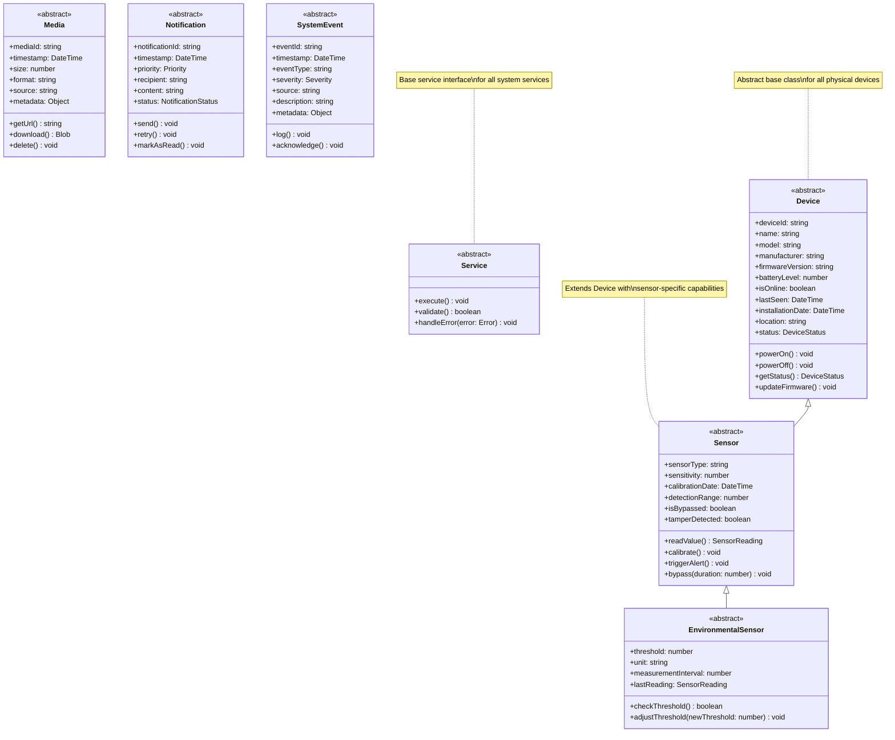

---

## 2. Actors, Account & Authentication

```mermaid
classDiagram
    class Account {
        +accountId: string
        +email: string
        +passwordHash: string
        +phoneNumber: string
        +createdAt: DateTime
        +lastLogin: DateTime
        +isActive: boolean
        +profile: UserProfile
        +authenticate(password: string) boolean
        +changePassword(oldPassword: string, newPassword: string) void
        +updateProfile(profile: UserProfile) void
        +deactivate() void
    }
    
    class Homeowner {
        +ownerId: string
        +homeAddress: string
        +emergencyContacts: Contact[]
        +preferences: HomeownerPreferences
        +addGuest(guest: Guest) void
        +removeGuest(guestId: string) void
        +grantPermission(userId: string, permission: Permission) void
    }
    
    class Guest {
        +guestId: string
        +invitedBy: string
        +validFrom: DateTime
        +validUntil: DateTime
        +accessLevel: AccessLevel
        +isTemporary: boolean
        +extendAccess(duration: number) void
        +revokeAccess() void
    }
    
    class AuthenticationService {
        <<Service>>
        -sessionManager: SessionManager
        -tokenGenerator: TokenGenerator
        +login(email: string, password: string) AuthToken
        +logout(token: string) void
        +validateToken(token: string) boolean
        +refreshToken(refreshToken: string) AuthToken
        +resetPassword(email: string) void
        +verifyEmail(token: string) boolean
    }
    
    class TwoFactorAuthenticationService {
        <<Service>>
        +totpSecret: string
        +backupCodes: BackupCodes
        +generateTOTP() string
        +verifyTOTP(code: string) boolean
        +generateBackupCodes() BackupCodes
        +verifyBackupCode(code: string) boolean
        +sendSMS(phoneNumber: string, code: string) void
    }
    
    class VerificationToken {
        +tokenId: string
        +userId: string
        +token: string
        +type: TokenType
        +expiresAt: DateTime
        +isUsed: boolean
        +validate() boolean
        +markAsUsed() void
    }
    
    class BackupCodes {
        +codes: string[]
        +generatedAt: DateTime
        +usedCodes: Set~string~
        +generate() string[]
        +verify(code: string) boolean
    }
    
    class TrustedDevice {
        +deviceId: string
        +userId: string
        +deviceName: string
        +deviceFingerprint: string
        +lastUsed: DateTime
        +isActive: boolean
        +revoke() void
    }
    
    class PasswordPolicy {
        +minLength: number
        +requireUppercase: boolean
        +requireLowercase: boolean
        +requireNumbers: boolean
        +requireSpecialChars: boolean
        +maxAge: number
        +historyCount: number
        +validate(password: string) boolean
    }
    
    class RateLimitPolicy {
        +maxAttempts: number
        +timeWindow: number
        +lockoutDuration: number
        +checkLimit(userId: string) boolean
        +recordAttempt(userId: string) void
        +resetAttempts(userId: string) void
    }
    
    class AuthorizationService {
        <<Service>>
        -roleManager: RoleManager
        +checkPermission(userId: string, resource: string, action: string) boolean
        +assignRole(userId: string, role: Role) void
        +revokeRole(userId: string, roleId: string) void
        +getUserPermissions(userId: string) Permission[]
    }
    
    class Role {
        +roleId: string
        +roleName: string
        +description: string
        +permissions: Permission[]
        +isSystem: boolean
        +addPermission(permission: Permission) void
        +removePermission(permissionId: string) void
    }
    
    class Permission {
        +permissionId: string
        +resource: string
        +action: string
        +scope: Scope
        +description: string
    }
    
    class Session {
        +sessionId: string
        +userId: string
        +token: string
        +deviceInfo: DeviceInfo
        +ipAddress: string
        +createdAt: DateTime
        +expiresAt: DateTime
        +lastActivity: DateTime
        +invalidate() void
        +extend() void
    }

    Account <|-- Homeowner
    Account <|-- Guest
    
    Service <|-- AuthenticationService
    Service <|-- TwoFactorAuthenticationService
    Service <|-- AuthorizationService
    
    AuthenticationService --> Account : authenticates
    AuthenticationService --> Session : creates
    AuthenticationService --> VerificationToken : uses
    
    TwoFactorAuthenticationService --> BackupCodes : manages
    TwoFactorAuthenticationService --> TrustedDevice : manages
    
    AuthenticationService --> PasswordPolicy : enforces
    AuthenticationService --> RateLimitPolicy : applies
    
    AuthorizationService --> Role : manages
    AuthorizationService --> Permission : checks
    
    Role --> Permission : contains
    Account --> Session : has
    
    note for AuthenticationService "Handles user login,\nlogout, and token management"
    note for TwoFactorAuthenticationService "Provides additional\nsecurity layer"
```

---

## 3. Core Platform (Hub/Cloud/Config/Log)

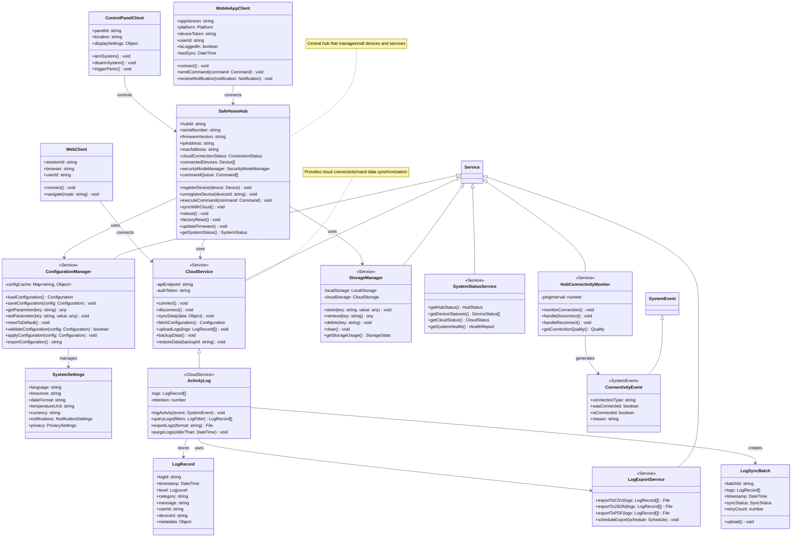

---

## 4. Security Modes & Zones

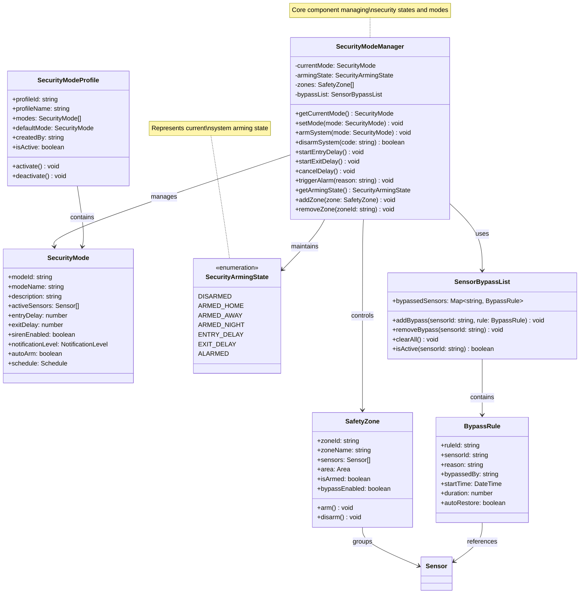

---

## 5. Devices & Sensors

```mermaid
classDiagram
    class MotionSensor {
        <<Sensor>>
        +detectionAngle: number
        +maxRange: number
        +petImmune: boolean
        +lastMotionDetected: DateTime
        +motionCount: number
        +detectMotion() void
        +resetCount() void
    }
    
    class WindowDoorSensor {
        <<Sensor>>
        +isOpen: boolean
        +openedAt: DateTime
        +openCount: number
        +notifyOnOpen: boolean
        +notifyOnClose: boolean
        +getState() ContactState
    }
    
    class FireSmokeSensor {
        <<EnvironmentalSensor>>
        +smokeLevel: number
        +temperatureReading: number
        +isSmokeDetected: boolean
        +isFireDetected: boolean
        +testAlarm() void
        +silence() void
    }
    
    class COSensor {
        <<EnvironmentalSensor>>
        +coLevel: number
        +ppmThreshold: number
        +isAlarmActive: boolean
        +lastTest: DateTime
        +getCOLevel() number
    }
    
    class GasSensor {
        <<EnvironmentalSensor>>
        +gasType: string
        +gasLevel: number
        +explosionRisk: boolean
        +shutoffValve: boolean
        +triggerShutoff() void
    }
    
    class LeakSensor {
        <<EnvironmentalSensor>>
        +moistureLevel: number
        +isLeakDetected: boolean
        +leakLocation: string
        +alertThreshold: number
    }
    
    class AirQualitySensor {
        <<EnvironmentalSensor>>
        +pm25: number
        +pm10: number
        +humidity: number
        +temperature: number
        +co2Level: number
        +vocLevel: number
        +aqi: number
        +getAQI() number
    }
    
    class InternalSiren {
        <<Device>>
        +volume: number
        +tone: string
        +isActive: boolean
        +duration: number
        +activate() void
        +deactivate() void
        +test() void
        +setVolume(level: number) void
    }
    
    class SmartHomeDevice {
        <<Device>>
        +protocol: string
        +isControllable: boolean
        +energyUsage: number
        +lastCommand: Command
        +sendCommand(command: Command) void
    }
    
    class SmartLight {
        <<SmartHomeDevice>>
        +brightness: number
        +color: Color
        +isOn: boolean
        +schedule: Schedule
        +turnOn() void
        +turnOff() void
        +setBrightness(level: number) void
        +setColor(color: Color) void
        +dim(percentage: number) void
    }
    
    class LightGroup {
        +groupId: string
        +groupName: string
        +lights: SmartLight[]
        +turnAllOn() void
        +turnAllOff() void
        +setGroupBrightness(level: number) void
    }
    
    class VentilationSystem {
        <<Device>>
        +fanSpeed: number
        +mode: VentilationMode
        +isRunning: boolean
        +airFlowRate: number
        +start() void
        +stop() void
        +setSpeed(speed: number) void
        +setMode(mode: VentilationMode) void
    }
    
    class SmartMeter {
        <<Device>>
        +meterType: string
        +currentReading: number
        +unit: string
        +readings: PowerReading[]
        +getReading() PowerReading
        +getUsageHistory() PowerReading[]
        +resetMeter() void
    }
    
    class PowerReading {
        +timestamp: DateTime
        +value: number
        +unit: string
        +cost: number
    }

    Sensor <|-- MotionSensor
    Sensor <|-- WindowDoorSensor
    
    EnvironmentalSensor <|-- FireSmokeSensor
    EnvironmentalSensor <|-- COSensor
    EnvironmentalSensor <|-- GasSensor
    EnvironmentalSensor <|-- LeakSensor
    EnvironmentalSensor <|-- AirQualitySensor
    
    Device <|-- InternalSiren
    Device <|-- SmartHomeDevice
    Device <|-- VentilationSystem
    Device <|-- SmartMeter
    
    SmartHomeDevice <|-- SmartLight
    
    LightGroup --> SmartLight : controls
    SmartMeter --> PowerReading : produces
    
    note for MotionSensor "Detects movement\nwith pet immunity option"
    note for FireSmokeSensor "Critical life safety sensor"
    note for SmartLight "Controllable lighting\nwith color support"
```

---

## 6. Surveillance, Media & Audio

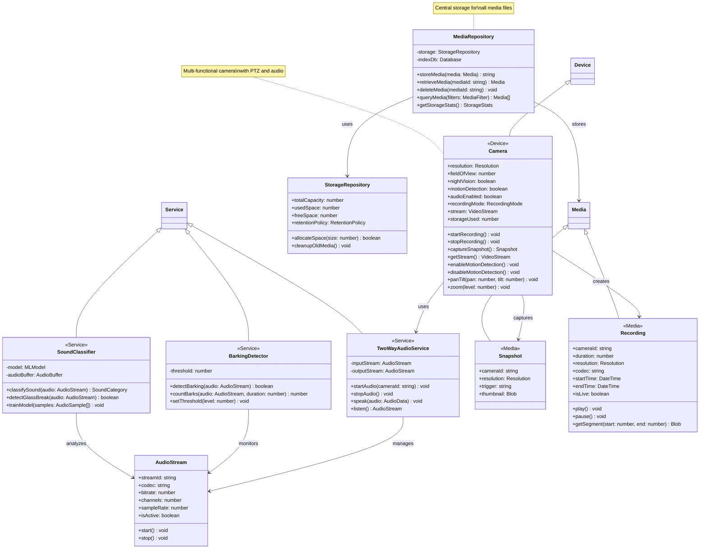

---

## 7. Notifications & Automation

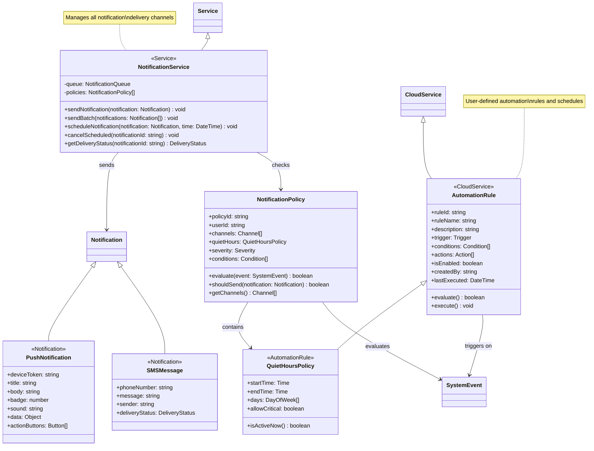

---

## 8. Incidents, Verification & Emergency

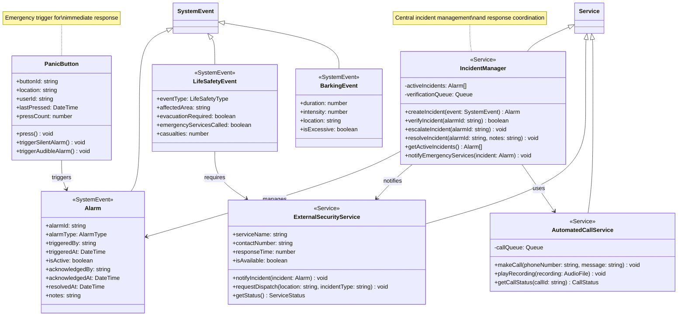

---

## 9. Device Onboarding

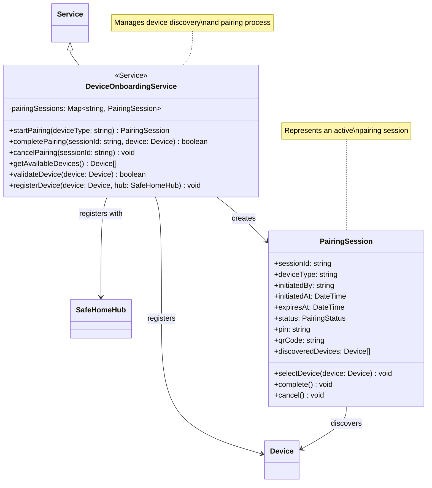

---

## 10. Commands, DTOs & Reports

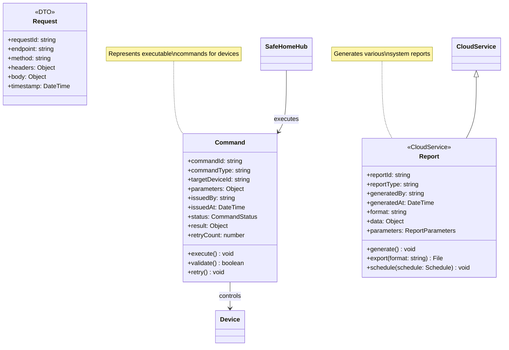

---

## Complete System Integration

### Overall Architecture

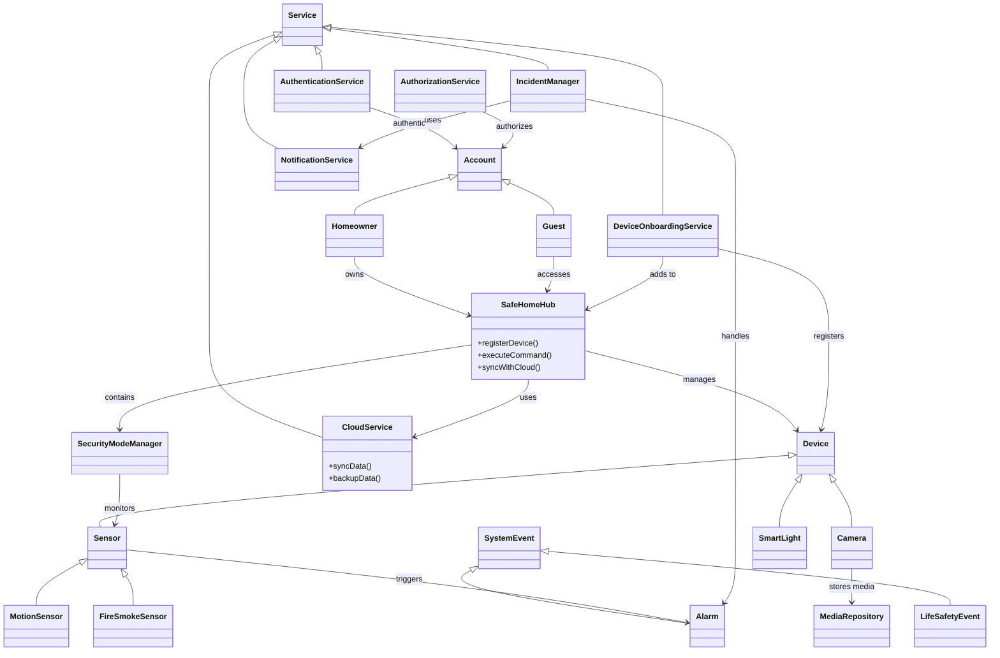

### Key Relationships Summary

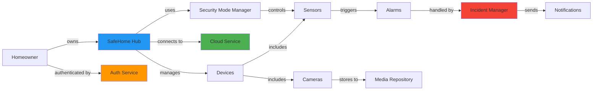

### System Layer Architecture

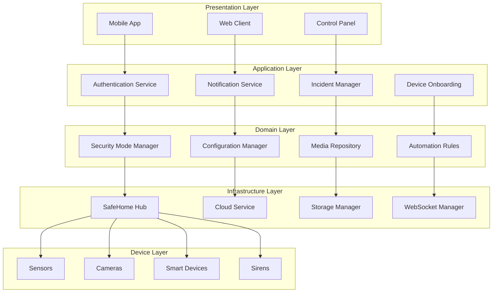

---

## Class Statistics

### Implementation Summary

| Category | Classes | Status |
|----------|---------|--------|
| **Base Classes** | 7 | Abstract |
| **Authentication & Authorization** | 13 | 🔴 Not Implemented |
| **Core Platform** | 14 | 🔴 Not Implemented |
| **Security Modes** | 7 | 🔴 Not Implemented |
| **Devices & Sensors** | 15 | 🔴 Not Implemented |
| **Surveillance & Media** | 9 | 🔴 Not Implemented |
| **Notifications & Automation** | 6 | 🔴 Not Implemented |
| **Incidents & Emergency** | 6 | 🔴 Not Implemented |
| **Device Onboarding** | 2 | 🔴 Not Implemented |
| **Commands & Reports** | 3 | 🔴 Not Implemented |
| **TOTAL** | **82** | — |

### Relationship Types

- **Inheritance (is-a)**: 30+ relationships
- **Composition (has-a)**: 40+ relationships
- **Dependency (uses)**: 50+ relationships
- **Association**: 20+ relationships

---

## Design Patterns Used

### 1. **Abstract Factory Pattern**
- `Device` and `Sensor` abstract classes
- Concrete implementations for specific device types

### 2. **Observer Pattern**
- `SystemEvent` and event listeners
- Notification distribution system

### 3. **Strategy Pattern**
- `SecurityMode` with different arming strategies
- `NotificationPolicy` with various delivery strategies

### 4. **Singleton Pattern**
- `SafeHomeHub` (single hub per home)
- `CloudService` (single cloud connection)

### 5. **Command Pattern**
- `Command` class for device control
- Command queue management

### 6. **Repository Pattern**
- `MediaRepository` for media storage
- `StorageRepository` for data persistence

### 7. **Service Layer Pattern**
- All `Service` classes
- Clear separation of business logic

### 8. **Factory Method Pattern**
- `DeviceOnboardingService` for device creation
- `NotificationService` for notification creation

---

## Key Design Principles

### SOLID Principles

- **Single Responsibility**: Each class has one clear purpose
- **Open/Closed**: Abstract base classes allow extension
- **Liskov Substitution**: All derived classes can replace base classes
- **Interface Segregation**: Focused interfaces for specific needs
- **Dependency Inversion**: Depend on abstractions, not concretions

### Additional Principles

- **DRY (Don't Repeat Yourself)**: Common functionality in base classes
- **KISS (Keep It Simple)**: Clear, focused class responsibilities
- **Separation of Concerns**: Layered architecture
- **Encapsulation**: Private attributes with public methods

---

## References

- [Class Structure Analysis](./class_analysis.md)
- [UML Frontend Diagram](./uml_class_diagram.md)
- [Mermaid Documentation](https://mermaid.js.org/)
- [UML Class Diagram Guide](https://www.uml-diagrams.org/class-diagrams-overview.html)

---

**Document Version:** 1.0.0  
**Last Updated:** 2025-11-09  
**Author:** SafeHome Development Team  
**Total Classes:** 82  
**Total Diagrams:** 13

